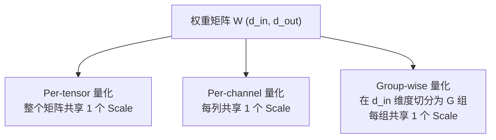

# 大模型量化算法深度解析

在大语言模型（LLM）的部署与优化中，量化（Quantization）是降低显存占用、提高推理速度的核心技术。本篇文档对目前主流的量化算法进行了系统性的梳理，从基础量化公式到前沿的码本量化（IQ-quants）进行详细拆解。

---

## 1. 大模型量化基础（Quantization Fundamentals）

量化的本质是将高精度浮点数（如 FP16 / BF16）映射到低位宽的数字（如 INT8 / INT4 / FP8）中，从而减少存储空间和计算开销。

### 1.1 对称量化（Symmetric Quantization）

对称量化假设浮点数的分布关于零点对称，因此不需要引入偏移量（Zero-point），零点固定映射为整数空间中的 $0$ 。

#### 数学公式

量化公式为：

$$
q = \text{clamp}\left(\text{round}\left(\frac{w}{S}\right), q_{\text{min}}, q_{\text{max}}\right)
$$

反量化（重构）公式为：

$$
w \approx q \cdot S
$$

对于 $b$ 位有符号整数（如 INT8），缩放因子 $S$ 的计算公式为：

$$
S = \frac{\max(|w|)}{q_{\text{max}}}
$$

其中 $q_{\text{min}} = -2^{b-1} + 1$ ， $q_{\text{max}} = 2^{b-1} - 1$ （例如在 INT8 对称量化中，对应 $[-127, 127]$）。

#### 数值示例（INT8 对称量化）

假设有一组权重通道的数据为 $w = [ -0.8, -0.2, 0.0, 0.4, 1.2 ]$ ：

1. 计算绝对值最大值： $\max(|w|) = 1.2$ 。
2. 计算缩放因子 $S$ ：

$$
S = \frac{1.2}{127} \approx 0.0094488
$$

3. 进行量化计算：
   * $q_0 = \text{round}\left(\frac{-0.8}{0.0094488}\right) = \text{round}(-84.66) = -85$
   * $q_1 = \text{round}\left(\frac{-0.2}{0.0094488}\right) = \text{round}(-21.16) = -21$
   * $q_2 = 0$
   * $q_3 = \text{round}\left(\frac{0.4}{0.0094488}\right) = 42$
   * $q_4 = \text{round}\left(\frac{1.2}{0.0094488}\right) = 127$
   * 量化后的整数组为 $q = [ -85, -21, 0, 42, 127 ]$ 。
4. 反量化恢复浮点数：
   * $w_{\text{dequant}} = q \cdot S = [ -0.8031, -0.1984, 0.0, 0.3968, 1.2 ]$ 。

---

### 1.2 非对称量化（Asymmetric Quantization）

非对称量化能够根据浮点数据的实际分布范围 $[\min(w), \max(w)]$ 动态调整零点 $Z$ ，特别适用于非对称分布的数据（例如激活值，由于经过 ReLU 或 GeLU 等激活函数，通常非负且非对称）。

#### 数学公式

量化公式为：

$$
q = \text{clamp}\left(\text{round}\left(\frac{w}{S}\right) + Z, q_{\text{min}}, q_{\text{max}}\right)
$$

反量化公式为：

$$
w \approx (q - Z) \cdot S
$$

缩放因子 $S$ 与零点 $Z$ 的计算方式为：

$$
S = \frac{\max(w) - \min(w)}{q_{\text{max}} - q_{\text{min}}}
$$

$$
Z = \text{round}\left(\frac{-\min(w)}{S}\right) + q_{\text{min}}
$$

其中对于 INT8 非对称量化， $q_{\text{min}} = -128$ ， $q_{\text{max}} = 127$ （或无符号 INT8 对应 $[0, 255]$ ）。

---

## 2. 量化粒度（Quantization Granularity）

根据缩放因子 $S$ 的共享范围，量化粒度主要分为以下三种：



### 2.1 Per-tensor（逐张量量化）
* **定义**：整个权重矩阵仅使用一个全局的标量 $S$ 。
* **优点**：极小的存储开销，硬件乘法计算最简（ $Y = (X \cdot W_q) \cdot S$ ）。
* **缺点**：若矩阵中不同通道的数值动态范围差异较大，量化误差会非常严重。

### 2.2 Per-channel（逐通道量化）
* **定义**：对于矩阵乘法 $Y = X W$ （其中 $W$ 的形状为 $[d_{\text{in}}, d_{\text{out}}]$ ），对权重 $W$ 的每一列（即输出通道维度 $d_{\text{out}}$ ）单独计算并应用一个 $S_j$ 。
* **优点**：能够捕捉每个通道独立的数值分布，精度远超 Per-tensor 量化。
* **缺点**：需额外存储 $d_{\text{out}}$ 个 $S$ 值。

### 2.3 Group-wise（逐组量化 / Block-wise）
* **定义**：将输入通道维度 $d_{\text{in}}$ 划分为大小为 $G$ （例如 $G = 128$ 或 $64$ ）的多个组。每个组（即含有 $G$ 个权重的片段）共享一个局部缩放因子 $S_{j, g}$ 。
* **优点**：能极佳地捕捉局部参数分布，是 4-bit 以下超低比特量化的精度保障。
* **缺点**：Scale 的存储开销变大（当 $G=128$ 时，若使用 16-bit Scale，会额外引入约 1.56% 的显存开销）。

---

## 3. 激活值量化的挑战与混合精度方案（LLM.int8()）

在传统的 W8A8（Weight 8-bit, Activation 8-bit）量化中，激活值量化面临着极大的精度损失挑战。

### 3.1 激活值离群值（Activation Outliers）
在大语言模型（参数量超过 6.7B 之后）中，激活值中存在极少数通道（约 0.1%），其数值大小是正常通道的几十倍甚至上百倍（通常数值超过 6.0 且可达 100 左右）。如果采用常规量化，这些离群值（Outliers）会压缩绝大多数正常激活值的量化精度，导致严重的性能下滑。

### 3.2 LLM.int8() 的混合精度分解机制

LLM.int8() 提出了**异常值协同分解（Vector-wise Quantization with Mixed Precision）**来无损解决该问题。

#### 算法流程图

```mermaid
sequenceDiagram
    rect rgb(30, 41, 59)
    Note over 输入激活 X, 权重 W: 寻找激活 X 中绝对值大于阈值 alpha=6 的列索引
    end
    输入激活 X->>离群通道 (FP16): 提取对应的列 (Shape: T x 离群数)
    输入激活 X->>常规通道 (INT8): 提取其余常规列 (Shape: T x 常规数)
    权重 W->>离群通道 (FP16): 提取对应的行 (Shape: 离群数 x d_out)
    权重 W->>常规通道 (INT8): 提取其余常规行 (Shape: 常规数 x d_out)
    Note over 离群通道 (FP16): 执行 FP16 矩阵乘法
    Note over 常规通道 (INT8): 执行 INT8 矩阵乘法，后乘以 Scale
    离群通道 (FP16)->>输出 Y: 矩阵乘法结果相加
    常规通道 (INT8)->>输出 Y: 矩阵乘法结果相加
```



#### 核心数学步骤

对于输入激活值 $X$ 和权重 $W$ ，设离群通道的索引集合为 $I_{\text{out}}$ ，常规通道集合为 $I_{\text{normal}}$ ：

$$
Y = X_{:, I_{\text{normal}}} W_{I_{\text{normal}}, :} + X_{:, I_{\text{out}}} W_{I_{\text{out}}, :}
$$

1. 将第一部分通过传统的 Vector-wise 方式量化为 INT8 进行乘法运算。
2. 将第二部分（离群通道，占比极小，约 0.1%）保留为 FP16 进行高精度运算。
3. 将两部分相加得到输出，保证了计算开销极低的同时实现精度的无损保持。

---

## 4. 激活值平滑化方案（SmoothQuant）

### 4.1 核心思想
SmoothQuant 避免了像 LLM.int8() 那样在运行时动态拆分矩阵的开销。它通过一个**等效的通道平滑变换**，利用通道缩放因子 $s$ 将激活值中的离群值按比例“转移”到权重矩阵中，使激活值和权重都变得易于量化。

### 4.2 数学原理与推导

设原始矩阵乘法为 $Y = X W$ 。为了改变各通道的动态范围，引入对角矩阵 $\text{diag}(s)$ ：

$$
Y = \left( X \text{diag}(s)^{-1} \right) \left( \text{diag}(s) W \right) = \hat{X} \hat{W}
$$

其中平滑对角元素 $s_j$ （对应通道 $j$）的计算公式为：

$$
s_j = \frac{\max(|X_j|)^\alpha}{\max(|W_j|)^{1-\alpha}}
$$

* $\alpha \in [0, 1]$ 是迁移强度的超参数。
* 当 $\alpha = 1$ 时，完全平滑激活值（量化难度完全转移给权重）。
* 当 $\alpha = 0$ 时，退化为常规的 Per-channel 权重平滑。通常建议选择 $\alpha = 0.5$ 以平衡两者的量化难度。

#### 实际部署优势
* **在线零开销**：在模型加载（离线阶段），直接将 $\text{diag}(s)$ 融进权重： $\hat{W} = \text{diag}(s) W$ 。
* **合并 LayerNorm**：在线推理时，将除以 $s$ 的变换融合进前一个 LayerNorm 或 RMSNorm 算子中，即在求出激活值时它已经变成了平滑后的 $\hat{X}$ ，无需在推理中额外执行矩阵除法。

---

## 5. 基于校准集（Calibration）的二阶优化方案（GPTQ, AWQ）

当模型量化压缩到极低的 3-bit 或 4-bit 时，简单的 RTN 算法会导致不可接受的性能下滑。必须结合少量校准集进行前向传播，通过优化数学公式调整未量化权重。

### 5.1 GPTQ：基于 Hessian 的二阶误差补偿

GPTQ 继承自 OBQ (Optimal Brain Quantizer)，旨在通过泰勒展开的二阶项（Hessian 矩阵）最小化量化前后的误差：

$$
\min_{\hat{W}} \| W X - \hat{W} X \|_2^2
$$

根据二阶展开，量化某一权重 $w_i$ 会产生一定的误差，我们需要通过调整剩余未量化的权重来对其进行补偿。误差补偿更新公式为：

$$
\Delta w = -\frac{w_i - \text{round}(w_i)}{[H^{-1}]_{ii}} \cdot H^{-1}_{:, i}
$$

其中 $H = 2 X X^T$ 是该层输入的 Hessian 矩阵。
GPTQ 的改进之处在于：
1. 通过 Cholesky 分解提前对 Hessian 矩阵求逆，使得计算以块为单位并行化。
2. 通过 Lazy Update（延迟更新）策略减少频繁修改内存，将复杂度从 $O(d^3)$ 降到适合超大模型离线量化的开销范围内。

---

### 5.2 AWQ：激活感知权重量化

#### 核心发现
AWQ 发现并不是所有权重都同等重要。仅占总数 1% 的权重（显著权重，Salient Weights）决定了大部分的精度损失，而这些显著权重与输入激活值的幅值（大小）强相关。

#### 核心原理
AWQ 不使用复杂的 Hessian 更新，而是通过以下步骤：
1. 收集校准集中的激活值分布，找出显著权重通道。
2. 对显著权重通道应用一个统一的保护缩放因子 $s$ ；对该通道乘以 $s$ ，并对输入乘以 $s^{-1}$ 。
3. 在空间内搜索该通道的缩放因子 $s^*$ ，最小化量化后的均方误差：

$$
s^* = \arg\min_s \| W X - \text{quant}(W \cdot \text{diag}(s)) \text{diag}(s)^{-1} X \|
$$

这种方法极大地保护了 1% 的重要参数，且不受校准数据集分布过拟合的影响，具有极强的泛化性。

---

## 6. QLoRA 中的 NF4 与双重量化（Double Quantization）

为了在消费级显卡上微调大模型，QLoRA 提出了高效的 4-bit 微调机制，其中包含两个核心的量化技术创新：

### 6.1 NF4 (Normal Float 4) 数据格式
传统的 FP4/INT4 都是均匀划分数值区间的。然而，大模型的权重在经过深度训练后，其分布高度符合均值为 0 、方差为 $\sigma$ 的正态分布。

NF4（正态浮点 4）利用了正态分布的分位数（Quantile）划分区间，其划分方式使得**数据落在每一个量化区间内的概率完全相等**。这意味着 NF4 的信息熵（Information Entropy）达到了理论上限，能够最大程度保留原浮点权重的信息。

#### 数值分位点分布（NF4 的 16 个精确值点）
NF4 的 16 个可用分位值常数（归一化到 $[-1, 1]$ 之间）为：
```text
[-1.0, -0.694431, -0.515473, -0.384907, -0.275991, -0.179975, -0.091828, 0.0,
 0.064909, 0.160108, 0.258609, 0.366767, 0.486161, 0.624323, 0.793577, 1.0]
```

### 6.2 双重量化（Double Quantization, DQ）
大模型通常以 64 个权重为一个 Block 进行量化（即 Block size = 64），对于每一个 Block，需要存储一个 32 位的浮点数 Scale。
这会导致 Scale 自身占用额外的存储开销：每个权重需要分摊 $32 / 64 = 0.5 \text{ bit}$ 。

双重量化对这第一层生成的 FP32 Scale 再进行一次量化：
1. 第一层量化的 Scale 使用 256 作为 Block size，使用 8-bit (FP8/INT8) 格式进行量化。
2. 这样最终 Scale 占用的平均存储开销降为：

$$
\frac{8}{64} + \frac{32}{64 \times 256} \approx 0.127 \text{ bit/weight}
$$

这为每个参数 average 省下了约 $0.37 \text{ bit}$ 的显存，在大参数量模型（如 70B）中能够节省数 GB 显存。

---

## 7. 边缘端多级标度与向量量化（Llama.cpp K-quants & IQ-quants）

边缘端推理框架 `llama.cpp` 中定义了一套极具工程美学的多级标度和码本量化算法。

### 7.1 K-quants：多级标度层级机制
在 `llama.cpp` 中，为了极力压榨内存，提出了 Super Block 与 Sub-block 协同的双层 Scale 机制。

* **超级块（Super Block）**：通常包含 256 个权重。每个超级块持有一个全局的高精度 FP16 缩放因子 $d$ 。
* **子块（Sub-block）**：超级块内部被划分为 16 个子块（每个子块包含 16 个权重）。每个子块独立持有：
    * 一个低比特（如 4-bit 或 6-bit）的相对缩放因子 $d_{\text{sub}}$ 。
    * 一个低比特的相对最小值 $m_{\text{sub}}$ （用于实现非对称量化）。

对于超级块中的第 $i$ 个权重，其所属的子块索引为 $ib = i // 16$ ，其重构（反量化）计算公式为：

$$
w_i = d \cdot \left( d_{\text{sub}}[ib] \cdot q_i - m_{\text{sub}}[ib] \right)
$$

这种方法用小比特局部参数精调替代了全局高精度大 Scale 的空间开销，从而让 `q4_K`、`q5_K` 在极小精度衰减下达到极高压缩率。

---

### 7.2 IQ-quants：向量量化与码本机制
当大模型压缩到极低的 1.5-bit 到 2-bit 时，标量量化（Scalar Quantization，如 RTN）的精度会彻底坍塌。IQ-quants 引入了**向量量化（Vector Quantization）**。

#### 核心思想
* 将相邻的 $8$ 个权重打包为一个 8 维向量 $V$ 。
* 预先在代码或推理库中固化一个高精度的稀疏多维“码本”（Codebook）。码本里包含若干个代表方向和距离的标准 8 维基准向量（例如仅包含 $[-1, 0, 1, 2]$ 的稀疏组合）。
* **量化**：对于输入向量 $V$ ，搜索码本中距离最近的基准向量，记录其索引 $idx$ 。
* **重构**：反量化时只需提取全局 Scale 并乘以对应索引的码本向量：

$$
V_{\text{dequant}} = S \cdot \text{Codebook}[idx]
$$

#### 为什么 2-bit 以下 IQ-quants 更好？
普通的 2-bit 标量量化对于每个通道只能表示 4 个离散的数值。而通过将 8 个权重绑定为 8 维向量，2-bit（相当于 8 个数共 $16 \text{ bit}$）可以在 8 维空间中提供 $2^{16} = 65536$ 种基准向量的组合。这使得它具有极强的多维几何映射保真度，极大地保留了低比特下模型的语义特征和逻辑推理能力。

---

## 8. 主流大模型量化算法特性综合对比

下表归纳了上述各大主流大模型量化算法在易用性、精度和显存开销上的特点：

| 算法名称 | 目标对象 | 硬件依赖与开销 | 核心原理 | 适用位宽 (Weight/Activation) | 典型应用场景 |
| :--- | :--- | :--- | :--- | :--- | :--- |
| **RTN** | 权重 (W) | 无需校准集，开销极低 | 四舍五入，对称或非对称线性映射 | W8A16, W4A16 | 快速压缩、初步评估 |
| **LLM.int8()** | 权重与激活 (W & A) | 需动态分流，推理存在延迟 | 异常通道用 FP16 计算，常规通道用 INT8 | W8A8 | 早期高精度部署 |
| **SmoothQuant** | 权重与激活 (W & A) | 零推理开销，极力推荐 | 通道级等效缩放，将激活离群值转移至权重 | W8A8, W4A8 | 工业级高性能推理 |
| **GPTQ** | 权重 (W) | 需校准集，离线二阶逆 Hessian 计算 | 逐列量化并使用 Hessian 矩阵补偿剩余误差 | W4A16, W3A16 | GPU 显卡本地推理 |
| **AWQ** | 权重 (W) | 需校准集，离线搜索速度快于 GPTQ | 激活感知，搜索最佳 scale 保护显著通道 | W4A16, W3A16 | 移动端、大并发服务端推理 |
| **QLoRA (NF4)** | 权重 (W) | 双重量化，支持多 GPU 并行 | 利用正态分布分位数编码 NF4 + Scale 二次量化 | W4A16 | 本地低显存高效微调 |
| **K-quants** | 权重 (W) | CPU/GPU 混合分块加速 (llama.cpp) | 双层标度分块重构，超级块与子块协同 | W5_K, W4_K, W3_K | 个人 PC/移动边缘端部署 |
| **IQ-quants** | 权重 (W) | 需静态码本硬编码与查表重构 | 8维向量量化，多维空间近邻搜索映射 | W2_K, W1.5_K | 极致显存压缩（百亿模型跑在手机） |

---

## 9. 总结建议
在实际的大模型落地部署过程中，可根据以下指导原则选择量化算法：
1. **对于显存微调**：首选 **QLoRA (NF4)**，能将微调显存开销降低 60% 以上且不损失性能。
2. **对于云端 GPU 高性能推理**：若需要极致吞吐率，推荐使用 **SmoothQuant (W8A8)** ；若以大 batch 且显存受限为主，选择 **AWQ / GPTQ (W4A16)**。
3. **对于个人 PC 和移动边缘端 (CPU/Mac Metal)**：推荐使用 **llama.cpp** 的 **K-quants**；当显存极其匮乏（如想在 16G 内存电脑上运行 70B 模型）时，推荐采用 **IQ-quants**。
