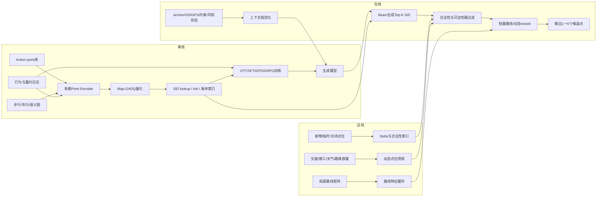

# 地图上下车点生成式推荐：完整实验、训练样本与在线推理方案

> 版本：2026-07-21  
> 范围：用户已选择起点或终点后，为其推荐便于乘客与司机见面的上车点或下车点（Pickup/Drop-off，PUDO）。  
> 本文暂不把司机派单、拼车全局匹配和运力调度并入生成模型主任务，但会给出派单后动态重推荐和路缘容量协调的扩展方案。  
> 本文沿用《地图 POI 生成式搜索》文档的分析框架，覆盖任务定义、相关工作、开源基座、点位 Encoder、SID、CPT、SFT、RL、样本构造、loss/reward、分期实验和 200～300ms 在线推理。  
> 文中标为“建议”的数据规模、loss 权重和延迟拆分均是实验起点，不是论文公开结论。

---

## 0. 阅读约定

本文用三种标签区分信息来源：

- **[论文事实]**：论文或官方模型卡已经描述、验证的做法。
- **[点位迁移]**：基于论文方法，针对地图上下车点推荐提出的设计。
- **[待消融]**：不能直接假定有效，必须通过对照实验验证。

核心符号：

- `a_o`：用户选择的起点 anchor，可为 POI、AOI、地址或经纬度。
- `a_d`：用户选择的终点 anchor。
- `g`：用户设备定位及定位精度。
- `r`：一次点位推荐请求。
- `u`：候选 action-point。
- `c`：用户、司机、道路和环境组成的在线上下文。
- `d`：已匹配司机及其位置、朝向、接驾路线；派单前为空。
- `t`：时间、日期、节假日。
- `w`：天气和可见度。
- `h`：当前 session 和用户显式授权使用的短期历史。
- `b`：乘客步行、无障碍、行李等显式约束。
- `A^+(c)`：上下文 `c` 下可接受的多正确点位集合。

本文不把 action-point 简化为一个经纬度。建议定义：

```text
action_point =
  physical_point
  × action_type(pickup/dropoff)
  × road_side
  × vehicle_heading_or_access
  × floor_or_vertical_level
  × pedestrian_access
```

生成模型的目标是：

```math
P_\theta(\mathrm{SID}(u)\mid a_o,a_d,g,\mathrm{stage},d,t,w,b,h)
```

其中 `stage` 至少区分：

```text
PRE_DISPATCH：司机尚未分配
POST_DISPATCH：司机已分配，可使用司机位置、朝向和接驾路线
IN_TRIP_DROPOFF：行程中动态确认或调整下车点
```

---

# 1. 方案覆盖检查

| 讨论项 | 是否覆盖 | 本文位置 | 说明 |
|---|---:|---|---|
| 上下车点任务定义及与 POI 搜索的差异 | 是 | 第2节 | 从“找实体”转为“多主体、多约束的会合点决策” |
| 传统上下车点推荐研究 | 是 | 第3节 | 覆盖步行、绕行、方向、交通、容量和全局协调 |
| 快手九篇生成式搜推方法迁移 | 是 | 第3节 | OneRec 至 OneRetrieval |
| 开源基座模型 | 是 | 第5节 | Qwen3.5-2B-Base 主模型，Qwen3-1.7B-Base 对照 |
| 点位候选库和 action-point 定义 | 是 | 第4、7节 | 操作类型、道路侧向、楼层和接入方向均进入点位定义 |
| Text/Geo/Graph/Behavior/Visual Encoder | 是 | 第6节 | 静态点位与动态上下文分离 |
| Qwen Embedding、FAMAE、Q-Former | 是 | 第6节 | 分别承担文本、字段行为和变长多模态融合 |
| 上下车点 SID 与 Map-GAOQ | 是 | 第7节 | 双 namespace、稳定属性编码、动态状态不入 SID |
| CPT 样本构造与示例 | 是 | 第8节 | 共22类 |
| SFT 样本构造与示例 | 是 | 第9节 | 共25类 |
| RL/DPO/GRPO 样本构造与示例 | 是 | 第10节 | 共23类 |
| CPT/SFT/RL loss | 是 | 第8～10节 | NTP、MML、KD、DPO、GRPO、prefix credit |
| 地图点位 reward | 是 | 第10节 | 乘客、司机、会合、行程、路缘和业务六类目标 |
| 分期实验和训练量 | 是 | 第11节 | 从点位库审计到 Shadow/A-B |
| 在线 Prompt 与 200～300ms 架构 | 是 | 第12节 | 无在线 CoT，固定长度 SID，Top-K 来自 beam |
| 风险、指标和上线护栏 | 是 | 第13节 | 安全、法规、容量、反馈偏差和 SID churn |

---

# 2. 任务定义与总体结论

## 2.1 第一版推荐主线

1. 构建经过地图、道路法规和运营审核的 action-point 库，不生成任意经纬度。
2. 用文本、结构、精确空间、步行图、车行图、视觉和行为多路 Encoder 得到静态点位表征。
3. 使用 action-conditioned Map-GAOQ 构造固定长度 SID；`<PU>` 与 `<DO>` 使用独立 namespace。
4. 动态交通、施工、路缘拥挤、天气和司机实时状态只作为生成上下文与 rerank 特征，不写入稳定 SID。
5. 依次进行 SID token warm-up、CPT、多阶段 SFT、高置信 DPO，最后才实验 on-policy GRPO/TPMA。
6. 线上每条 beam 只生成一个合法点位 SID；Top-K 来自并行 beam，不串行生成自然语言解释。
7. 模型输出后必须经过合法性、可达性、步行预算、道路侧向和动态关闭硬过滤，再做轻量路线重排。
8. 第一阶段保留现有规则/LambdaMART/DeepFM/图模型作为 fallback 和并行候选源。

## 2.2 三种推荐状态

### 状态A：只选择了一个端点

例如用户先选择“上海虹桥火车站”为起点，此时终点尚未知。

可使用：

```text
起点AOI/POI
用户GPS及精度
时间、天气
显式步行/无障碍约束
短期历史
```

不能假设目的地方向。此时应偏向稳定、醒目、合法、容易步行到达且历史会合成功率高的点位。

### 状态B：起终点均已选择，但尚未派单

此时可使用 OD 方向优化道路侧向，减少车辆掉头和首尾段绕行。MPLRec 等工作已经说明，目的地方向会显著影响上车点选择。

### 状态C：司机已经分配

增加：

```text
driver_location
driver_heading
driver_approach_route
driver_ETA
vehicle_type
current_traffic
curb_capacity
```

可进行动态上车点调整，但需要明确展示步行代价，并允许用户保留原点。

## 2.3 与 POI 搜索的根本差异

| POI生成式搜索 | 上下车点生成式推荐 |
|---|---|
| query 决定目标实体 | 可能没有 query，主要依赖结构化上下文 |
| 相关性和实体正确性优先 | 合法、可达、安全和司乘会合成功优先 |
| POI 通常相对稳定 | 点位合法性和可用性具有明显时变性 |
| 用户是主要决策主体 | 乘客、司机、平台和道路系统共同受影响 |
| 点击/导航可作为较快反馈 | 真正标签要等到接到/送达，反馈延迟且有删失 |
| 位置近通常是相关性信号 | 直线近可能在道路对面、不同楼层或不可停车 |
| 一个 POI 可有多个正确结果 | 一个 anchor 周边常有多个近似等价点位 |

点位优化优先级建议：

```text
SID合法、点位有效
→ 操作类型正确
→ 乘客和车辆均可达
→ 法规、安全、道路侧向、楼层正确
→ 满足显式步行/无障碍约束
→ 降低司乘会合失败和等待
→ 降低司机绕行、掉头和行程首尾段成本
→ 优化履约、体验和路缘系统外部性
```

## 2.4 上车点与下车点不应混为一个任务

### 上车点主要矛盾

- 乘客从当前真实位置走到点位。
- 司机从实时位置接近点位。
- 双方 ETA 同步。
- 需要减少电话、聊天、找车、过街和司机等待。
- 机场、车站、商场等场景存在指定网约车区和楼层。

### 下车点主要矛盾

- 点位是否服务正确入口或建筑区域。
- 下车后步行到最终 anchor 的成本。
- 是否可安全停车、开门和携带行李。
- 单行路、隔离带和目的地方向造成的尾段绕行。
- 行程中交通变化可能导致动态调整。

建议共享 backbone 和静态点位 Encoder，但使用：

```text
<PU> 与 <DO> task token
独立合法性 mask
独立 reward 权重
独立核心评估切片
```

## 2.5 “生成式”不等于生成坐标

第一版严禁模型直接生成浮点经纬度，原因包括：

- 任意坐标可能落在道路中央、隔离带、私有区域或不同楼层。
- 无法保证车辆停靠合法性和乘客步行可达性。
- 坐标小误差可能改变道路侧向或入口。
- 无法稳定做版本、下线、运营干预和安全审计。

生成目标必须是经过审核、可索引、可版本化的 SID。连续坐标生成只可作为离线候选发现工具，发现后仍需地图吸附、法规校验和入库。

## 2.6 必须保留的传统强基线

生成式模型必须在相同候选库和相同动态特征下比较：

```text
最近合法点位
最近入口/最近道路侧
多目标规则打分
Fuzzy-AHP/MPLRec式打分
LambdaMART
DeepFM/DCN
Two-Tower + ANN
GraphSAGE/HGT + ranker
路线成本Oracle
现网点位推荐MCA
```

如果生成模型只是在候选库更好或特征更多时获胜，不能归因于生成式建模。

---

# 3. 相关研究与生成式搜推方法迁移

## 3.1 上下车点推荐研究给出的约束

| 工作 | 主要方法/事实 | 对本方案的启示 |
|---|---|---|
| [A Pick-Up Points Recommendation System for Ridesourcing Service](https://www.mdpi.com/2071-1050/11/4/1097) | 从可接受步行范围筛选历史热点，再用 Fuzzy-AHP 综合兼容性、可达性和交通协调因素 | 候选点不是纯距离问题；道路环境和交通管理必须进入硬约束或 reward |
| [Pick-Up Point Recommendation Using Users’ Historical Orders](https://doi.org/10.1007/978-3-031-19214-2_33) | 用 DBSCAN 聚类用户历史订单，利用通勤规律做个性化 | 用户习惯点有价值，但只能在合法和当前可用的候选中起次级作用 |
| [MPLRec](https://doi.org/10.1109/TMC.2022.3208566) | 在道路网络上生成潜在上车点；按 Geohash 检索；使用步行距离、时间和方向条件化热度、预计车费等特征；用仿真评估 | 目的地方向、道路图和历史轨迹是核心；生成模型后仍需路线与动态 scorer |
| [Flexible PUDO](https://doi.org/10.1016/j.trd.2024.104064) | 允许短距离步行，通过两阶段启发式减少绕行与拥堵；在成都数据上分析首尾段效率 | reward 要同时覆盖乘客步行、车辆绕行、拥堵和环境外部性 |
| [Online Ridesharing with Meeting Points](https://arxiv.org/abs/2209.10892) | 离线选择 meeting-point candidates，构建 HMPO graph 和 k-skip cover，加速在线匹配 | 候选点库和图预计算是线上低延迟的基础；生成不应取代全局匹配 |
| [Dynamic Pick-up Point Recommendation](https://doi.org/10.1016/j.knosys.2025.114543) | 同时考虑步行、等待、交通和车费；点位评分后用自适应 Kuhn-Munkres 做全局匹配 | 点位个体效用与系统容量协调是两个阶段 |
| [Capacity-Aware Dynamic PUP Recommendation](https://papers.ssrn.com/abstract=6592901) | pair-level operational score 与动态路缘容量协调分离 | 生成模型适合产生/评分候选，容量分配应由后置优化器完成 |

这些研究不能直接证明生成式推荐有效，但共同约束了正确问题定义：

```text
先保证候选可行
再优化单请求效用
最后处理多请求容量和全局协调
```

## 3.2 快手九篇生成式搜推方法迁移

| 工作 | 核心训练方式 | 上下车点迁移 |
|---|---|---|
| [OneRec](https://arxiv.org/html/2502.18965) | Balanced K-Means SID；session NTP；Reward Model 对 beam 排序；self-hard DPO；IPA | 用模型 beam 产生同一 AOI 内“道路对面、错楼层、错操作类型”等困难点位；高低 reward 组成 DPO |
| [OneRec-V2](https://arxiv.org/html/2508.20900) | Lazy Decoder-Only；真实反馈 RL；duration-aware reward；GBPO；强调 on-policy | 使用本模型真实展现后的接受、改点、接驾成功和等待反馈；对会合耗时做条件化归一化 |
| [OneRec-Think](https://arxiv.org/html/2510.11639) | Itemic token 与自然语言对齐；rationale 数据；Rollout-Beam+GRPO | 教师读取长地图事实生成结构化点位理由，学生线上只生成 SID；不输出自然语言 CoT |
| [OpenOneRec](https://arxiv.org/abs/2512.24762) / [官方仓库](https://github.com/Kuaishou-OneRec/OpenOneRec) | Itemic-Text Alignment→Co-Pretrain→多任务 SFT→蒸馏→Rec-GRPO | SID token warm-up、点位/道路 CPT、多任务 SFT、通用知识保持和最终 GRPO 分阶段进行 |
| [OneLoc](https://arxiv.org/html/2508.14646) | Geo-aware SID；邻域 prompt；地理和业务 reward；DPO | 最接近本任务，但不能只用距离；需替换为步行图、车行图、道路侧向和操作合法性 reward |
| [OneSearch](https://arxiv.org/html/2509.03236) | query/item 表征协同；RQ-KMeans+OPQ；多阶段 SFT；RM+listwise DPO+真实行为 | 构造 context/action-point 协同空间；从静态 grounding 到在线同构输入，再到多点位 listwise 训练 |
| [OneSearch-V2](https://arxiv.org/html/2603.24422) | 教师侧关键词推理；学生看原输入；CE+KL 自蒸馏；TPMA-GRPO | 教师将复杂道路事实压缩为结构化意图，学生输入紧凑上下文；按 GAOQ prefix 做 token credit |
| [OneReason](https://arxiv.org/abs/2606.06260) | token/item/relation/user 多粒度预训练；认知 SFT；多域 RL 统一 | 对应点位 token、点位属性、步行/车行图关系、用户出行习惯和最终点位决策 |
| [OneRetrieval](https://arxiv.org/html/2606.13533) | 属性↔slot、文本↔SID、协同共现、reserved-slot self-routing | 支持临时接送区、新增出入口和大型活动运营点位；仍需 delta 索引与审核 |

## 3.3 五个必须校正的认识

### 校正一：OneLoc 的“距离近”不能直接成为点位通用 reward

道路对面 20m 的点可能需要步行绕行 500m；车辆直线近也可能要掉头 1.5km。必须使用步行路线、车行路线、道路侧向和楼层。

### 校正二：OneSearch-V2 不支持线上长 CoT

复杂点位推理应发生在离线教师侧：

```text
Teacher input = 完整道路、步行、视觉、动态事实
Student input = 线上紧凑结构化上下文
Target = 同一个点位SID
Loss = CE + token-level KL + 稳定性正则
```

### 校正三：动态状态不能进入 SID 码本

如果交通速度、天气、拥挤或司机位置进入点位 embedding 后再量化，SID 会频繁变化。SID 只编码相对稳定的点位本体和 action 属性。

### 校正四：生成候选与全局协调是两层问题

单请求生成模型可以输出 Top-K 点位及效用分数，但高峰期同一上客区的容量分配、司机匹配和排队需要后置优化器处理。

### 校正五：日志中“用户接受”不等于成功会合

用户点击默认点可能只是没有修改；真正强标签来自实际上车/下车位置、等待、沟通、取消原因和履约。

---

# 4. 数据、标签、候选库与评估集

## 4.1 点位主数据

建议区分 physical point 和 action-point：

```json
{
  "physical_point_id": "pp_hongqiao_west_b1_zone6",
  "action_point_id": "ap_hongqiao_west_b1_zone6_pickup",
  "action_type": "pickup",
  "name": "虹桥火车站西交通中心网约车上客区6号柱",
  "aliases": ["西交B1网约车区6号柱"],
  "lat": 31.196,
  "lon": 121.315,
  "level": "B1",
  "road_segment_id": "road_7821",
  "road_side": "right",
  "heading_range": [170, 250],
  "parent_aoi": "虹桥综合交通枢纽",
  "serves_pois": ["虹桥火车站"],
  "pedestrian_anchors": ["西出站口", "西交通中心电梯"],
  "vehicle_entries": ["申虹路入口"],
  "point_type": "designated_ride_hailing_zone",
  "pickup_legal": true,
  "dropoff_legal": false,
  "wheelchair_accessible": true,
  "shelter": true,
  "lighting": "good",
  "signage": ["网约车", "6号柱"],
  "status": "active",
  "version": 17
}
```

## 4.2 地图与图数据

至少维护两张有向图和一张语义关系图：

```text
PedestrianGraph：
  entrance, elevator, stair, escalator, crosswalk, indoor corridor,
  barrier, slope, wheelchair_access, security_gate

VehicleGraph：
  directed road, turn restriction, U-turn, lane, curb, stop legality,
  road side, heading, height limit, private access

SemanticGraph：
  action_point —serves→ POI/AOI
  action_point —near_landmark→ signage/column/gate
  action_point —same_physical_point→ other action type
  action_point —alternative_to→ nearby point
```

直线距离只能作为辅助特征，不能代替上述图。

## 4.3 动态快照

动态信息不进入稳定 SID：

```json
{
  "snapshot_time": "2026-07-21T18:20:00+08:00",
  "action_point_id": "ap_hongqiao_west_b1_zone6_pickup",
  "traffic_speed_bucket": "slow",
  "curb_occupancy": 0.82,
  "queue_estimate": 9,
  "temporary_closure": false,
  "construction_nearby": false,
  "weather": "heavy_rain",
  "visibility": "medium",
  "supply_density": 0.63
}
```

## 4.4 行为与履约日志

```json
{
  "request_id": "r_001",
  "stage": "POST_DISPATCH",
  "anchor_origin": "虹桥火车站",
  "anchor_destination": "陆家嘴国金中心",
  "gps": {"lat": 31.197, "lon": 121.314, "accuracy_m": 45},
  "driver_state": {
    "road_segment": "road_130",
    "heading": 210,
    "eta_s": 420
  },
  "shown_points": ["ap_A", "ap_B", "ap_C"],
  "shown_propensity": [0.51, 0.31, 0.18],
  "accepted_point": "ap_B",
  "manual_drag": false,
  "actual_board_point": "ap_B",
  "rider_walk_s": 260,
  "driver_detour_s": 45,
  "rider_wait_s": 70,
  "driver_wait_s": 35,
  "call_count": 0,
  "chat_count": 0,
  "completed": true,
  "cancel_reason": null
}
```

还应记录：

```text
用户保留原点
切换候选
手动拖图改点
到达点位后的GPS轨迹
司机到达、等待、驶离轨迹
实际上车/下车地图匹配结果
司机或乘客“位置不对”反馈
安全/交通投诉
接驾路线重算次数
终点入口二次导航
```

## 4.5 候选点库构建

候选来源：

1. 官方/运营指定接送区。
2. POI/AOI 入口、出口、门、停车区和落客区。
3. 道路合法路缘的稳定 anchor。
4. 历史真实上下车点经地图匹配和聚类得到的稳定簇。
5. 大型活动、施工和新交通设施产生的临时运营点。

候选发现流程：

```text
历史轨迹/GPS聚类
→ 吸附到车行与步行图
→ 按道路侧向、楼层和操作类型拆分
→ 法规/安全/私有区域过滤
→ 最小会合样本和稳定性过滤
→ 人工或运营抽检
→ action-point入库和版本化
```

不能把隔离带两侧、地面与地下、不同航站楼或不同道路方向的点聚成一个簇。

步行候选半径不应全局固定为 500m。建议按以下条件设预算：

```text
用户显式设置
普通街区/大型枢纽
pickup/dropoff
天气和昼夜
无障碍/行李
短途订单
城市密度
```

## 4.6 标签层级

建议把行为分为：

| 层级 | 例子 | 标签强度 |
|---|---|---:|
| 履约成功 | 实际在推荐点附近完成上下车，低等待、无位置投诉 | 最强正例 |
| 会合成功 | actual point 与推荐 action-point 匹配 | 强正例 |
| 用户接受 | 点击候选或保留默认点 | 中等正例 |
| 轻交互 | 查看说明、展开地图 | 弱正例 |
| 未选择 | 曝光但未点击 | 未知，不是强负例 |
| 明确改点 | 接受后手动拖离、切换其他点 | 条件负例 |
| 位置失败 | “找不到/位置不对”、多次通话、错楼层 | 强负例 |
| 非点位取消 | 用户改计划、司机拒单、价格原因 | 不作为点位负例 |

可构造连续会合质量：

```math
Q_{\mathrm{meet}}=f(D_{\mathrm{actual}},T_{\mathrm{riderWait}},T_{\mathrm{driverWait}},N_{\mathrm{contact}},I_{\mathrm{wrongPoint}})
```

其中各项需按城市、场景和 action type 校准，不能直接使用一套固定阈值。

## 4.7 数据清洗和标签对齐

- GPS 先做轨迹级地图匹配，不按单点最近道路吸附。
- actual boarding/alighting 需结合车辆低速/停车、开关门或订单事件窗口。
- 高楼、地下、枢纽使用楼层和室内图；经纬度相同不代表同一点位。
- 把乘客和司机轨迹时钟对齐，处理设备时间漂移。
- 过滤明显 GPS 飘点，但保留“定位精度差”作为模型输入。
- 取消原因必须拆分，不将供给、价格或用户改计划归因于点位。
- 只使用决策时刻已经可见的特征，避免未来交通、最终路线和履约结果泄漏。

## 4.8 数据切分

主切分采用时间切分：

```text
train：较早时间
validation：后续连续时间窗
test：最新连续时间窗
```

额外构造：

```text
new-point cold start
new-AOI cold start
new-user cold start
policy-version holdout
festival/event holdout
heavy-rain/night holdout
cross-city holdout
post-dispatch distribution shift
```

同一物理点的 pickup/dropoff sibling、同一订单和相邻轨迹片段不得跨集合泄漏。

## 4.9 必备评估切片

```text
pickup / dropoff
only-one-anchor / full-OD
pre-dispatch / post-dispatch / in-trip
普通街道 / 小区 / 商场 / 医院 / 校园
机场 / 火车站 / 大型会展 / 体育场
单行路 / 隔离带 / 高架 / 地下 / 多楼层
道路同侧 / 道路对面
定位准确 / GPS弱 / 室内定位
晴天 / 雨雪 / 夜间
普通步行 / 显式无障碍 / 大件行李
头部点 / 长尾点 / 新增点 / 临时点
低拥挤 / 高拥挤 / 容量受限
短途 / 长途
熟悉用户 / 新用户
```

---

# 5. 开源基座模型选择

## 5.1 推荐模型

| 角色 | 模型 | 用法 |
|---|---|---|
| 主生成模型 | [Qwen3.5-2B-Base](https://huggingface.co/Qwen/Qwen3.5-2B-Base) | 从 Base 做 SID warm-up、CPT、SFT、RL |
| 稳定对照 | [Qwen3-1.7B-Base](https://qwenlm.github.io/blog/qwen3/) | 标准架构和成熟训练栈对照 |
| 文本 Encoder | [Qwen3-Embedding-0.6B](https://huggingface.co/Qwen/Qwen3-Embedding-0.6B) | 编码点位名、地标、入口、说明和 AOI |
| 离线教师 | 7B～32B 指令/推理模型 | 生成结构化点位理由、困难反事实和标签校验 |
| 线上蒸馏模型 | 0.8B～2B 候选 | 主方案成立后再做延迟/成本蒸馏 |

## 5.2 为什么从 Base 开始

- 需要新增大量点位 SID token。
- CPT 要学习道路、步行、点位行为和 Itemic token。
- 指令模型的对话偏好不是主任务所需。
- 线上只需短上下文到短 SID，不需要开放式回答。

Post-trained 大模型主要作为离线教师，不进入 200～300ms 主链路。

## 5.3 输入 token 设计

建议把高频结构字段离散为紧凑 token：

```text
<TASK_PU>/<TASK_DO>
<PRE_DISPATCH>/<POST_DISPATCH>/<IN_TRIP>
<ANCHOR_POI>/<ANCHOR_AOI>/<ANCHOR_GPS>
<GPS_ACC_0_10>/<GPS_ACC_10_50>/<GPS_ACC_50_PLUS>
<WALK_BUDGET_0_100>/<...>
<RAIN>/<NIGHT>/<ACCESSIBLE>
<DRIVER_HEADING_NW>/<DRIVER_ETA_5_10>
<TRAFFIC_SLOW>/<CURB_BUSY>
<SID_V3>
```

连续变量优先做业务可解释分桶，并保留少量归一化数值特征供 context projector 使用。

---

# 6. Action-Point Encoder、FAMAE、Q-Former 与融合

## 6.1 静态点位表征

```math
e_{\mathrm{text}}=\mathrm{QwenEmbedding}(\mathrm{name},\mathrm{alias},\mathrm{landmark},\mathrm{instruction},\mathrm{AOI})
```

```math
e_{\mathrm{struct}}=\mathrm{Embedding}(\mathrm{type},\mathrm{action},\mathrm{level},\mathrm{legality},\mathrm{facility})
```

```math
e_{\mathrm{geo}}=\mathrm{GeoRoadEncoder}(\mathrm{lat},\mathrm{lon},\mathrm{grid},\mathrm{roadSide},\mathrm{heading})
```

```math
e_{\mathrm{graph}}=\mathrm{GraphEncoder}(\mathrm{pedestrianGraph},\mathrm{vehicleGraph},\mathrm{AOI})
```

```math
e_{\mathrm{visual}}=\mathrm{VisualEncoder}(\mathrm{mapPatch},\mathrm{streetView},\mathrm{signage})
```

```math
e_{\mathrm{behavior}}=\mathrm{BehaviorEncoder}(\mathrm{requestPointOutcomeGraph})
```

最终静态表征：

```math
z_{\mathrm{point}}=\mathrm{LayerNorm}(\sum_k g_kW_ke_k)
```

## 6.2 Text Encoder

Qwen3-Embedding 可以作为点位文本强基线，输入：

```text
点位名称和别名
服务POI/AOI
入口/出口/柱号
面向乘客的步行说明
面向司机的驶入说明
图像/VLM离线描述
```

正负例：

```text
正例：
  虹桥西交通中心B1网约车区6号柱
  ↔ 西出站口下楼到B1网约车上客区

困难负例：
  ↔ 虹桥东交通中心网约车区
  ↔ 西交通中心地面出租车上客点
  ↔ 同经纬度附近B2停车区
```

纯文本 embedding 不能单独承担精确道路侧向、可停车性、步行可达和历史会合质量。

## 6.3 GeoRoadEncoder

输入建议：

```text
sin/cos(latitude, longitude)
multi-frequency Fourier features
H3/S2/GeoHash 多尺度 cell
road segment embedding
road side and direction
heading interval
level/elevation
turn restriction
curb type and stop legality
static approach/departure route statistics
```

训练任务：

```text
same_road_side classification
heading compatibility
turn/U-turn relation
walk/drive route-time bucket
same-level classification
legal pickup/dropoff prediction
```

## 6.4 Multi-Graph Encoder

推荐使用 HGT、GraphSAGE 或轻量 relation-aware Transformer，同时编码：

```text
乘客步行图
司机车行图
AOI/入口语义图
历史替代点图
```

边类型包括：

```text
walk_connected
drive_reachable
same_road_side
requires_crossing
requires_U_turn
inside_AOI
serves_POI
same_physical_point
alternative_to
```

## 6.5 BehaviorEncoder

构建异构图：

```text
request/context node
user/session node
driver approach bucket node
action-point node
AOI/POI node
```

边：

```text
shown
accepted
kept_default
manually_moved_to
boarded_at
alighted_at
wrong_point
called_before_meeting
completed
```

可使用 Two-Tower、LightGCN、HGT 或时序 Transformer。必须做时间衰减和曝光 propensity 修正。

## 6.6 FAMAE 的作用

FAMAE 不替代 Qwen embedding，而是补充字段和行为可预测性：

```text
mask action_type → 从法规、道路和行为恢复
mask road_side → 从车行图和轨迹恢复
mask level → 从入口、视觉和历史会合恢复
mask serves_POI → 从地标和行为恢复
mask accessibility → 从设施关系恢复
```

这类训练能让点位 embedding 更适合 SID 量化，而不仅是文本相似。

## 6.7 Q-Former 何时使用

固定向量融合优先用 gated MLP。只有输入包含变长 token 时再实验 Q-Former：

```text
多张底图/街景patch
多个入口和步行路径节点
多个车行邻居和转向
多条历史会合轨迹
多条视觉地标描述
```

用 8～16 个 learnable queries cross-attend 到多模态 token，输出固定数量 latent。

## 6.8 静态点位与动态上下文分离

```math
z_{\mathrm{static}}=f_{\mathrm{point}}(\mathrm{stablePointFields})
```

```math
z_{\mathrm{context}}=f_{\mathrm{ctx}}(a_o,a_d,g,d,t,w,b,\mathrm{traffic},\mathrm{capacity})
```

SID 只由 `z_static` 或 action-conditioned static embedding 生成。模型条件和 reranker 使用 `z_context`。

## 6.9 Encoder loss

```math
L_{\mathrm{enc}}=\lambda_1L_{\mathrm{ctx2point}}+\lambda_2L_{\mathrm{behavior}}+\lambda_3L_{\mathrm{fieldMask}}+\lambda_4L_{\mathrm{roadRelation}}+\lambda_5L_{\mathrm{graphLink}}+\lambda_6L_{\mathrm{modalityConsistency}}
```

其中：

- `L_ctx2point`：context–point InfoNCE，多正例版本。
- `L_behavior`：会合成功/失败 pairwise 或 calibrated BCE。
- `L_fieldMask`：FAMAE。
- `L_roadRelation`：道路侧向、方向和路线桶。
- `L_graphLink`：步行/车行/语义图 link prediction。
- `L_modalityConsistency`：随机丢弃视觉、行为或文本模态后的表征一致性。

---

# 7. Point SID 与 Action-Conditioned Map-GAOQ

## 7.1 SID 单元粒度

第一版不建议只给 physical point 一个 ID。主方案：

```text
u = (
  physical_point_id,
  action_type,
  road_side,
  vehicle_access_direction,
  level
)
```

两个经纬度相同但楼层不同的点必须是不同 action-point。一个物理点若只允许下车，也不能在 pickup namespace 中生成。

## 7.2 主输出格式

```text
<point_begin>
<sid_v3>
<PU> 或 <DO>
<m1_037>
<m2_181>
<leaf_029>
<point_end>
```

线上可将 begin/end 固定到解码器状态，不必都占生成 token；真正生成深度保持 3～4 token。

## 7.3 Action-conditioned GAOQ

步骤：

1. 用多路静态 Encoder 得到 `z_point`。
2. 拼接 action type、道路侧向、楼层和静态法规 embedding。
3. 训练 FAMAE/行为辅助任务，使 embedding 保留会合相关字段。
4. 使用 GAOQ 学习全局对齐的量化方向。
5. 逐层量化并在最后增加 leaf 消解 prefix 内冲突。
6. 分别建立 `<PU>`、`<DO>` 合法 trie。

action-conditioned embedding：

```math
z_u=f_{\mathrm{action}}(z_{\mathrm{point}},e_{\mathrm{action}},e_{\mathrm{roadSide}},e_{\mathrm{level}})
```

## 7.4 为什么动态信息不进入量化

以下字段禁止进入稳定码本：

```text
实时交通速度
施工临时状态
天气
路缘实时占用
司机位置和ETA
当前供需
```

否则相同点位会随分钟变化 SID，造成模型、索引和日志标签失配。

## 7.5 SID 对照实验

| 方案 | 优点 | 风险 |
|---|---|---|
| 随机 ID | 最简单 | 无前缀语义、长尾学习差 |
| H3/GeoHash 层级 | 空间解释直观 | 道路对面、楼层和操作合法性表达弱 |
| Road-first 层级 | 方向和道路关系强 | 语义、行为和跨道路替代点弱 |
| RQ-KMeans | 标准语义量化 | 各层漂移、利用率不均 |
| RQ-OPQ | 减少量化误差 | 不直接保证业务可预测性 |
| GAOQ | 全局对齐的层级方向 | 需验证 prefix 与点位效用是否一致 |
| FAMAE+GAOQ | 强化字段/行为可预测性 | 训练更复杂 |
| 双 namespace GAOQ | pickup/dropoff 合法性清晰 | 码本和索引翻倍 |
| 共享码本+action token | 跨任务共享充分 | 同一 prefix 可能混合冲突行为 |

推荐主对照：

```text
H3+road-side
RQ-OPQ
shared GAOQ
dual-namespace GAOQ
FAMAE + dual-namespace GAOQ
```

## 7.6 SID 指标

```text
code utilization
prefix entropy
leaf collision P50/P95/P99
quantization error
prefix action purity
prefix road-side consistency
prefix walk/drive relation consistency
behavior predictiveness
new-point routing accuracy
SID churn
下游 HR/MRR/NDCG
```

## 7.7 新增、关闭和临时点位

离线稳定点：

```text
新码本版本
old→new SID 映射
双码本过渡
模型蒸馏迁移
```

近线临时点：

```text
delta 点位索引
运营 reserved slots 实验
规则/ANN 召回分支
过期时间TTL
人工审核
```

关闭点位首先从合法 trie 和 lookup 中移除，不能只依赖 RL 记忆。

## 7.8 是否联合生成上下车点 pair

第一版分别生成：

```text
pickup = model(context, <PU>)
dropoff = model(context, <DO>)
```

二期可实验联合 pair：

```text
<PU><pickup_sid><PAIR_SEP><DO><dropoff_sid>
```

联合生成可学习首尾段总成本，但组合空间更大、解码更长、点位动态状态更难同步。必须与“独立生成+pair rerank”比较。

---

# 8. CPT：22类样本构造、示例与 Loss

## 8.1 CPT 阶段

### CPT-0：SID token warm-up

- 冻结 backbone，只训练新增 SID embedding 和 LM head。
- 使用 prefix caption、point↔SID、SID→caption。
- 监控新增 token norm、频率和不同位置梯度。

### CPT-1：点位与地图知识对齐

- 加入结构字段、道路侧向、步行/车行图、视觉地标。
- 全参、LoRA 和只训练 adapter 做对照。

### CPT-2：行为 co-pretraining

- 加入 anchor/OD–point 共现、session、轨迹、会合结果和反事实。
- 混入通用中文、地图、道路和交通知识以抑制遗忘。

## 8.2 CPT 数据比例和训练量

| 类型 | 比例 |
|---|---:|
| SID token/prefix/点位双向对齐 | 18% |
| 点位结构、道路和图关系 | 20% |
| anchor/OD–point 协同共现 | 18% |
| session、改点和短序列 | 10% |
| 乘客/司机轨迹与会合结果 | 12% |
| 反事实、困难失败和仿真 | 8% |
| 生命周期、法规、版本和新增点 | 7% |
| 通用地图、交通和语言保持 | 7% |

2B 模型起始预算：

```text
POC：0.5～2B tokens
完整第一版：5～12B tokens
扩展条件：held-out NTP、长尾HR、跨城和新点收益仍持续改善
```

所有样本必须带 task type、action type、城市、场景和数据来源标签。

## 8.3 CPT 样本全集

### CPT-01：SID prefix → cluster caption

```text
<task=point_prefix_caption>
Input:
  namespace=<PU>
  prefix=<m1_037><m2_181>
  statistics:
    point_types=[designated_zone, station_pickup]
    top_aois=[虹桥综合交通枢纽]
    levels=[B1,B2]
    road_relation=[indoor_vehicle_lane]
Output:
  该前缀主要覆盖虹桥枢纽地下网约车上客区，
  但不能仅凭prefix确定具体交通中心、楼层或柱号。
```

### CPT-02：action-point record → SID

```text
<task=point_to_sid>
Input:
  action=pickup
  name=虹桥西交通中心B1网约车上客区6号柱
  parent=虹桥火车站
  road_side=right
  heading=170-250
  level=B1
  pickup_legal=1
Output:
  <sid_v3><PU><m1_037><m2_181><leaf_029>
```

### CPT-03：SID → dense caption

```text
<task=sid_to_point_caption>
Input:
  <sid_v3><PU><m1_037><m2_181><leaf_029>
Output:
  虹桥火车站西交通中心B1网约车上客区6号柱，
  服务西出站方向，车辆从申虹路驶入，仅用于上客。
```

### CPT-04：同一物理点的 action 差异

```text
<task=action_contrast>
Input:
  physical_point=国贸商城北侧辅路
  pickup_policy=07:00-09:30禁停
  dropoff_policy=允许即停即走
  time=08:30
Output:
  pickup=unavailable
  dropoff=available
  reason=同一物理位置在当前时段的上下车合法性不同。
```

### CPT-05：结构字段 masked reconstruction

```text
<task=masked_point_field>
Input:
  action=pickup
  level=B1
  point_type=designated_ride_hailing_zone
  road_side=[MASK]
  vehicle_entry=申虹路
  heading_range=170-250
Output:
  road_side=right
```

也可 mask `action_type/level/serves_POI/accessibility/legality`。

### CPT-06：道路侧向和方向 grounding

```text
<task=road_side_grounding>
Input:
  rider_anchor=道路东侧商场
  candidate_A=东侧辅路, requires_crossing=0
  candidate_B=西侧主路, straight_distance_less=35m, requires_crossing=1
Output:
  A与乘客同侧，B虽直线更近但需要过街，不能按直线距离判定更优。
```

### CPT-07：步行图关系

```text
<task=pedestrian_relation>
Input:
  start=虹桥火车站西出站口
  candidate=<西交通中心B1上客区SID>
  path=[大厅,电梯,连廊,B1,6号柱]
  stairs=0
  indoor=1
Output:
  walk_reachable=1
  walk_complexity=medium
  wheelchair_accessible=1
```

### CPT-08：车行图与转向关系

```text
<task=vehicle_relation>
Input:
  driver_road=延安高架出口
  driver_heading=west
  candidate_A=道路同向右侧
  candidate_B=反向左侧
Output:
  A=direct_access
  B=requires_U_turn
```

### CPT-09：点位—AOI—入口关系

```text
<task=point_semantic_graph>
Input:
  subject=<医院南门落客点SID>
  relation=?
  object=<医院门诊楼SID>
  facts=[same_AOI,walk_connected,serves_outpatient]
Output:
  relation=dropoff_serves_entrance
  explanation=该点服务门诊楼南门，不是医院主体坐标。
```

### CPT-10：视觉地标与地图描述

```text
<task=visual_landmark_grounding>
Input:
  VLM_caption=地下车道右侧蓝色网约车标牌，连续柱号5、6、7
  candidate_signage=6号柱
  level=B1
Output:
  landmark_instruction=到B1后沿蓝色网约车标牌前往6号柱。
```

视觉描述只补充可识别性，不能替代道路图和楼层数据。

### CPT-11：anchor → 历史点位共现

```text
<task=anchor_point_cooccur>
Input:
  action=pickup
  anchor=北京协和医院东单院区
  time=工作日白天
Output:
  <门诊楼南门上客点SID>
```

按完成会合和履约加权，不能只复刻默认曝光。

### CPT-12：OD → 点位协同共现

```text
<task=od_point_cooccur>
Input:
  origin=国贸商城
  destination=首都机场
  action=pickup
  trip_heading=northeast
Output:
  <国贸商城东北侧同向上客点SID>
```

### CPT-13：用户历史习惯点

```text
<task=user_point_history>
Input:
  explicit_history=[
    工作日早晨,小区北门,completed,
    工作日早晨,小区北门,completed
  ]
  current_anchor=同一小区
  current_time=工作日08:00
Output:
  habitual_candidate=<小区北门上客点SID>
```

历史只提供 prior，不能覆盖当前关闭、天气或无障碍约束。

### CPT-14：session 与手动改点

```text
<task=point_revision_session>
Input:
  shown=<商场东门上客点>
  user_action=manual_drag
  dragged_to=<商场北门辅路>
  reason_signal=driver_approach_from_north
Output:
  final_point=<商场北门辅路上客点SID>
  revision=avoid_crossing_and_detour
```

### CPT-15：乘客轨迹 → 实际会合点

```text
<task=rider_trace_to_point>
Input:
  rider_trace=[西出站口,电梯,B1连廊,6号柱]
  stop_duration=210s
  action=pickup
Output:
  actual_point=<西交通中心B1上客区6号柱SID>
```

### CPT-16：司机轨迹 → 实际会合点

```text
<task=driver_trace_to_point>
Input:
  vehicle_trace=[申虹路入口,B1车道,低速,6号柱,停车]
  order_event=passenger_boarded
Output:
  actual_point=<西交通中心B1上客区6号柱SID>
  map_match_confidence=high
```

### CPT-17：会合结果序列

```text
<task=meeting_outcome_sequence>
Input:
  recommended=<小区北门SID>
  accepted=1
  rider_walk=90s
  driver_wait=20s
  call_count=0
  actual_board_match=1
  completed=1
Output:
  outcome=high_quality_success
```

### CPT-18：失败归因

```text
<task=meeting_failure_attribution>
Input:
  recommended=<商场地下B2点SID>
  actual_board=<商场地面北门SID>
  call_count=3
  cancel_reason=位置不对
  driver_supply=normal
Output:
  point_failure=1
  error=wrong_level_and_access
```

### CPT-19：地理与道路反事实

```text
<task=point_counterfactual>
Input:
  anchor=道路东侧酒店
  destination_direction=east
Candidates:
  A=东侧辅路,walk=120m,driver_detour=60m
  B=西侧主路,walk=40m,driver_detour=1600m,requires_U_turn=1
Output:
  preferred=A
  reason=B直线更近但司机绕行和乘客过街成本更高。
```

### CPT-20：动态状态条件化

```text
<task=dynamic_point_state>
Input:
  point_A=<会展中心东门SID>,curb_occupancy=0.96,event_exit=1
  point_B=<会展中心南门SID>,curb_occupancy=0.42,walk_extra=80m
  action=pickup
Output:
  current_preference=B
  stable_identity_unchanged=1
```

### CPT-21：法规、生命周期和 SID 版本

```text
<task=point_lifecycle_and_version>
Input:
  old_sid=<sid_v3><PU><m1_11><m2_92><leaf_07>
  change=道路施工导致上客点永久迁移120m
  new_point=<临时北门上客点>
  new_version=v4
Output:
  old_status=closed
  new_sid=<sid_v4><PU><m1_11><m2_95><leaf_02>
  relation=replacement_for
```

### CPT-22：新增点、模态缺失与通用知识保持

```text
<task=new_point_missing_modality>
Input:
  name=新开通T3网约车上客区
  action=pickup
  road_segment=<road_991>
  level=P2
  behavior=[NA]
  visual=[NA]
  serves_POI=机场T3
Output:
  nearest_prefix=<PU><m1_208><m2_031>
  cold_start=1
```

同时混入通用样本：

```text
<task=general_map_qa>
Input:
  为什么道路对面的点位直线距离更近，却可能不适合作为上车点？
Output:
  可能需要乘客过街、司机掉头或绕行，也可能存在隔离带和禁停规则。
```

## 8.4 CPT loss

主模型使用 weighted next-token prediction：

```math
L_{\mathrm{CPT}}=-\sum_t w_{\mathrm{type}(x_t)}\log P_\theta(x_t\mid x_{1:t-1})+\lambda_{\mathrm{retain}}L_{\mathrm{retain}}
```

建议：

- SID、关系答案和目标点位 token 权重高于输入上下文。
- 原始曝光列表不作为目标或显著降权。
- `L_retain` 使用通用文本 CE 或对原始基座做 KL anchor。
- encoder 的图、字段和对比 loss 保留在 Encoder 阶段。
- 动态状态样本要做 timestamp masking，防止未来信息泄漏。

---

# 9. SFT：25类在线同构样本、示例与 Loss

## 9.1 SFT curriculum

```text
SFT-0：SID/点位/道路 grounding
SFT-1：无司机的 pickup/dropoff 基础推荐
SFT-2：完整OD、道路侧向和复杂AOI
SFT-3：派单后动态推荐、session和个性化
SFT-4：多正例、Top-K和联合pair
SFT-5：教师侧复杂推理→学生无CoT蒸馏
SFT-6：关闭、无安全点、新点和鲁棒性
```

## 9.2 SFT mixture 与规模

| 类型 | 比例 |
|---|---:|
| SID/点位 grounding | 10% |
| pre-dispatch pickup | 22% |
| pre-dispatch dropoff | 15% |
| post-dispatch/in-trip 动态推荐 | 15% |
| 完整OD、复杂枢纽和显式约束 | 13% |
| 多正例、Top-K、联合pair | 10% |
| session、习惯点和改点 | 5% |
| 教师蒸馏 | 6% |
| 无安全点、生命周期和新点 | 3% |
| 通用能力保持 | 1% |

训练规模建议：

```text
POC：5～10M 高质量样本
中期：50～150M 去重样本
完整第一版：150～500M 样本
教师复杂样本：1～3M context模板去重样本
```

应按 `request×time_bucket×stage` 去重，避免头部交通枢纽淹没普通场景。

## 9.3 SFT 样本全集

### SFT-01：普通街道上车

```text
<task=pickup>
<stage=PRE_DISPATCH>
origin_anchor=建国路SOHO
origin_gps_acc=15m
destination=首都机场
time=10:20
walk_budget=200m
Output:
  <sid_v3><PU><m1_021><m2_104><leaf_008>
```

目标点位为同侧合法辅路，减少司机掉头。

### SFT-02：POI 入口上车

```text
origin_anchor=北京协和医院东单院区
user_location=门诊楼南侧
destination=北京南站
action=pickup
Output:
  <门诊楼南门上客点SID>
```

不能输出医院主体坐标或急诊通道。

### SFT-03：小区不同门上车

```text
origin_anchor=阳光花园
user_location=小区8号楼
destination_direction=north
candidate_access:
  north_gate=walk180m,driver_direct
  south_gate=walk90m,driver_detour900m
Output:
  <小区北门上客点SID>
```

### SFT-04：道路侧向与避免掉头

```text
origin_anchor=国贸商城
destination=首都机场
trip_heading=northeast
candidate_A=东北侧辅路
candidate_B=西南侧主路
Output:
  <东北侧辅路上客点SID>
```

### SFT-05：机场/火车站指定上客区

```text
origin_anchor=虹桥火车站
user_location=西出站口
action=pickup
constraints=网约车
Output:
  <西交通中心B1网约车上客区SID>
```

### SFT-06：普通下车

```text
destination_anchor=国贸商城
origin=首都机场
action=dropoff
target_entrance=办公楼
Output:
  <国贸办公楼北门落客点SID>
```

### SFT-07：特定入口/楼层下车

```text
destination_anchor=上海儿童医学中心
destination_subtarget=急诊
action=dropoff
time=23:20
Output:
  <急诊夜间入口落客点SID>
```

### SFT-08：单行路/窄路下车

```text
destination_anchor=老城区酒店
road=单行窄路
candidate_A=酒店正门,vehicle_detour=1200m
candidate_B=后街步行入口,walk=80m,legal_dropoff=1
Output:
  <后街落客点SID>
```

### SFT-09：只选择起点，终点未知

```text
<stage=PRE_DISPATCH>
origin_anchor=上海虹桥火车站
destination=<MISSING>
user_location=西出站口
Output:
  <稳定高成功率西交通中心上客点SID>
```

目标不得假设行驶方向。

### SFT-10：只选择终点，起点未知

```text
destination_anchor=国家大剧院
origin=<MISSING>
action=dropoff
target_entrance=北门
Output:
  <国家大剧院北门落客点SID>
```

### SFT-11：完整 OD 条件

```text
origin=商场A
destination=机场T2
action=pickup
od_heading=east
traffic=normal
Output:
  <商场东侧同向上客点SID>
```

### SFT-12：派单后结合司机接近方向

```text
<stage=POST_DISPATCH>
origin_anchor=国贸商城
driver_road=建国门外大街北侧
driver_heading=east
driver_eta=6min
user_walk_budget=180m
Output:
  <国贸北侧东向上客点SID>
```

### SFT-13：手动拖点后的 session

```text
history:
  shown=<东门上客点>
  user_dragged_to=<北门>
current_request=same_order
Output:
  <北门合法上客点SID>
```

模型应尊重当前 session 的明确修改。

### SFT-14：显式无障碍约束

```text
origin_anchor=医院门诊楼
action=pickup
explicit_constraint=wheelchair_accessible
candidate_A=台阶近门
candidate_B=无障碍坡道门,walk_extra=60m
Output:
  <无障碍坡道门上客点SID>
```

只能使用用户显式选择的约束，不能推断健康状况。

### SFT-15：大件行李/携幼

```text
origin_anchor=机场到达层
explicit_constraint=large_luggage
candidate_A=步行楼梯
candidate_B=电梯直达网约车区
Output:
  <电梯直达上客区SID>
```

### SFT-16：暴雨和夜间

```text
origin_anchor=商场
weather=heavy_rain
time=22:40
candidate_A=露天近点
candidate_B=有雨棚照明点,walk_extra=45m
Output:
  <有雨棚照明上客点SID>
```

### SFT-17：大型活动和拥挤

```text
origin_anchor=体育场
event=散场
east_gate_capacity=full
south_gate_capacity=available
walk_extra_to_south=120m
Output:
  <体育场南门临时上客区SID>
```

### SFT-18：用户习惯点

```text
origin_anchor=家庭住址小区
history=<北门连续10次高质量完成>
current_status=北门正常开放
Output:
  <北门上客点SID>
```

训练时做 history dropout，防止个性化压过当前事实。

### SFT-19：多正确点位 MML

```json
{
  "context": {
    "anchor": "开放式办公园区",
    "action": "pickup",
    "time": "14:00"
  },
  "valid_targets": [
    {"sid": "<north_gate>", "gain": 4},
    {"sid": "<east_gate>", "gain": 4},
    {"sid": "<south_gate>", "gain": 3}
  ]
}
```

不把一次日志中的单一选择当作唯一正确答案。

### SFT-20：Top-K 点位列表

```text
Input:
  anchor=虹桥火车站
  action=pickup
Output list:
  1.<西交通中心B1上客区SID>
  2.<东交通中心网约车区SID>
  3.<北侧临时接送区SID>
```

列表任务只作辅助；线上主链仍是一条 beam 一个 SID。

### SFT-21：联合 pickup/dropoff pair

```text
Input:
  origin=老城区单行路酒店
  destination=机场T2
Output:
  <PU><酒店后街上客点SID><PAIR_SEP><DO><T2出发层落客点SID>
```

与独立生成+pair rerank 做消融。

### SFT-22：无安全合法点/保留原点

```text
Input:
  anchor=施工封闭街区
  action=pickup
  all_candidates=[closed,illegal,unreachable]
Output:
  <NO_SAFE_RECOMMENDATION>
```

如果用户原始点合法，可输出 `<KEEP_ORIGINAL>`；不能为了命中强行生成。

### SFT-23：关闭、施工和生命周期

```text
Input:
  anchor=会展中心
  action=pickup
  east_gate=temporary_closed
  north_gate=active
Output:
  <会展中心北门上客点SID>
```

### SFT-24：GPS 弱和室内定位

```text
Input:
  anchor=虹桥火车站
  gps_accuracy=120m
  indoor=1
  last_known_semantic_location=西出站口
Output:
  <西交通中心B1上客区SID>
```

不能用漂移经纬度覆盖高置信语义位置。

### SFT-25：教师结构化推理与学生无 CoT 蒸馏

教师输入：

```text
raw context
+ candidate road facts
+ pedestrian routes
+ driver approach
+ dynamic traffic/capacity
+ visual landmark descriptions
```

教师输出：

```json
{
  "intent": "pickup",
  "hard_constraints": [
    "pickup_legal",
    "wheelchair_accessible"
  ],
  "soft_tradeoff": {
    "rider_walk": "medium",
    "driver_detour": "low",
    "shelter": "preferred"
  },
  "target_sid": "<accessible_sheltered_point>"
}
```

学生输入仅保留线上紧凑上下文，目标仍为同一个 SID。复杂教师字段不在线生成。

## 9.4 SFT loss

多正确点位边际似然：

```math
L_{\mathrm{MML}}=-\log\sum_{u\in A^+(c)}w_uP_\theta(\mathrm{SID}_u\mid c)
```

教师蒸馏：

```math
L_{\mathrm{KD}}=\sum_l D_{\mathrm{KL}}(P_T(s_l\mid c,\mathrm{privileged})\Vert P_S(s_l\mid c))
```

总 loss：

```math
L_{\mathrm{SFT}}=L_{\mathrm{CE}}+\lambda_mL_{\mathrm{MML}}+\lambda_dL_{\mathrm{KD}}+\lambda_rL_{\mathrm{RDrop}}+\lambda_uL_{\mathrm{UL}}
```

说明：

- `L_CE`：response-only SID CE。
- `L_MML`：多正确点位。
- `L_KD`：内化复杂道路和动态推理。
- `L_RDrop`：相同输入不同 dropout 的分布一致性。
- `L_UL`：只用于非法、关闭、错误 action、错楼层等高置信负例。

位置加权：

```math
L_{\mathrm{SID}}=-\sum_{l=1}^{L}\alpha_l\log P(s_l\mid c,s_{1:l-1})
```

先使用等权，再根据 prefix action purity 和条件熵做消融。

---

# 10. RL：23类偏好/rollout 样本、Loss 与 Reward

## 10.1 分期

```text
RL-0：规则/路线/履约高置信 DPO + chosen NLL
RL-1：模型 beam self-hard DPO
RL-2：本模型真实展现 on-policy GRPO
RL-3：action-point prefix-aware TPMA-GRPO
RL-4：容量协调器反馈的系统级约束实验
```

建议规模：

```text
DPO：3～15M 高置信 pairs
GRPO：每轮0.2～1M prompts，每个prompt 8～16 rollouts
SFT replay：15%～25%
安全/法规/复杂枢纽/长尾单独保量
```

## 10.2 DPO loss 和 pair 构造原则

```math
A_\theta(c,y)=\log\frac{\pi_\theta(y\mid c)}{\pi_{\mathrm{ref}}(y\mid c)}
```

```math
L_{\mathrm{DPO}}=-\log\sigma(\beta[A_\theta(c,y^+)-A_\theta(c,y^-)])
```

加入 chosen NLL anchor：

```math
L=L_{\mathrm{DPO}}+\alpha L_{\mathrm{NLL}}(y^+)
```

只在以下情况构造 pair：

- 硬约束一方通过、一方失败。
- 履约会合质量差距超过置信阈值。
- 反事实路线引擎给出稳定显著差距。
- 同一模型 beam 中高概率但明确错误。

不能因为用户只点击 A 就默认 A 优于所有未点击 B。

## 10.3 RL 样本全集

### RL-01：高质量履约 chosen vs 位置失败 rejected

```text
Context:
  anchor=国贸商城
  action=pickup
Chosen:
  <北侧辅路SID>
  actual_board_match=1,call=0,completed=1
Rejected:
  <南侧主路SID>
  user_moved_point=1,wrong_point_feedback=1
```

### RL-02：OneRec 式 beam self-hard

```text
Model beams:
  A=<同侧合法点>, reward=0.88
  B=<同侧但步行较远>, reward=0.73
  C=<道路对面>, reward=0.31
  D=<invalid_sid>, reward=-1.0
Chosen=A
Rejected=C
```

优先使用模型高概率的 C，而不是随机远负例。

### RL-03：道路对面反例

```text
Context:
  user=道路东侧
Chosen:
  <东侧辅路上客点>
Rejected:
  <西侧主路上客点>
Reason:
  rejected需要过街且司机反向。
```

### RL-04：禁停/非法 action

```text
Context:
  action=pickup,time=08:30
Chosen:
  <允许上客辅路>
Rejected:
  <早高峰禁止上客路段>
```

非法点位同时应被 constrained decoding 过滤。

### RL-05：步行超预算

```text
walk_budget=150m
Chosen=<合法点A>,walk=120m
Rejected=<热门点B>,walk=360m
```

不能让历史热度覆盖显式步行硬约束。

### RL-06：司机绕行与乘客步行权衡

```text
Candidate A:
  rider_walk=60m,driver_detour=1400m,U_turn=1
Candidate B:
  rider_walk=150m,driver_detour=100m,U_turn=0
Context:
  user_walk_budget=200m
Chosen=B
Rejected=A
```

### RL-07：司乘 ETA 同步

```text
Candidate A:
  rider_arrival=2min,driver_arrival=8min,rider_wait=6min
Candidate B:
  rider_arrival=5min,driver_arrival=6min,rider_wait=1min
Chosen=B
Rejected=A
```

### RL-08：派单后司机接近方向

```text
driver_heading=east
driver_route=道路北侧
Chosen=<北侧东向上客点>
Rejected=<南侧西向上客点>
```

### RL-09：下车入口正确性

```text
destination=医院急诊
Chosen=<急诊入口落客点>
Rejected=<门诊楼正门落客点>
```

### RL-10：下车后尾段步行

```text
destination=大型园区5号楼
Candidate A=园区主门,post_walk=900m
Candidate B=5号楼东门,post_walk=110m,legal=1
Chosen=B
Rejected=A
```

### RL-11：显式无障碍约束

```text
explicit_constraint=wheelchair_accessible
Chosen=<坡道电梯点>
Rejected=<仅楼梯近点>
```

### RL-12：雨夜安全与可识别性

```text
weather=heavy_rain,time=23:00
Chosen=<有雨棚照明和清晰柱号点>
Rejected=<无照明路边近点>
```

### RL-13：拥挤与路缘容量

```text
Candidate A:
  walk=80m,curb_occupancy=0.98,queue=20
Candidate B:
  walk=150m,curb_occupancy=0.45,queue=3
Chosen=B
Rejected=A
```

容量是动态上下文，不改变两点的 SID。

### RL-14：关闭与生命周期

```text
catalog_version=v4
Chosen=<new_active_sid>
Rejected=<old_closed_sid>
```

### RL-15：无安全点/拒识

```text
Context:
  all_nearby_points=[closed,illegal,unreachable]
Chosen=<NO_SAFE_RECOMMENDATION>
Rejected=<popular_but_illegal_point>
```

### RL-16：不应构造 pair 的多正确案例

```text
Context:
  开放式园区，正常天气
Point A:
  walk=120m,meeting_success=high
Point B:
  walk=130m,meeting_success=high
Point C:
  walk=145m,meeting_success=high
```

A/B/C 都可接受。使用多正例或 set reward，不因一次点击强制排序。

### RL-17：一正多负 listwise

```json
{
  "context": "虹桥火车站西出站口上车",
  "chosen": "<西交通中心B1网约车区>",
  "rejected": [
    "<东交通中心网约车区>",
    "<西交通中心出租车区>",
    "<地面禁停道路>"
  ]
}
```

### RL-18：GRPO rollout group

```text
Prompt:
  anchor=虹桥火车站
  action=pickup
  stage=POST_DISPATCH

Rollouts:
  1=<西B1网约车区>
  2=<东网约车区>
  3=<出租车上客区>
  4=<社会车辆停车场>
  5=<道路对面点>
  6=<closed_sid>
  7=<invalid_sid>
  8=<NO_SAFE_RECOMMENDATION>
```

### RL-19：TPMA prefix

```text
Valid:
  A=<PU><m1_37><m2_181><leaf_29>
  B=<PU><m1_37><m2_181><leaf_31>

Rollout X=<PU><m1_37><m2_181><leaf_88>
Rollout Y=<PU><m1_37><m2_90><leaf_12>
Rollout Z=<DO><m1_37><m2_181><leaf_29>
```

X 前两级正确但 leaf 错；Y 中层偏离；Z action namespace 已错误。信用应逐级区分。

### RL-20：实际会合偏差

```text
Recommended A:
  actual_board_distance_along_graph=18m
Recommended B:
  actual_board_distance_along_graph=260m
  user_manual_move=1
Chosen=A
Rejected=B
```

距离需沿道路/步行图计算，并按 GPS 置信度降权。

### RL-21：沟通和取消归因

```text
Order A:
  calls=3,cancel_reason=位置不对
Order B:
  calls=0,cancel_reason=用户改计划
Order C:
  calls=0,cancel_reason=司机拒单
```

只将 A 作为点位负反馈；B/C 不直接惩罚点位。

### RL-22：Reward hacking 对抗

```text
Context:
  explicit_constraint=wheelchair_accessible
Candidate A:
  accessible=1,accept_rate=0.42
Candidate B:
  accessible=0,accept_rate=0.81
```

硬 gate 必须使 B 失败，不能让高接受率覆盖约束。

### RL-23：IPS、随机流量与系统容量

```json
{
  "context_id": "ctx_88",
  "point": "<south_gate>",
  "position": 4,
  "exposure_propensity": 0.06,
  "accepted": 1,
  "meeting_success": 1,
  "curb_capacity_cost": 0.3
}
```

训练权重可使用截断 IPS：

```math
w=\min(w_{\mathrm{max}},1/\rho_{\mathrm{exp}})
```

系统容量 reward 必须来自同一时间窗的协调器或仿真，不能用单请求静态热度替代。

## 10.4 点位 Reward 总体设计

### 10.4.1 硬门控

```text
invalid/stale SID
错误action type
点位关闭
pickup/dropoff非法
车辆不可达
乘客不可达
明确超出步行/无障碍约束
错楼层/错AOI服务关系
安全红线
```

硬门控失败应直接过滤或给强负，不与 CTR、热度或履约价值加权平均。

### 10.4.2 六类软 reward

1. `R_user`：步行时间、步行复杂度、雨棚、照明、无障碍、下车后尾段。
2. `R_driver`：接近绕行、掉头、驶入/驶出、停车难度。
3. `R_meet`：ETA 同步、实际会合偏差、等待、电话/聊天、找车。
4. `R_trip`：首尾段总行程时间、费用、路线稳定性。
5. `R_system`：路缘占用、拥堵、排放、容量和公平。
6. `R_business`：接受、发单、完成和投诉。

总体 reward：

```math
R=G_{\mathrm{valid}}G_{\mathrm{legal}}G_{\mathrm{reachable}}G_{\mathrm{constraint}}(w_uR_{\mathrm{user}}+w_dR_{\mathrm{driver}}+w_mR_{\mathrm{meet}}+w_tR_{\mathrm{trip}}+w_sR_{\mathrm{system}}+w_bR_{\mathrm{business}})-P
```

### 10.4.3 条件化归一化

不能直接使用原始米数和秒数。建议按以下 bucket 计算 percentile 或 z-score：

```text
city
scene_type
pickup/dropoff
pre/post-dispatch
time_of_day
weather
anchor_category
mobility_constraint
```

步行 reward 示例：

```math
R_{\mathrm{walk}}=1-F_{\mathrm{bucket}}(\log(1+t_{\mathrm{walk}}))
```

司机绕行同理，但 pickup 和 dropoff 权重不同。

### 10.4.4 Pickup/Dropoff 权重区别

Pickup：

```text
meeting synchronization
driver approach
rider wait
call/chat
curb pickup capacity
```

Dropoff：

```text
destination entrance satisfaction
post-walk
safe door opening
vehicle trip tail detour
dropoff legality
```

不要共享一套固定 reward 权重。

### 10.4.5 Reward Model 与规则/路线引擎

Reward 由三类信号组合：

```text
Hard rule engine：
  法规、关闭、操作类型、可达性、安全

Deterministic simulator/route engine：
  步行、车行、掉头、ETA、首尾段成本

Learned RM：
  会合成功、可识别性、用户接受和复杂交互
```

Learned RM 不能覆盖硬规则；路线引擎的不可用/超时也不能被当作零成本。

## 10.5 GRPO 与 Action-Point TPMA

对于多正确点位：

```math
r_l(s)=\max_{u\in A^+(c)}\sum_{j=1}^{l}\alpha_j\mathbf{1}[s_j=u_j]
```

```math
\Delta r_l=r_l-r_{l-1}
```

prefix reward 还需融合：

```text
namespace/action是否正确
prefix是否合法
是否仍覆盖任一可接受点
prefix道路侧向/楼层纯度
prefix内可行点比例
prefix centroid与有效点embedding相似度
```

OneSearch-V2 式 TPMA 只能在确认 GAOQ prefix 具有稳定业务含义后使用。

## 10.6 延迟反馈和 on-policy

点位结果可能在数分钟甚至行程结束后才获得。建议：

```text
request_id贯穿推荐、派单、接驾和履约
短期reward：接受、改点、路线确认
中期reward：实际会合、等待、沟通
长期reward：完成、投诉、下车入口满足
```

GRPO 优先使用本模型真实展现流量。历史策略日志用于 warm start，并用 IPS/SNIPS/DR 和随机流量做偏差校正。

---

# 11. 分期实验、数据量与 Go/No-Go

## 11.1 实验节奏

| 阶段 | 核心实验 | 建议规模 | 主指标 | Go/No-Go |
|---|---|---:|---|---|
| P0 数据/标签审计 | actual point map-match、取消原因、泄漏和 propensity | 最近60～90天 | 标签覆盖、置信度、偏差 | 能构造可信会合正负例 |
| P1 Action-point 库 | 物理点拆分、道路侧向、楼层、法规和版本 | 1～2城市全量点 | 合法率、覆盖率、重复率 | 候选覆盖现网高质量会合 |
| P2 传统基线 | 规则、MPLRec式、LambdaMART、DeepFM、图模型 | 全量日志 | HR/NDCG、会合、绕行 | 建立可信强基线 |
| P3 Point Encoder | text-only、+struct、+road、+graph、+behavior、Q-Former | 0.1～1B边/对 | ctx2point Recall、关系准确率 | 多路融合优于 text-only |
| P4 SID | H3、road-first、RQ-OPQ、GAOQ、FAMAE+GAOQ | 全量action-point | utilization、collision、churn、HR | SID不劣于最强ANN/ID方案 |
| P5 CPT | warm-up→点位对齐→行为 co-pretrain | 0.5～2B→5～12B tokens | SID PPL、道路关系、长尾 | 新token稳定且基础能力无明显回退 |
| P6 SFT | pickup/dropoff、pre/post、多正例、教师蒸馏 | 10M→50～150M | HR/MRR、硬约束、会合proxy | 达到或超过传统强基线 |
| P7 DPO | 规则、路线、履约和 self-hard | 3～15M pairs | 会合、绕行、Recall回退 | 质量提升且覆盖不坍缩 |
| P8 GRPO/TPMA | on-policy 多目标 reward | 0.2～1M×8～16/轮 | reward稳定、长尾、hacking | 无安全/头部/容量异常 |
| P9 动态与容量 | post-dispatch、协调器 rerank | 重点城市/枢纽 | 等待、接驾、容量 | 单请求与系统指标均改善 |
| P10 Shadow/A-B | 额外候选源→融合→主推荐 | 1%→5%→20% | P99、会合、投诉、履约 | 所有护栏满足后扩量 |

## 11.2 建议学习率搜索

```text
SID token warm-up：5e-4 ～ 2e-3，仅新增embedding/LM head
CPT full/LoRA：1e-5 ～ 5e-5
SFT：5e-6 ～ 2e-5
DPO beta：0.05 ～ 0.2
GRPO KL coefficient：0.01 ～ 0.05
```

监控：

```text
新增token embedding norm
不同SID位置梯度
输出熵和码本利用率
pickup/dropoff namespace混淆
通用能力回退
头部点位集中度
```

## 11.3 关键消融矩阵

### Encoder

```text
text
+struct
+GeoRoad
+pedestrian graph
+vehicle graph
+behavior
+visual
gated fusion vs Q-Former
```

### SID

```text
random
H3+road side
RQ-OPQ
shared GAOQ
dual-namespace GAOQ
FAMAE+dual GAOQ
```

### Context

```text
only anchor
+full OD
+time/weather
+user explicit constraints
+short history
+driver post-dispatch
+dynamic capacity
```

### Training

```text
SFT only
CPT+SFT
CPT+SFT+DPO
CPT+SFT+DPO+GRPO
+TPMA
```

### Serving

```text
unconstrained beam + filter
namespace constrained
region/scene trie constrained
+dynamic route rerank
+capacity coordinator
```

---

# 12. 200～300ms 在线 Inference

## 12.1 离线、近线和在线架构



## 12.2 不在线输出 CoT

线上只输出 SID，原因：

- 3～4 个 token 可控制延迟。
- 自然语言 reasoning 会增加几十个 token。
- 地图事实变化快，在线长解释容易幻觉。
- 用户解释可由模板根据已验证字段生成。

解释模板：

```text
推荐“北门辅路上车点”
原因：与您同侧、司机无需掉头、步行约2分钟。
```

所有原因必须来自验证后的结构字段，而不是生成模型自由编写。

## 12.3 教师 Prompt

```text
System:
你是地图上下车点决策教师。只根据给定地图、道路、法规、
步行、司机和动态事实选择候选，不得补造事实。

Task:
1. 识别pickup/dropoff和决策stage。
2. 先排除非法、关闭、不可达和违反显式约束的点。
3. 比较乘客步行、司机绕行、ETA同步、目的地入口和路缘容量。
4. 输出结构化hard_constraints、soft_tradeoff和target_sid。

Input:
{full_context_and_candidate_facts}
```

教师只用于数据生成、审核和蒸馏。

## 12.4 可读训练 Prompt

```text
<task=PUDO_RECOMMEND>
<action=PU>
<stage=POST_DISPATCH>
<origin_anchor=虹桥火车站>
<origin_semantic_location=西出站口>
<destination=陆家嘴国金中心>
<gps_accuracy=50_100>
<time=weekday_evening_peak>
<weather=rain>
<walk_budget=300m>
<driver_road=申虹路>
<driver_heading=southwest>
<driver_eta=5_10min>
<sid_version=v3>

Output:
<PU><m1_037><m2_181><leaf_029>
```

## 12.5 紧凑线上 Prompt

```text
<PUDO><PU><POST>
<AOI_8841><SEM_WEST_EXIT><DEST_CELL_1208>
<GPS_ACC_50_100><WKD_PM_PEAK><RAIN>
<WALK_200_300><DRV_ROAD_331><DRV_HEAD_SW><DRV_ETA_5_10>
<SID_V3>
```

不在线拼接长地址、整张图描述或候选列表。

## 12.6 Top-K 生成

主方案：

```text
一条beam = 一个固定长度SID
beam32/64 = 并行候选
decode后去重physical point和近重复点
最终展示1～5个
```

不使用：

```text
SID1, SID2, SID3 ... 串行长列表生成
自然语言解释→SID两阶段在线生成
逐token CPU合法性RPC
```

## 12.7 合法性约束

分层约束：

1. `<PU>/<DO>` namespace mask。
2. SID 版本 mask。
3. 城市/局部区域 prefix mask。
4. prefix→下一 token GPU bitset/trie。
5. lookup 后按动态状态、步行预算和路线做最终过滤。

区域约束不能过窄，否则会过滤特殊枢纽的远端指定上客区。应使用预计算 action-point service region，而不是简单圆形半径。

## 12.8 动态 reranker

生成模型负责把海量点位压缩到 Top-32/64。reranker 对少量候选计算：

```text
exact walk route
driver approach route
trip tail route
U-turn/road-side
current traffic
curb occupancy
ETA synchronization
hard policy
```

可使用：

```text
规则 + 线性多目标
LambdaMART
小型MLP/DeepFM
容量协调器
```

生成模型不应替代精确路线计算。

## 12.9 延迟预算

以下为目标预算，不是未经实测的承诺：

| 模块 | P99预算 |
|---|---:|
| 网关、anchor和session读取 | 10～25ms |
| 结构化上下文和缓存查询 | 10～25ms |
| prompt tokenize/prefill | 15～40ms |
| 3～4 token、beam32/64解码 | 30～75ms |
| SID lookup和硬过滤 | 5～15ms |
| Top候选路线/动态rerank | 25～70ms |
| 排队、网络和异常余量 | 35～70ms |
| 合计目标 | 130～295ms |

工程措施：

```text
BF16/FP8或验证后的INT8
TensorRT-LLM/vLLM/SGLang
CUDA Graph
deadline-aware micro-batching
固定最大prompt长度
固定SID深度
GPU驻留trie
局部路线矩阵缓存
anchor×action×time_bucket缓存
超时立即fallback
```

## 12.10 Pre-dispatch 与 Post-dispatch 两段式

```text
Pre-dispatch:
  给出稳定候选，帮助用户选择并发单

Post-dispatch:
  司机分配后判断是否值得调整
  只有收益超过阈值且用户代价可解释时才推荐变更
```

频繁改变点位会损害信任。post-dispatch 应增加 change penalty：

```math
R_{\mathrm{post}}=R_{\mathrm{newPoint}}-\lambda_{\mathrm{change}}C_{\mathrm{userConfusion}}
```

## 12.11 混合推荐与降级

并行分支：

```text
现网规则/排序
指定接送区强规则
最近合法点
图模型/ANN
生成式SID
临时运营delta
```

fallback 触发：

```text
模型超过120～150ms
SID版本不匹配
合法候选不足
路线服务超时
所有候选被动态状态过滤
高置信官方指定点与模型冲突
安全/法规数据不完整
```

官方指定接送区和安全规则优先级高于模型。

---

# 13. 指标、风险与验收

## 13.1 离线指标

### 检索/生成

```text
HR/Recall@K
MRR@K
NDCG@K
multi-positive Recall
invalid SID rate
namespace/action accuracy
```

### 点位可行性

```text
pickup/dropoff legality
pedestrian reachability
vehicle reachability
road-side accuracy
level/floor accuracy
explicit constraint satisfaction
closed/stale point rate
```

### 乘客

```text
walking time/distance
post-dropoff walking
walking complexity
cross-road rate
accessible-route satisfaction
shelter/lighting satisfaction
```

### 司机与行程

```text
approach detour
U-turn rate
pickup ETA
trip first/last-leg detour
route-time saving
```

### 会合与系统

```text
actual meeting distance
rider/driver waiting
call/chat rate
manual relocation rate
wrong-point cancellation
curb occupancy/capacity violations
congestion externality
```

## 13.2 在线指标

主指标：

```text
候选接受率
保留默认点率
手动拖点率
发单转化
完成履约率
实际点位匹配率
司乘会合成功率
接驾时长
乘客等待
司机等待
电话/聊天率
位置错误取消率
点位相关投诉率
```

护栏：

```text
安全事件
法规违规
无障碍约束失败
步行P95/P99
司机绕行P95/P99
路缘容量超限
P50/P95/P99 latency
GPU成本
头部点位集中度
```

## 13.3 主要风险

| 风险 | 表现 | 处理 |
|---|---|---|
| 任意坐标幻觉 | 点落在道路、隔离带或错误楼层 | 只生成审核 SID，禁止直接坐标 |
| 直线距离误导 | 道路对面或需掉头 | 步行/车行图、road-side 和 route reward |
| 动态特征污染 SID | 码本分钟级 churn | 静态点位量化，动态只进 context/rerank |
| 接受率 reward hacking | 默认热门点压过合法/约束 | 硬 gate；会合和履约后验优先 |
| 旧策略曝光偏差 | 只学习现网头部点 | 随机流量、IPS/SNIPS/DR、on-policy |
| 单标签惩罚其他好点 | 多正确点覆盖坍缩 | MML、set/list reward、阈值 pair |
| GPS/楼层噪声 | 错误 actual point 标签 | 轨迹地图匹配、事件窗口和置信度权重 |
| 取消归因错误 | 供给/价格取消惩罚点位 | 原因拆分和弱标签 |
| 个性化压过当前事实 | 习惯点已关闭仍推荐 | legality gate、history dropout |
| Post-dispatch 频繁改点 | 用户困惑、会合反而失败 | change penalty、收益阈值、允许保留原点 |
| 热点过度集中 | 路缘拥堵和排队 | 容量快照、系统 reward、协调器 |
| pickup/dropoff 混淆 | 上客点用于下客或反之 | 双 namespace 和独立 mask |
| 新/临时点不可召回 | 活动和施工响应慢 | delta/运营分支、reserved slot 实验 |
| 在线 CoT 超时 | 超过300ms且解释幻觉 | 教师侧推理、学生直出 SID |
| 生成替代精确路线 | 绕行/ETA计算错误 | Top-K 后精确 route rerank |

## 13.4 隐私、公平和安全

- 只使用完成任务所需的位置和短期上下文。
- 用户长期历史必须有明确授权和保留周期。
- 无障碍、行李、携幼等约束以用户显式选择为准，不从敏感属性推断。
- 评估不同区域、时段和群体的步行负担，避免把系统效率成本集中到特定用户。
- 安全和法规模型输出应可审计，不能由黑盒 reward 单独决定。

## 13.5 第一阶段成功标准

不使用 RL 时，先证明：

```text
Action-point库
→ 多路静态Encoder
→ dual-namespace Map-GAOQ
→ SID warm-up/CPT
→ 多正例SFT
→ beam候选
→ hard filter + route rerank
```

至少满足：

1. 在相同候选和特征下，HR/NDCG 不劣于最强传统 ranker。
2. 道路对面、错楼层、错 action、复杂枢纽和新点切片有稳定收益。
3. 合法性、安全和显式约束失败率不高于现网。
4. 生成式候选能为后置路线 reranker 提供更高上限。
5. 目标硬件满足 P99 延迟和成本预算。

如果上述主链不能成立，不应使用复杂 RL 掩盖点位库、SID 或 SFT 的基础问题。

---

# 14. 推荐的首轮实验包

建议先选：

```text
1个普通高密度城市区域
+ 1个火车站/机场复杂枢纽
+ 1个新AOI冷启动集合
```

首轮只做 pickup，输入覆盖：

```text
only-origin
full-OD
pre-dispatch
```

模型和基线：

```text
LambdaMART/DeepFM
QwenEmbedding ANN + ranker
Qwen3-1.7B + RQ-OPQ SID
Qwen3.5-2B + dual GAOQ SID
Qwen3.5-2B + FAMAE + dual GAOQ SID
```

训练先到 CPT+SFT，不做 RL。若满足第13.5节，再增加 DPO 和 post-dispatch。

最小可验证问题：

```text
生成式SID能否在同样候选库下，
更好地利用anchor、完整OD、道路侧向、点位关系和用户短历史，
召回后置route-ranker真正需要的高质量点位？
```

---

# 15. 主要参考资料

## 生成式搜推

- [OneRec](https://arxiv.org/html/2502.18965)
- [OneRec-V2](https://arxiv.org/html/2508.20900)
- [OneRec-Think](https://arxiv.org/html/2510.11639)
- [OpenOneRec Technical Report](https://arxiv.org/abs/2512.24762)
- [OpenOneRec 官方仓库](https://github.com/Kuaishou-OneRec/OpenOneRec)
- [OneLoc](https://arxiv.org/html/2508.14646)
- [OneSearch](https://arxiv.org/html/2509.03236)
- [OneSearch-V2](https://arxiv.org/html/2603.24422)
- [OneReason](https://arxiv.org/abs/2606.06260)
- [OneRetrieval](https://arxiv.org/html/2606.13533)
- [ReSID：FAMAE 与 GAOQ](https://arxiv.org/html/2602.02338)

## 上下车点与 meeting point

- [A Pick-Up Points Recommendation System for Ridesourcing Service](https://www.mdpi.com/2071-1050/11/4/1097)
- [Pick-Up Point Recommendation Using Users’ Historical Ride-Hailing Orders](https://doi.org/10.1007/978-3-031-19214-2_33)
- [Data-Driven Pick-Up Location Recommendation for Ride-Hailing Services / MPLRec](https://doi.org/10.1109/TMC.2022.3208566)
- [MPLRec 作者公开 PDF](https://liuzhidan.github.io/files/2024-TMC-MPLRec.pdf)
- [Location- and Time-Dependent Meeting Point Recommendations](https://arxiv.org/abs/1709.08489)
- [Online Ridesharing with Meeting Points](https://arxiv.org/abs/2209.10892)
- [Incorporating Walking into Ride-Hailing: Flexible PUDO](https://doi.org/10.1016/j.trd.2024.104064)
- [Dynamic Pick-up Point Recommendation with Multi-modal Deep Forest](https://doi.org/10.1016/j.knosys.2025.114543)
- [Capacity-Aware Dynamic Pick-Up Point Recommendation](https://papers.ssrn.com/abstract=6592901)
- [The Ridesharing Routing Problem with Flexible Pickup and Drop-off Points](https://doi.org/10.1016/j.trb.2025.103234)
- [Estimating and Mitigating the Congestion Effect of Curbside PUDOs](https://arxiv.org/abs/2206.02164)

## 基座模型

- [Qwen3 官方介绍](https://qwenlm.github.io/blog/qwen3/)
- [Qwen3.5-2B-Base 模型卡](https://huggingface.co/Qwen/Qwen3.5-2B-Base)
- [Qwen3-Embedding-0.6B 模型卡](https://huggingface.co/Qwen/Qwen3-Embedding-0.6B)
