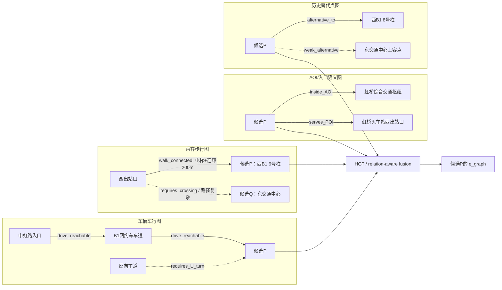
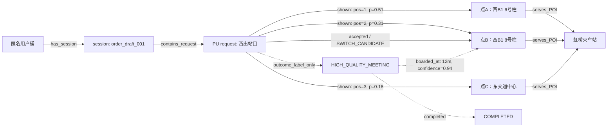
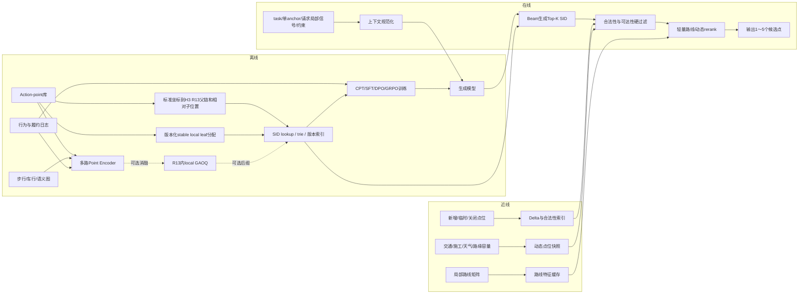

# 地图上下车点生成式推荐：完整实验、训练样本与在线推理方案

> 版本：2026-07-24（按“起点/终点为两次独立、发单前且司机未分配的推荐请求”校正）
>
> 范围：用户选择起点后触发一次上车点推荐，选择终点后另触发一次下车点推荐；两次请求都发生在发单前，彼此不联合建模。
>
> 本文不把已分配司机状态、派单后改点、行程中改点、拼车匹配和运力调度并入生成模型主任务；订单后的司机轨迹与履约结果只可作为延迟监督标签。
>
> 本文沿用《地图 POI 生成式搜索》文档的分析框架，覆盖任务定义、相关工作、开源基座、点位 Encoder、SID、CPT、SFT、RL、样本构造、loss/reward、分期实验和 200～300ms 在线推理。
>
> 文中标为“建议”的数据规模、loss 权重和延迟拆分均是实验起点，不是论文公开结论。

---

## 0. 阅读约定

本文用三种标签区分信息来源：

- **[论文事实]**：论文或官方模型卡已经描述、验证的做法。
- **[点位迁移]**：基于论文方法，针对地图上下车点推荐提出的设计。
- **[待消融]**：不能直接假定有效，必须通过对照实验验证。

核心符号：

- `τ`：当前独立请求的类型，`τ ∈ {PU, DO}`。
- `a`：当前请求唯一的已选 anchor；PU 请求中是已选起点，DO 请求中是已选终点。
- `g_τ`：当前请求可用的乘客定位信号；PU 通常使用，DO 通常为空或只保留与终点局部定位有关的信号。
- `r`：一次点位推荐请求。
- `u`：候选 action-point。
- `c_τ`：由 `(τ, a, g_τ, t, w, b, h)` 和请求时可见的道路/点位状态组成的在线上下文。
- `y_post`：订单发出、司机分配及履约后产生的轨迹、等待、沟通和完成结果，只用于标签、reward 或离线评估。
- `t`：时间、日期、节假日。
- `w`：天气和可见度。
- `h`：当前 session 和用户显式授权使用的短期历史。
- `b`：乘客步行、无障碍、行李等显式约束。
- `A⁺(c)`：上下文 `c` 下可接受的多正确点位集合。

本文不把 action-point 简化为一个经纬度。建议定义：

```text
action_point =
  physical_point
  × action_type(pickup/dropoff)
  × road_side
  × vehicle_heading_or_access
  × floor_or_vertical_level
  × pedestrian_access
```

生成模型的目标是：

```math
P_\theta(\mathrm{SID}_\tau(u)\mid \tau,a,g_\tau,t,w,b,h)
```

对应两次互不依赖的调用：

```text
选择起点：r_PU=(PU, selected_origin, pickup_local_context) → pickup SID
选择终点：r_DO=(DO, selected_destination, dropoff_local_context) → dropoff SID
```

主任务中不提供另一端点、`stage` 或已分配司机 `d`。因为两类请求均为发单前，`stage` 是常量；司机尚未分配，`d` 不存在。即使订单完成后的司机轨迹可用于训练标签，也不得泄漏到请求时输入。

---

# 1. 方案覆盖检查

| 讨论项 | 是否覆盖 | 本文位置 | 说明 |
|---|---:|---|---|
| 上下车点任务定义及与 POI 搜索的差异 | 是 | 第2节 | 从“找实体”转为“多主体、多约束的会合点决策” |
| 传统上下车点推荐研究 | 是 | 第3节 | 覆盖步行、绕行、方向、交通、容量和全局协调 |
| 快手九篇生成式搜推方法迁移 | 是 | 第3节 | OneRec 至 OneRetrieval |
| 开源基座模型 | 是 | 第5节 | Qwen3.5-2B-Base 主模型，Qwen3-1.7B-Base 对照 |
| 点位候选库和 action-point 定义 | 是 | 第4、7节 | 操作类型、道路侧向、楼层和接入方向均进入点位定义 |
| Text/Geo/Graph/Behavior/Visual Encoder | 是 | 第6节 | 静态点位与动态上下文分离 |
| Qwen Embedding、FAMAE、Q-Former | 是 | 第6节 | 分别承担文本、字段行为和变长多模态融合 |
| 上下车点 SID | 是 | 第7节 | Action namespace + H3 地理层级前缀 + stable local leaf；GAOQ 仅作局部后缀消融 |
| CPT 样本构造与示例 | 是 | 第8节 | 共22类 |
| SFT 样本构造与示例 | 是 | 第9节 | 共25类 |
| RL/DPO/GRPO 样本构造与示例 | 是 | 第10节 | 共23类 |
| CPT/SFT/RL loss | 是 | 第8～10节 | NTP、MML、KD、DPO、GRPO、prefix credit |
| 地图点位 reward | 是 | 第10节 | 乘客、通用车辆可达、会合、路缘和业务目标；履约数据仅作延迟反馈 |
| 分期实验和训练量 | 是 | 第11节 | 从点位库审计到 Shadow/A-B |
| 在线 Prompt 与 200～300ms 架构 | 是 | 第12节 | 无在线 CoT，固定长度 SID，Top-K 来自 beam |
| 风险、指标和上线护栏 | 是 | 第13节 | 安全、法规、容量、反馈偏差和 SID churn |

---

# 2. 任务定义与总体结论

## 2.1 第一版推荐主线

1. 构建经过地图、道路法规和运营审核的 action-point 库，不生成任意经纬度。
2. 用文本、结构、精确空间、步行图、车行图、视觉和行为多路 Encoder 得到静态点位表征。
3. 使用 `<PU/DO> + R5 cell + R5→R9相对子网格序号 + R9→R13相对子网格序号 + stable local leaf` 构造固定长度 SID。
4. 请求时可见的交通、施工、路缘拥挤和天气只作为生成上下文与 rerank 特征，不写入稳定 SID。
5. 依次进行 SID token warm-up、CPT、多阶段 SFT、高置信 DPO，最后才实验 on-policy GRPO/TPMA。
6. 线上每条 beam 只生成一个合法点位 SID；Top-K 来自并行 beam，不串行生成自然语言解释。
7. 模型输出后必须经过合法性、可达性、步行预算、道路侧向和动态关闭硬过滤，再做轻量路线重排。
8. 第一阶段保留现有规则/LambdaMART/DeepFM/图模型作为 fallback 和并行候选源。

## 2.2 两类独立的发单前请求

### 请求A：选起点后推荐上车点

```text
task=<TASK_PU>
anchor=用户刚选择的起点
request-local context=用户GPS及精度、起点内语义位置、时间/天气、显式约束、短期历史
output=<PU> namespace 内的一个或多个 pickup SID
```

此时不读取终点，也没有已分配司机。目标是从起点周边选择合法、乘客可达、通用车辆可达、醒目且历史会合表现好的上车点。

### 请求B：选终点后推荐下车点

```text
task=<TASK_DO>
anchor=用户刚选择的终点
request-local context=终点入口/子区域、时间/天气、显式约束、短期历史
output=<DO> namespace 内的一个或多个 dropoff SID
```

此时不读取起点，也没有已分配司机。目标是选择服务正确入口、下车合法安全、下车后步行成本低且易识别的下车点。

两类请求可共享 backbone、点位 Encoder、H3 child-position token embedding 和部分索引结构，但 local leaf 表、训练记录、合法 mask、reward 权重、缓存 key 和线上指标必须按 `τ` 分开。当前实验不做完整 OD 条件化、上下车点联合生成或派单后重推荐。

## 2.3 与 POI 搜索的根本差异

| POI生成式搜索 | 上下车点生成式推荐 |
|---|---|
| query 决定目标实体 | 可能没有 query，主要依赖结构化上下文 |
| 相关性和实体正确性优先 | 合法、可达、安全和司乘会合成功优先 |
| POI 通常相对稳定 | 点位合法性和可用性具有明显时变性 |
| 用户是主要决策主体 | 乘客、司机、平台和道路系统共同受影响 |
| 点击/导航可作为较快反馈 | 真正标签要等到接到/送达，反馈延迟且有删失 |
| 位置近通常是相关性信号 | 直线近可能在道路对面、不同楼层或不可停车 |
| 一个 POI 可有多个正确结果 | 一个 anchor 周边常有多个近似等价点位 |

点位优化优先级建议：

```text
SID合法、点位有效
→ 操作类型正确
→ 乘客和车辆均可达
→ 法规、安全、道路侧向、楼层正确
→ 满足显式步行/无障碍约束
→ 降低司乘会合失败和等待
→ 降低点位本身的通用车辆驶入/驶出复杂度
→ 优化履约、体验和路缘系统外部性
```

## 2.4 上车点与下车点不应混为一个任务

### 上车点主要矛盾

- 乘客从当前真实位置走到点位。
- 司机尚未分配，因此只能评估点位的静态/历史车辆可达性，不能使用某位司机的实时位置或朝向。
- 需要减少未来可能发生的电话、聊天、找车、过街和等待；这些是订单后的监督信号，不是线上输入。
- 机场、车站、商场等场景存在指定网约车区和楼层。

### 下车点主要矛盾

- 点位是否服务正确入口或建筑区域。
- 下车后步行到最终 anchor 的成本。
- 是否可安全停车、开门和携带行李。
- 单行路、隔离带、道路侧向和通用车辆驶入/驶出是否合理。
- 本期只处理选终点后的发单前推荐，不处理行程中动态调整。

建议共享 backbone 和静态点位 Encoder，但使用：

```text
<PU> 与 <DO> task token
独立合法性 mask
独立 reward 权重
独立核心评估切片
```

这里的“共享”是参数共享，不是把一次订单的起点和终点拼成一个联合输入。

## 2.5 “生成式”不等于生成坐标

第一版严禁模型直接生成浮点经纬度，原因包括：

- 任意坐标可能落在道路中央、隔离带、私有区域或不同楼层。
- 无法保证车辆停靠合法性和乘客步行可达性。
- 坐标小误差可能改变道路侧向或入口。
- 无法稳定做版本、下线、运营干预和安全审计。

生成目标必须是经过审核、可索引、可版本化的 SID。连续坐标生成只可作为离线候选发现工具，发现后仍需地图吸附、法规校验和入库。

## 2.6 必须保留的传统强基线

生成式模型必须在相同候选库和相同动态特征下比较：

```text
最近合法点位
最近入口/最近道路侧
多目标规则打分
Fuzzy-AHP/MPLRec式打分
LambdaMART
DeepFM/DCN
Two-Tower + ANN
GraphSAGE/HGT + ranker
路线成本Oracle
现网点位推荐MCA
```

如果生成模型只是在候选库更好或特征更多时获胜，不能归因于生成式建模。

---

# 3. 相关研究与生成式搜推方法迁移

## 3.1 上下车点推荐研究给出的约束

| 工作 | 主要方法/事实 | 对本方案的启示 |
|---|---|---|
| [A Pick-Up Points Recommendation System for Ridesourcing Service](https://www.mdpi.com/2071-1050/11/4/1097) | 从可接受步行范围筛选历史热点，再用 Fuzzy-AHP 综合兼容性、可达性和交通协调因素 | 候选点不是纯距离问题；道路环境和交通管理必须进入硬约束或 reward |
| [Pick-Up Point Recommendation Using Users’ Historical Orders](https://doi.org/10.1007/978-3-031-19214-2_33) | 用 DBSCAN 聚类用户历史订单，利用通勤规律做个性化 | 用户习惯点有价值，但只能在合法和当前可用的候选中起次级作用 |
| [MPLRec](https://doi.org/10.1109/TMC.2022.3208566) | 在道路网络上生成潜在上车点；按 Geohash 检索；使用步行距离、时间和方向条件化热度、预计车费等特征；用仿真评估 | 目的地方向、道路图和历史轨迹是核心；生成模型后仍需路线与动态 scorer |
| [Flexible PUDO](https://doi.org/10.1016/j.trd.2024.104064) | 允许短距离步行，通过两阶段启发式减少绕行与拥堵；在成都数据上分析首尾段效率 | reward 要同时覆盖乘客步行、车辆绕行、拥堵和环境外部性 |
| [Online Ridesharing with Meeting Points](https://arxiv.org/abs/2209.10892) | 离线选择 meeting-point candidates，构建 HMPO graph 和 k-skip cover，加速在线匹配 | 候选点库和图预计算是线上低延迟的基础；生成不应取代全局匹配 |
| [Dynamic Pick-up Point Recommendation](https://doi.org/10.1016/j.knosys.2025.114543) | 同时考虑步行、等待、交通和车费；点位评分后用自适应 Kuhn-Munkres 做全局匹配 | 点位个体效用与系统容量协调是两个阶段 |
| [Capacity-Aware Dynamic PUP Recommendation](https://papers.ssrn.com/abstract=6592901) | pair-level operational score 与动态路缘容量协调分离 | 生成模型适合产生/评分候选，容量分配应由后置优化器完成 |

表中的目的地方向、预计车费、已分配车辆或全局匹配是相关工作的设定，不是本产品协议。当前迁移只保留单 anchor 下可用的道路/入口知识、点位通用车辆可达性，以及订单后的结果监督；不能因为论文使用过某字段，就把另一端点或司机状态加入线上输入。MPLRec 式基线也必须裁剪到与生成模型相同的单 anchor 特征集合后再比较。

这些研究不能直接证明生成式推荐有效，但共同约束了正确问题定义：

```text
先保证候选可行
再优化单请求效用
最后处理多请求容量和全局协调
```

## 3.2 快手九篇生成式搜推方法迁移

| 工作 | 核心训练方式 | 上下车点迁移 |
|---|---|---|
| [OneRec](https://arxiv.org/html/2502.18965) | Balanced K-Means SID；session NTP；Reward Model 对 beam 排序；self-hard DPO；IPA | 用模型 beam 产生同一 AOI 内“道路对面、错楼层、错操作类型”等困难点位；高低 reward 组成 DPO |
| [OneRec-V2](https://arxiv.org/html/2508.20900) | Lazy Decoder-Only；真实反馈 RL；duration-aware reward；GBPO；强调 on-policy | 使用本模型真实展现后的接受、改点、接驾成功和等待反馈；对会合耗时做条件化归一化 |
| [OneRec-Think](https://arxiv.org/html/2510.11639) | Itemic token 与自然语言对齐；rationale 数据；Rollout-Beam+GRPO | 教师读取长地图事实生成结构化点位理由，学生线上只生成 SID；不输出自然语言 CoT |
| [OpenOneRec](https://arxiv.org/abs/2512.24762) / [官方仓库](https://github.com/Kuaishou-OneRec/OpenOneRec) | Itemic-Text Alignment→Co-Pretrain→多任务 SFT→蒸馏→Rec-GRPO | SID token warm-up、点位/道路 CPT、多任务 SFT、通用知识保持和最终 GRPO 分阶段进行 |
| [OneLoc](https://arxiv.org/html/2508.14646) | Geo-aware SID；邻域 prompt；地理和业务 reward；DPO | 最接近本任务，但不能只用距离；需替换为步行图、车行图、道路侧向和操作合法性 reward |
| [OneSearch](https://arxiv.org/html/2509.03236) | query/item 表征协同；RQ-KMeans+OPQ；多阶段 SFT；RM+listwise DPO+真实行为 | 构造 context/action-point 协同空间；从静态 grounding 到在线同构输入，再到多点位 listwise 训练 |
| [OneSearch-V2](https://arxiv.org/html/2603.24422) | 教师侧关键词推理；学生看原输入；CE+KL 自蒸馏；TPMA-GRPO | 教师将复杂道路事实压缩为结构化意图，学生输入紧凑上下文；主方案按确定性 H3 prefix 和 local leaf 做 token credit，local GAOQ 只作消融 |
| [OneReason](https://arxiv.org/abs/2606.06260) | token/item/relation/user 多粒度预训练；认知 SFT；多域 RL 统一 | 对应点位 token、点位属性、步行/车行图关系、用户出行习惯和最终点位决策 |
| [OneRetrieval](https://arxiv.org/html/2606.13533) | 属性↔slot、文本↔SID、协同共现、reserved-slot self-routing | 支持临时接送区、新增出入口和大型活动运营点位；仍需 delta 索引与审核 |

## 3.3 五个必须校正的认识

### 校正一：OneLoc 的“距离近”不能直接成为点位通用 reward

道路对面 20m 的点可能需要步行绕行 500m；车辆直线近也可能要掉头 1.5km。必须使用步行路线、车行路线、道路侧向和楼层。

### 校正二：OneSearch-V2 不支持线上长 CoT

复杂点位推理应发生在离线教师侧：

```text
Teacher input = 完整道路、步行、视觉、动态事实
Student input = 线上紧凑结构化上下文
Target = 同一个点位SID
Loss = CE + token-level KL + 稳定性正则
```

### 校正三：动态状态不能进入 SID 地理前缀或 local leaf

H3 地理前缀只从 action-point 库中的标准代表坐标生成，不能使用用户 GPS。交通速度、天气、拥挤或司机位置既不能改变 H3 prefix，也不能参与 stable local leaf 分配；它们只进入请求上下文和 reranker。

### 校正四：生成候选与全局协调是两层问题

单请求生成模型可以输出 Top-K 点位及效用分数，但高峰期同一上客区的容量分配、司机匹配和排队需要后置优化器处理。

### 校正五：日志中“用户接受”不等于成功会合

用户点击默认点可能只是没有修改；真正强标签来自实际上车/下车位置、等待、沟通、取消原因和履约。

---

# 4. 数据、标签、候选库与评估集

## 4.1 点位主数据

建议区分 physical point 和 action-point：

```json
{
  "physical_point_id": "pp_hongqiao_west_b1_zone6",
  "action_point_id": "ap_hongqiao_west_b1_zone6_pickup",
  "action_type": "pickup",
  "name": "虹桥火车站西交通中心网约车上客区6号柱",
  "aliases": ["西交B1网约车区6号柱"],
  "lat": 31.196,
  "lon": 121.315,
  "level": "B1",
  "road_segment_id": "road_7821",
  "road_side": "right",
  "heading_range": [170, 250],
  "parent_aoi": "虹桥综合交通枢纽",
  "serves_pois": ["虹桥火车站"],
  "pedestrian_anchors": ["西出站口", "西交通中心电梯"],
  "vehicle_entries": ["申虹路入口"],
  "point_type": "designated_ride_hailing_zone",
  "pickup_legal": true,
  "dropoff_legal": false,
  "wheelchair_accessible": true,
  "shelter": true,
  "lighting": "good",
  "signage": ["网约车", "6号柱"],
  "status": "active",
  "version": 17,
  "sid_fields": {
    "sid_version": "sid_v4",
    "h3_library_version": "<pinned_build_version>",
    "r5_dictionary_version": "r5_dict_v1",
    "leaf_table_version": "leaf_table_v18",
    "canonical_lat": 31.196,
    "canonical_lon": 121.315,
    "r5_cell": "<computed_r5_cell>",
    "r9_cell": "<computed_r9_cell>",
    "r13_cell": "<computed_r13_cell>",
    "r5_token": "<r5_0187>",
    "child_5_to_9_pos": 782,
    "child_9_to_13_pos": 1140,
    "local_leaf": 3
  }
}
```

`sid_fields` 中的数值仅示意字段结构。生产数据必须先由标准代表坐标计算 R13 cell，再使用 H3 `cellToParent` 和 `cellToChildPos` 派生父 cell 与相对子网格序号，不能分别从经纬度独立计算 R5/R9/R13 后拼接。

## 4.2 地图与图数据

至少维护两张有向图和一张语义关系图：

```text
PedestrianGraph：
  entrance, elevator, stair, escalator, crosswalk, indoor corridor,
  barrier, slope, wheelchair_access, security_gate

VehicleGraph：
  directed road, turn restriction, U-turn, lane, curb, stop legality,
  road side, heading, height limit, private access

SemanticGraph：
  action_point —serves→ POI/AOI
  action_point —near_landmark→ signage/column/gate
  action_point —same_physical_point→ other action type
  action_point —alternative_to→ nearby point
```

直线距离只能作为辅助特征，不能代替上述图。

## 4.3 动态快照

动态信息不进入稳定 SID：

```json
{
  "snapshot_time": "2026-07-21T18:20:00+08:00",
  "action_point_id": "ap_hongqiao_west_b1_zone6_pickup",
  "traffic_speed_bucket": "slow",
  "curb_occupancy": 0.82,
  "queue_estimate": 9,
  "temporary_closure": false,
  "construction_nearby": false,
  "weather": "heavy_rain",
  "visibility": "medium",
  "supply_density": 0.63
}
```

## 4.4 行为与履约日志

日志建议明确分成四段：

```text
request_context：推荐发生前可见，可作为当前请求模型输入
exposure：模型/策略实际展现的候选及曝光概率
interaction：用户在发单前对候选的选择、切换或拖点行为
post_order_outcome：发单、分配司机及履约后才产生，只能作为延迟标签
```

### 4.4.1 选起点后的上车点推荐日志

```json
{
  "request_id": "pudo_req_pu_001",
  "session_id": "order_draft_001",
  "request_type": "PU",
  "request_ts": "2026-07-24T18:20:00+08:00",
  "feature_cutoff": "before_order_submit",
  "request_context": {
    "selected_anchor": {
      "anchor_id": "poi_hongqiao_station",
      "name": "虹桥火车站",
      "anchor_type": "POI"
    },
    "user_location": {
      "lat": 31.197,
      "lon": 121.314,
      "accuracy_m": 45,
      "semantic_subarea": "西出站口"
    },
    "time_bucket": "weekday_evening_peak",
    "weather": "heavy_rain",
    "explicit_constraints": {
      "walk_budget_m": 300,
      "wheelchair_accessible": false,
      "large_luggage": true
    }
  },
  "exposure": {
    "policy_version": "pudo_gen_v3",
    "sid_version": "sid_v4",
    "sid_catalog_version": "pudo_sid_catalog_v18",
    "h3_library_version": "<pinned_build_version>",
    "r5_dictionary_version": "r5_dict_v1",
    "leaf_table_version": "leaf_table_v18",
    "candidates": [
      {
        "point_id": "ap_hongqiao_west_b1_zone6_pickup",
        "position": 1,
        "exposure_propensity": 0.51
      },
      {
        "point_id": "ap_hongqiao_west_b1_zone8_pickup",
        "position": 2,
        "exposure_propensity": 0.31
      },
      {
        "point_id": "ap_hongqiao_east_b1_pickup",
        "position": 3,
        "exposure_propensity": 0.18
      }
    ]
  },
  "interaction": {
    "default_point": "ap_hongqiao_west_b1_zone6_pickup",
    "accepted_point": "ap_hongqiao_west_b1_zone8_pickup",
    "selection_action": "SWITCH_CANDIDATE",
    "manual_drag": false,
    "decision_latency_ms": 1800
  },
  "post_order_outcome": {
    "outcome_available_ts": "2026-07-24T18:38:00+08:00",
    "actual_board_point": "ap_hongqiao_west_b1_zone8_pickup",
    "actual_board_match_distance_m": 12,
    "actual_point_match_confidence": 0.94,
    "rider_walk_s": 260,
    "assigned_driver_approach_s": 310,
    "assigned_driver_detour_s": 45,
    "rider_wait_s": 70,
    "driver_wait_s": 35,
    "call_count": 0,
    "chat_count": 0,
    "wrong_point_feedback": false,
    "point_related_complaint": false,
    "completed": true,
    "cancel_reason": null
  }
}
```

### 4.4.2 选终点后的下车点推荐日志

```json
{
  "request_id": "pudo_req_do_001",
  "session_id": "order_draft_001",
  "request_type": "DO",
  "request_ts": "2026-07-24T18:21:10+08:00",
  "feature_cutoff": "before_order_submit",
  "request_context": {
    "selected_anchor": {
      "anchor_id": "poi_shanghai_childrens_medical_center",
      "name": "上海儿童医学中心",
      "anchor_type": "POI"
    },
    "destination_subarea": "急诊入口",
    "time_bucket": "weekday_evening_peak",
    "weather": "heavy_rain",
    "explicit_constraints": {
      "post_walk_budget_m": 200,
      "wheelchair_accessible": true,
      "large_luggage": false
    }
  },
  "exposure": {
    "policy_version": "pudo_gen_v3",
    "sid_version": "sid_v4",
    "sid_catalog_version": "pudo_sid_catalog_v18",
    "h3_library_version": "<pinned_build_version>",
    "r5_dictionary_version": "r5_dict_v1",
    "leaf_table_version": "leaf_table_v18",
    "candidates": [
      {
        "point_id": "ap_scmc_emergency_night_dropoff",
        "position": 1,
        "exposure_propensity": 0.58
      },
      {
        "point_id": "ap_scmc_outpatient_south_dropoff",
        "position": 2,
        "exposure_propensity": 0.27
      },
      {
        "point_id": "ap_scmc_main_gate_dropoff",
        "position": 3,
        "exposure_propensity": 0.15
      }
    ]
  },
  "interaction": {
    "default_point": "ap_scmc_emergency_night_dropoff",
    "accepted_point": "ap_scmc_emergency_night_dropoff",
    "selection_action": "KEEP_DEFAULT",
    "manual_drag": false,
    "decision_latency_ms": 620
  },
  "post_order_outcome": {
    "outcome_available_ts": "2026-07-24T19:12:00+08:00",
    "actual_alight_point": "ap_scmc_emergency_night_dropoff",
    "actual_alight_match_distance_m": 9,
    "actual_point_match_confidence": 0.97,
    "post_dropoff_walk_s": 95,
    "destination_entrance_reached": true,
    "assigned_driver_dropoff_detour_s": 30,
    "stop_duration_s": 28,
    "unsafe_door_open_event": false,
    "destination_renavigation_count": 0,
    "wrong_point_feedback": false,
    "point_related_complaint": false,
    "completed": true,
    "cancel_reason": null
  }
}
```

两个请求可以使用同一个 `session_id` 做离线串联和数据质检，但 PU 样本不能读取已选终点，DO 样本也不能读取已选起点。`post_order_outcome` 在结果尚未产生时应为 `null` 或不落字段，只能在 feature cutoff 之后追加，用于标签、reward 和离线评估，不能回填为当前请求模型输入。

推荐统一记录以下行为枚举和归因字段：

```text
selection_action：
  KEEP_DEFAULT
  SWITCH_CANDIDATE
  MANUAL_DRAG
  NO_SELECTION

outcome attribution：
  actual point地图匹配结果与置信度
  乘客/车辆轨迹与事件时间窗
  “位置不对”、安全和交通投诉
  接驾路线重算、等待和沟通次数
  终点入口二次导航
  点位相关取消与非点位取消的拆分
```

## 4.5 候选点库构建

候选来源：

1. 官方/运营指定接送区。
2. POI/AOI 入口、出口、门、停车区和落客区。
3. 道路合法路缘的稳定 anchor。
4. 历史真实上下车点经地图匹配和聚类得到的稳定簇。
5. 大型活动、施工和新交通设施产生的临时运营点。

候选发现流程：

```text
历史轨迹/GPS聚类
→ 吸附到车行与步行图
→ 按道路侧向、楼层和操作类型拆分
→ 法规/安全/私有区域过滤
→ 最小会合样本和稳定性过滤
→ 人工或运营抽检
→ action-point入库和版本化
```

不能把隔离带两侧、地面与地下、不同航站楼或不同道路方向的点聚成一个簇。

步行候选半径不应全局固定为 500m。建议按以下条件设预算：

```text
用户显式设置
普通街区/大型枢纽
pickup/dropoff
天气和昼夜
无障碍/行李
短途订单
城市密度
```

## 4.6 标签层级

建议把行为分为：

| 层级 | 例子 | 标签强度 |
|---|---|---:|
| 履约成功 | 实际在推荐点附近完成上下车，低等待、无位置投诉 | 最强正例 |
| 会合成功 | actual point 与推荐 action-point 匹配 | 强正例 |
| 用户接受 | 点击候选或保留默认点 | 中等正例 |
| 轻交互 | 查看说明、展开地图 | 弱正例 |
| 未选择 | 曝光但未点击 | 未知，不是强负例 |
| 明确改点 | 接受后手动拖离、切换其他点 | 条件负例 |
| 位置失败 | “找不到/位置不对”、多次通话、错楼层 | 强负例 |
| 非点位取消 | 用户改计划、司机拒单、价格原因 | 不作为点位负例 |

可构造连续会合质量：

```math
Q_{\mathrm{meet}}=f(D_{\mathrm{actual}},T_{\mathrm{riderWait}},T_{\mathrm{driverWait}},N_{\mathrm{contact}},I_{\mathrm{wrongPoint}})
```

其中各项需按城市、场景和 action type 校准，不能直接使用一套固定阈值。

## 4.7 数据清洗和标签对齐

- GPS 先做轨迹级地图匹配，不按单点最近道路吸附。
- actual boarding/alighting 需结合车辆低速/停车、开关门或订单事件窗口。
- 高楼、地下、枢纽使用楼层和室内图；经纬度相同不代表同一点位。
- 把乘客和司机轨迹时钟对齐，处理设备时间漂移。
- 过滤明显 GPS 飘点，但保留“定位精度差”作为模型输入。
- 取消原因必须拆分，不将供给、价格或用户改计划归因于点位。
- 只使用决策时刻已经可见的特征，避免未来交通、最终路线和履约结果泄漏。

## 4.8 数据切分

主切分采用时间切分：

```text
train：较早时间
validation：后续连续时间窗
test：最新连续时间窗
```

额外构造：

```text
new-point cold start
new-AOI cold start
new-user cold start
policy-version holdout
festival/event holdout
heavy-rain/night holdout
cross-city holdout
request-schema/version holdout
```

同一物理点的 pickup/dropoff sibling、同一发单 session 的两次独立请求、同一订单和相邻轨迹片段不得跨集合泄漏。

## 4.9 必备评估切片

```text
pickup request / dropoff request
PU有用户GPS / PU弱GPS / DO无当前GPS
单anchor请求 / anchor子区域明确 / anchor子区域缺失
普通街道 / 小区 / 商场 / 医院 / 校园
机场 / 火车站 / 大型会展 / 体育场
单行路 / 隔离带 / 高架 / 地下 / 多楼层
道路同侧 / 道路对面
定位准确 / GPS弱 / 室内定位
晴天 / 雨雪 / 夜间
普通步行 / 显式无障碍 / 大件行李
头部点 / 长尾点 / 新增点 / 临时点
低拥挤 / 高拥挤 / 容量受限
短途 / 长途
熟悉用户 / 新用户
```

---

# 5. 开源基座模型选择

## 5.1 推荐模型

| 角色 | 模型 | 用法 |
|---|---|---|
| 主生成模型 | [Qwen3.5-2B-Base](https://huggingface.co/Qwen/Qwen3.5-2B-Base) | 从 Base 做 SID warm-up、CPT、SFT、RL |
| 稳定对照 | [Qwen3-1.7B-Base](https://qwenlm.github.io/blog/qwen3/) | 标准架构和成熟训练栈对照 |
| 文本 Encoder | [Qwen3-Embedding-0.6B](https://huggingface.co/Qwen/Qwen3-Embedding-0.6B) | 编码点位名、地标、入口、说明和 AOI |
| 离线教师 | 7B～32B 指令/推理模型 | 生成结构化点位理由、困难反事实和标签校验 |
| 线上蒸馏模型 | 0.8B～2B 候选 | 主方案成立后再做延迟/成本蒸馏 |

## 5.2 为什么从 Base 开始

- 需要新增大量点位 SID token。
- CPT 要学习道路、步行、点位行为和 Itemic token。
- 指令模型的对话偏好不是主任务所需。
- 线上只需短上下文到短 SID，不需要开放式回答。

Post-trained 大模型主要作为离线教师，不进入 200～300ms 主链路。

## 5.3 输入 token 设计

建议把高频结构字段离散为紧凑 token：

```text
<TASK_PU>/<TASK_DO>
<ANCHOR_POI>/<ANCHOR_AOI>/<ANCHOR_GPS>
<SEMANTIC_SUBAREA_KNOWN>/<SEMANTIC_SUBAREA_UNKNOWN>
<GPS_ACC_0_10>/<GPS_ACC_10_50>/<GPS_ACC_50_PLUS>
<WALK_BUDGET_0_100>/<...>
<RAIN>/<NIGHT>/<ACCESSIBLE>
<TRAFFIC_SLOW>/<CURB_BUSY>
<SID_V4>
```

连续变量优先做业务可解释分桶，并保留少量归一化数值特征供 context projector 使用。

---

# 6. Action-Point Encoder、FAMAE、Q-Former 与融合

## 6.1 静态点位表征

```math
e_{\mathrm{text}}=\mathrm{QwenEmbedding}(\mathrm{name},\mathrm{alias},\mathrm{landmark},\mathrm{instruction},\mathrm{AOI})
```

```math
e_{\mathrm{struct}}=\mathrm{Embedding}(\mathrm{type},\mathrm{action},\mathrm{level},\mathrm{legality},\mathrm{facility})
```

```math
e_{\mathrm{geo}}=\mathrm{GeoRoadEncoder}(\mathrm{lat},\mathrm{lon},\mathrm{grid},\mathrm{roadSide},\mathrm{heading})
```

```math
e_{\mathrm{graph}}=\mathrm{GraphEncoder}(\mathrm{pedestrianGraph},\mathrm{vehicleGraph},\mathrm{AOI})
```

```math
e_{\mathrm{visual}}=\mathrm{VisualEncoder}(\mathrm{mapPatch},\mathrm{streetView},\mathrm{signage})
```

```math
e_{\mathrm{behavior}}=\mathrm{BehaviorEncoder}(\mathrm{requestPointOutcomeGraph})
```

最终静态表征：

```math
z_{\mathrm{point}}=\mathrm{LayerNorm}(\sum_k g_kW_ke_k)
```

## 6.2 Text Encoder

Qwen3-Embedding 可以作为点位文本强基线，输入：

```text
点位名称和别名
服务POI/AOI
入口/出口/柱号
面向乘客的步行说明
面向司机的驶入说明
图像/VLM离线描述
```

正负例：

```text
正例：
  虹桥西交通中心B1网约车区6号柱
  ↔ 西出站口下楼到B1网约车上客区

困难负例：
  ↔ 虹桥东交通中心网约车区
  ↔ 西交通中心地面出租车上客点
  ↔ 同经纬度附近B2停车区
```

纯文本 embedding 不能单独承担精确道路侧向、可停车性、步行可达和历史会合质量。

## 6.3 GeoRoadEncoder

输入建议：

```text
sin/cos(latitude, longitude)
multi-frequency Fourier features
H3/S2/GeoHash 多尺度 cell
road segment embedding
road side and direction
heading interval
level/elevation
turn restriction
curb type and stop legality
static approach/departure route statistics
```

训练任务：

```text
same_road_side classification
heading compatibility
turn/U-turn relation
walk/drive route-time bucket
same-level classification
legal pickup/dropoff prediction
```

## 6.4 Multi-Graph Encoder

推荐使用 HGT、GraphSAGE 或轻量 relation-aware Transformer，同时编码：

```text
乘客步行图
车辆车行图
AOI/入口语义图
历史替代点图
```

边类型包括：

```text
walk_connected
drive_reachable
same_road_side
requires_crossing
requires_U_turn
inside_AOI
serves_POI
same_physical_point
alternative_to
```

### 6.4.1 示例：虹桥西出站口上车点的四张子图

假设当前独立请求为：

```text
task=<TASK_PU>
selected_anchor=虹桥火车站
semantic_subarea=西出站口
candidate_P=西交通中心B1网约车区6号柱
candidate_Q=东交通中心网约车区
```

同一个候选点 `P` 在四张图中有不同的邻居和关系：



每张子图先独立聚合，再做关系感知融合：

```math
h_g(u)=\mathrm{GNN}_g\left(u,\mathcal{N}_g(u),\mathcal{R}_g\right)
```

```math
e_{\mathrm{graph}}(u)=\mathrm{LayerNorm}\left(\sum_{g\in\{\mathrm{ped},\mathrm{veh},\mathrm{sem},\mathrm{alt}\}}\alpha_gW_gh_g(u)\right)
```

这个例子中：

- 步行图说明 `P` 与西出站口连通，`Q` 的路径更复杂。
- 车行图说明 `P` 可从合法车道驶入，但某些反向来路需要掉头；这是点位的通用路网属性，不是当前司机状态。
- 语义图说明 `P` 确实服务西出站口，而不是只与火车站主体坐标接近。
- 替代点图保留 6 号柱与 8 号柱的可替代性，支持多正例与故障降级。

动态拥挤、临时关闭和天气不写入上述稳定图 embedding，而在请求上下文或后置 reranker 中处理。

## 6.5 BehaviorEncoder

构建异构图：

```text
request/context node
user/session node
post-order outcome bucket node
action-point node
AOI/POI node
```

边：

```text
shown
accepted
kept_default
manually_moved_to
boarded_at
alighted_at
wrong_point
called_before_meeting
completed
```

可使用 Two-Tower、LightGCN、HGT 或时序 Transformer。必须做时间衰减和曝光 propensity 修正。

### 6.5.1 示例：一次 PU 请求形成的行为异构图

沿用第 4.4 节的 `pudo_req_pu_001`：



对应的核心边记录可以写成：

```text
(request_pu_001, shown{position=1, propensity=0.51}, point_A)
(request_pu_001, shown{position=2, propensity=0.31}, point_B)
(request_pu_001, accepted, point_B)
(outcome_pu_001, boarded_at{distance=12m, confidence=0.94}, point_B)
(request_pu_001, has_outcome, HIGH_QUALITY_MEETING)
```

训练时的使用方式：

1. `point_B` 是接受且实际上车匹配的强正例。
2. `point_A` 只是曝光未选，默认是未知样本，不能直接当强负例。
3. `point_C` 只有在存在过街、错侧或明确失败证据时才构造负例。
4. `shown` 边携带 position 和 propensity，用于 IPS/SNIPS 或采样校正。
5. outcome 虚线边发生在发单和履约之后，只能作为监督目标；生成当前请求 embedding 时必须按时间截断，禁止沿这些边回传未来信息。

DO 请求必须新建独立的 request node，使用 `alighted_at`、下车后步行和入口到达结果；不能把同一 session 中 PU 请求的已选起点或 `boarded_at` 边拼入 DO 在线输入。

## 6.6 FAMAE 的作用

FAMAE 不替代 Qwen embedding，而是补充字段和行为可预测性：

```text
mask action_type → 从法规、道路和行为恢复
mask road_side → 从车行图和轨迹恢复
mask level → 从入口、视觉和历史会合恢复
mask serves_POI → 从地标和行为恢复
mask accessibility → 从设施关系恢复
```

这类训练让点位 embedding 更适合 context–point 检索、local leaf 辅助任务和可选的 local GAOQ 后缀，而不仅是文本相似。主方案的 H3 地理前缀不由 embedding 量化得到。

## 6.7 Q-Former 何时使用

固定向量融合优先用 gated MLP。只有输入包含变长 token 时再实验 Q-Former：

```text
多张底图/街景patch
多个入口和步行路径节点
多个车行邻居和转向
多条历史会合轨迹
多条视觉地标描述
```

用 8～16 个 learnable queries cross-attend 到多模态 token，输出固定数量 latent。

## 6.8 静态点位与动态上下文分离

```math
z_{\mathrm{static}}=f_{\mathrm{point}}(\mathrm{stablePointFields})
```

```math
z_{\mathrm{context}}=f_{\mathrm{ctx}}(\tau,a,g_\tau,t,w,b,h,\mathrm{traffic},\mathrm{capacity})
```

主方案的 H3 prefix 只由 action-point 标准代表坐标和固定 H3 版本确定；stable local leaf 由 `(action namespace, R13 cell, action_point_id)` 的版本化槽位表分配。`z_static` 用于检索、排序、leaf 辅助预测以及可选 local GAOQ 消融，不决定主方案的地理 prefix。模型条件和 reranker 使用 `z_context`。订单后的司机轨迹可进入 `L_behavior` 的监督目标，但不能进入 `z_context`。

## 6.9 Encoder loss

```math
L_{\mathrm{enc}}=\lambda_1L_{\mathrm{ctx2point}}+\lambda_2L_{\mathrm{behavior}}+\lambda_3L_{\mathrm{fieldMask}}+\lambda_4L_{\mathrm{roadRelation}}+\lambda_5L_{\mathrm{graphLink}}+\lambda_6L_{\mathrm{modalityConsistency}}
```

其中：

- `L_ctx2point`：context–point InfoNCE，多正例版本。
- `L_behavior`：会合成功/失败 pairwise 或 calibrated BCE。
- `L_fieldMask`：FAMAE。
- `L_roadRelation`：道路侧向、方向和路线桶。
- `L_graphLink`：步行/车行/语义图 link prediction。
- `L_modalityConsistency`：随机丢弃视觉、行为或文本模态后的表征一致性。

---

# 7. Point SID：H3 地理层级前缀与 Action-Conditioned Local Leaf

## 7.1 SID 单元粒度

第一版不建议只给 physical point 一个 ID。主方案：

```text
u = (
  physical_point_id,
  action_type,
  road_side,
  vehicle_access_direction,
  level
)
```

两个经纬度相同但楼层不同的点必须是不同 action-point。一个物理点若只允许下车，也不能在 pickup namespace 中生成。

## 7.2 主输出格式

```text
<point_begin>
<PU> 或 <DO>
<sid_v4>
<r5_0187>
<child_5_9_0782>
<child_9_13_1140>
<leaf_003>
<point_end>
```

其中：

```text
<r5_0187>：
  当前服务点位库内的绝对R5 cell字典token

<child_5_9_0782>：
  目标R9 cell在该R5父cell全部R9后代中的确定性序号

<child_9_13_1140>：
  目标R13 cell在该R9父cell全部R13后代中的确定性序号

<leaf_003>：
  当前action namespace × R13 cell内的稳定action-point槽位
```

`<sid_v4>`、begin/end 和由请求确定的 `<PU>/<DO>` 可以强制写入或通过 mask 固定；模型实际预测 R5、两个 child position 和 local leaf 共 4 个 token，因此仍符合短解码目标。

## 7.3 H3 地理前缀构造

### 7.3.1 必须从 R13 沿逻辑父链向上计算

使用 action-point 库中的标准代表坐标：

```text
c13 = latLngToCell(canonical_lat, canonical_lon, 13)
c9  = cellToParent(c13, 9)
c5  = cellToParent(c13, 5)

p5_9  = cellToChildPos(c9, parent_resolution=5)
p9_13 = cellToChildPos(c13, parent_resolution=9)
```

解码时可逆：

```text
c9  = childPosToCell(p5_9,  c5, child_resolution=9)
c13 = childPosToCell(p9_13, c9, child_resolution=13)
```

不要分别调用 `latLngToCell(point, 5/9/13)` 后拼接三个完整 H3 ID。H3 提供精确的逻辑层级关系，但跨分辨率只有近似的几何包含；SID 应遵循 `cellToParent` 的逻辑父链。[H3 层级 API](https://h3geo.org/docs/api/hierarchy/)、[H3 层级说明](https://h3geo.org/docs/)

主 SID 可形式化为：

```math
\mathrm{SID}(u)=\left(\tau,c_5,p_{5\to9},p_{9\to13},\ell_{\tau,c_{13}}(u)\right)
```

### 7.3.2 子网格序号是确定性相对编码

`cellToChildPos` 返回 child 在父 cell 有序后代集合中的位置，顺序与 H3 `cellToChildren` 一致。不同父 cell 使用同一套计算逻辑，不是随机分配：

```text
R5 → R9：普通hex父cell跨4级，最多7^4=2401个逻辑后代位置
R9 → R13：普通hex父cell跨4级，最多7^4=2401个逻辑后代位置
```

因此建议使用两套可复用 token：

```text
<child_5_9_0000>  ... <child_5_9_2400>
<child_9_13_0000> ... <child_9_13_2400>
```

但相同 position 在不同父 cell 下只表示相同的逻辑枚举位置，不保证相同绝对罗盘方向。Class II/Class III 旋转和五边形缺失方向会影响几何解释；五边形后代数量也少于 2401。工程实现必须调用 H3 API、固定 H3 库版本并保存版本号，不能自行随机编号或假定所有父 cell 都是普通六边形。

### 7.3.3 分辨率含义

| 层级 | 平均面积 | 平均边长 | SID作用 |
|---|---:|---:|---|
| R5 | 约252.9 km² | 约9.85 km | 城市片区/大区域路由 |
| R9 | 约0.105 km² | 约200.8 m | 街区、AOI或枢纽局部区域 |
| R13 | 约43.9 m² | 约4.09 m | action-point附近的细粒度地理桶 |

数值是全球平均值，具体 cell 面积会随位置变化。[H3 分辨率统计](https://h3geo.org/docs/core-library/restable/)

R5 token 不建议覆盖全球全部约 202 万个 cell；只把服务点位库中活跃的 R5 cell 映射为紧凑原子 token，并在 lookup 中保存真实 H3 index。原始十六进制 H3 字符串也不应直接交给通用 BPE 拆分。

`real_r5_h3_index ↔ <r5_xxxx>` 映射本身也必须版本化且稳定：普通增删不能按“当前 active R5 排序”重新编号；新增 R5 使用预留或追加 token，删除 R5 保留 tombstone，active 状态只通过 mask 控制。否则即使 H3 父子关系未变，所有下游样本和模型 token 仍会发生无意义 churn。

## 7.4 Stable Local Leaf 与可选 Local GAOQ

### 7.4.1 主方案：稳定槽位

在每个 `(action namespace, R13 cell)` 桶内分配稳定 leaf：

```text
(PU, c13_x):
  leaf_000 = 地面东侧上车点
  leaf_001 = 地下B1网约车区
  leaf_002 = 地面西侧临停点

(DO, c13_x):
  leaf_000 = 地面落客点
  leaf_001 = 急诊入口落客点
```

分配规则：

1. leaf 与 `action_point_id` 建立版本化稳定映射。
2. 删除点保留 tombstone，不立即复用 leaf。
3. 预留 reserved leaf 支持新点和临时点。
4. PU/DO 分桶独立，同一 physical point 可以有不同 leaf。
5. leaf lookup 恢复 road side、level、vehicle access、legality 和 physical point。
6. 桶容量根据真实 `points-per-(action,R13)` 的 P95/P99/max 决定，超限进入 overflow 或扩展 leaf 版本。

### 7.4.2 可选方案：local semantic suffix

只有当同一 R13 cell 内 action-point 冲突较多、稳定 leaf 的长尾学习不足时，才实验：

```text
<PU><R5><CHILD_5_9><CHILD_9_13><LOCAL_GAOQ><LEAF>
```

Local GAOQ 只在同一 R13 或邻近局部桶内对 `z_point` 做语义/行为分组，不负责全局地理层级。FAMAE、GraphEncoder 和 BehaviorEncoder 在这里用于改善 local semantic suffix 或 leaf 预测。它是消融方案，不是第一版依赖。

## 7.5 为什么动态信息不进入 SID

以下字段既不能改变 H3 prefix，也不能改变 stable local leaf：

```text
实时交通速度
施工临时状态
天气
路缘实时占用
已分配司机位置和ETA
当前供需
```

H3 prefix 只使用点位库标准坐标；leaf 只使用稳定 action-point 身份。动态事实进入请求 context、合法性快照和 reranker。否则相同点位会随分钟变化 SID，造成模型、索引和日志标签失配。

## 7.6 SID 对照实验

| 方案 | 优点 | 风险 |
|---|---|---|
| 随机 ID | 最简单 | 无前缀语义、长尾学习差 |
| 完整 H3 ID：R5+R9+R13+leaf | 实现直观 | 绝对 R9/R13 词表大，父级信息冗余 |
| **相对 H3 prefix + stable leaf** | 确定、可逆、词表小、新点易路由 | R13边界敏感，leaf需稳定槽位管理 |
| H3 5→7→9→11→13 + leaf | 单步约49个后代、学习平滑 | 多生成2个token |
| H3 prefix + road/level token + leaf | 属性可解释 | 序列更长、属性更新导致SID变化 |
| H3 prefix + local GAOQ + leaf | 局部语义/行为更强 | 训练和版本管理更复杂 |
| Road-first 层级 | 方向和道路关系强 | 语义、行为和跨道路替代点弱 |
| RQ-KMeans | 标准语义量化 | 各层漂移、利用率不均 |
| RQ-OPQ | 减少量化误差 | 不直接保证业务可预测性 |
| 全局 dual-namespace GAOQ | 语义与行为可学习 | 码本训练、churn和新点路由复杂 |

推荐主对照：

```text
random action-point ID
absolute H3 R5/R9/R13 + leaf
relative H3 R5/child5→9/child9→13 + stable leaf（主方案）
fine H3 R5/7/9/11/13 + stable leaf
relative H3 prefix + local GAOQ + leaf
RQ-OPQ
global dual-namespace GAOQ
```

## 7.7 SID 指标

```text
R5 token覆盖率、频率和熵
child5→9 / child9→13 token利用率和条件熵
child position可逆重建成功率
非法parent-child路径率
points-per-(action,R13) P50/P95/P99/max
leaf容量、overflow和tombstone比例
同R13道路侧向/楼层冲突率
R13边界附近Recall@K
标准坐标修订后的SID churn
新点prefix路由和leaf分配成功率
SID词表、embedding/LM-head显存
固定trie下的beam P50/P99延迟
下游 HR/MRR/NDCG
```

local GAOQ 和全局量化方案另报告 quantization error、code utilization、prefix purity 和码本 churn，不能与确定性 H3 指标混为一谈。

其中 H3/lookup 正确性是发布硬门槛，不是可容忍退化的模型指标：对每个 active action-point 执行 `point → SID tokens → c13/local leaf → action_point_id`，有效 catalog 记录的往返一致率必须为 100%；五边形父 cell、R5 新增、leaf tombstone、跨 R13 迁移和版本回放必须纳入测试集。

## 7.8 新增、关闭和临时点位

离线稳定点：

```text
新增点：
  标准坐标→R13→逻辑R9/R5父链→两个child position
  在(action,R13)桶中分配reserved leaf
  更新lookup和合法trie，无需重训全局量化码本

仅名称/说明/法规元数据更新：
  尽量保持SID不变，更新lookup和动态/静态属性

标准坐标跨R13、action type或楼层身份变化：
  关闭old SID并分配new SID
  保存old→new映射、catalog version和生效时间
```

近线临时点：

```text
优先使用预留local leaf和delta合法trie
无法安全分配时走规则/ANN运营分支
规则/ANN 召回分支
过期时间TTL
人工审核
```

固定 `sid_version + h3_library_version + R5 token dictionary + leaf table version`。关闭点位首先从合法 trie 和 lookup 中移除，不能只依赖 RL 记忆。编码规范变化才升级 SID version；普通点位增删只升级 catalog/leaf table version。

## 7.9 两类请求严格独立

当前产品调用固定为：

```text
pickup_sid = model(<TASK_PU>, selected_origin, pickup_local_context)
dropoff_sid = model(<TASK_DO>, selected_destination, dropoff_local_context)
```

明确禁止把它改写为：

```text
model(origin, destination) → <PU><pickup_sid><PAIR_SEP><DO><dropoff_sid>
```

原因不是只为缩短解码，而是产品语义本身是两次独立决策：触发时刻、已选 anchor、可用局部信号、候选 namespace 和解释理由均不同。离线可按同一 session 关联两条记录做数据质检，但不可把另一端点拼回当前请求，也不设置 pair loss 或 pair rerank。

---

# 8. CPT：22类样本构造、示例与 Loss

## 8.1 CPT 阶段

### CPT-0：SID token warm-up

- 冻结 backbone，只训练新增的 active R5、两套 child position、local leaf embedding 和 LM head。
- 使用 H3 parent-child 重建、prefix caption、point↔SID、SID→caption。
- 监控新增 token norm、频率和不同位置梯度。

### CPT-1：点位与地图知识对齐

- 加入结构字段、道路侧向、步行/车行图、视觉地标。
- 全参、LoRA 和只训练 adapter 做对照。

### CPT-2：行为 co-pretraining

- 加入 action-aware anchor–point 共现、独立请求 session、轨迹、会合结果和反事实。
- 混入通用中文、地图、道路和交通知识以抑制遗忘。

## 8.2 CPT 数据比例和训练量

| 类型 | 比例 |
|---|---:|
| H3 prefix/local leaf/点位双向对齐 | 18% |
| 点位结构、道路和图关系 | 20% |
| action-aware anchor–point 协同共现 | 18% |
| session、改点和短序列 | 10% |
| 订单后乘客/司机轨迹与会合结果（仅监督目标） | 12% |
| 反事实、困难失败和仿真 | 8% |
| 生命周期、法规、版本和新增点 | 7% |
| 通用地图、交通和语言保持 | 7% |

2B 模型起始预算：

```text
POC：0.5～2B tokens
完整第一版：5～12B tokens
扩展条件：held-out NTP、长尾HR、跨城和新点收益仍持续改善
```

所有样本必须带 task type、action type、城市、场景和数据来源标签。

## 8.3 CPT 样本全集

### CPT-01：H3 prefix → 地理桶说明

```text
<task=point_prefix_caption>
Input:
  namespace=<PU>
  prefix=<r5_0187><child_5_9_0782><child_9_13_1140>
  statistics:
    point_types=[designated_zone, station_pickup]
    top_aois=[虹桥综合交通枢纽]
    levels=[ground,B1,B2]
    action_point_count=9
Output:
  该前缀对应虹桥西交通中心附近的R13地理桶，
  其中包含多个楼层和上客点；不能仅凭H3 prefix
  确定道路侧向、楼层、柱号或具体action-point。
```

### CPT-02：action-point record → SID

```text
<task=point_to_sid>
Input:
  action=pickup
  name=虹桥西交通中心B1网约车上客区6号柱
  parent=虹桥火车站
  road_side=right
  heading=170-250
  level=B1
  pickup_legal=1
  canonical_coordinate=(31.196,121.315)
Output:
  <PU><sid_v4><r5_0187><child_5_9_0782><child_9_13_1140><leaf_003>
```

### CPT-03：SID → dense caption

```text
<task=sid_to_point_caption>
Input:
  <PU><sid_v4><r5_0187><child_5_9_0782><child_9_13_1140><leaf_003>
Output:
  虹桥火车站西交通中心B1网约车上客区6号柱，
  服务西出站方向，车辆从申虹路驶入，仅用于上客。
```

### CPT-04：同一物理点的 action 差异

```text
<task=action_contrast>
Input:
  physical_point=国贸商城北侧辅路
  pickup_policy=07:00-09:30禁停
  dropoff_policy=允许即停即走
  time=08:30
Output:
  pickup=unavailable
  dropoff=available
  reason=同一物理位置在当前时段的上下车合法性不同。
```

### CPT-05：结构字段 masked reconstruction

```text
<task=masked_point_field>
Input:
  action=pickup
  level=B1
  point_type=designated_ride_hailing_zone
  road_side=[MASK]
  vehicle_entry=申虹路
  heading_range=170-250
Output:
  road_side=right
```

也可 mask `action_type/level/serves_POI/accessibility/legality`。

### CPT-06：道路侧向和方向 grounding

```text
<task=road_side_grounding>
Input:
  rider_anchor=道路东侧商场
  candidate_A=东侧辅路, requires_crossing=0
  candidate_B=西侧主路, straight_distance_less=35m, requires_crossing=1
Output:
  A与乘客同侧，B虽直线更近但需要过街，不能按直线距离判定更优。
```

### CPT-07：步行图关系

```text
<task=pedestrian_relation>
Input:
  start=虹桥火车站西出站口
  candidate=<西交通中心B1上客区SID>
  path=[大厅,电梯,连廊,B1,6号柱]
  stairs=0
  indoor=1
Output:
  walk_reachable=1
  walk_complexity=medium
  wheelchair_accessible=1
```

### CPT-08：车行图与转向关系

```text
<task=vehicle_relation>
Input:
  point_A=辅路右侧合法停靠点
  point_B=主路左侧停靠点
  local_road_graph=[单行方向,转向限制,隔离带,合法入口]
Output:
  A=generic_vehicle_access_easy
  B=requires_long_loop_or_U_turn_for_most_approaches
```

这是点位本体及局部路网的通用可达性学习，不输入某个已分配司机的位置或朝向。

### CPT-09：点位—AOI—入口关系

```text
<task=point_semantic_graph>
Input:
  subject=<医院南门落客点SID>
  relation=?
  object=<医院门诊楼SID>
  facts=[same_AOI,walk_connected,serves_outpatient]
Output:
  relation=dropoff_serves_entrance
  explanation=该点服务门诊楼南门，不是医院主体坐标。
```

### CPT-10：视觉地标与地图描述

```text
<task=visual_landmark_grounding>
Input:
  VLM_caption=地下车道右侧蓝色网约车标牌，连续柱号5、6、7
  candidate_signage=6号柱
  level=B1
Output:
  landmark_instruction=到B1后沿蓝色网约车标牌前往6号柱。
```

视觉描述只补充可识别性，不能替代道路图和楼层数据。

### CPT-11：anchor → 历史点位共现

```text
<task=anchor_point_cooccur>
Input:
  action=pickup
  anchor=北京协和医院东单院区
  time=工作日白天
Output:
  <门诊楼南门上客点SID>
```

按完成会合和履约加权，不能只复刻默认曝光。

### CPT-12：action-aware anchor → 点位协同共现

```text
<task=action_anchor_point_cooccur>
Input:
  action=dropoff
  anchor=国贸商城
  subarea=北门办公楼
Output:
  <国贸商城北门落客点SID>
```

同一 anchor 的 PU/DO 共现统计分别估计，不把一次订单的另一个端点作为条件。

### CPT-13：用户历史习惯点

```text
<task=user_point_history>
Input:
  explicit_history=[
    工作日早晨,小区北门,completed,
    工作日早晨,小区北门,completed
  ]
  current_anchor=同一小区
  current_time=工作日08:00
Output:
  habitual_candidate=<小区北门上客点SID>
```

历史只提供 prior，不能覆盖当前关闭、天气或无障碍约束。

### CPT-14：session 与手动改点

```text
<task=point_revision_session>
Input:
  shown=<商场东门上客点>
  user_action=manual_drag
  dragged_to=<商场北门辅路>
  reason_signal=user_near_north_exit_and_avoids_crossing
Output:
  final_point=<商场北门辅路上客点SID>
  revision=avoid_crossing
```

### CPT-15：乘客轨迹 → 实际会合点

```text
<task=rider_trace_to_point>
Input:
  rider_trace=[西出站口,电梯,B1连廊,6号柱]
  stop_duration=210s
  action=pickup
Output:
  actual_point=<西交通中心B1上客区6号柱SID>
```

### CPT-16：司机轨迹 → 实际会合点

```text
<task=driver_trace_to_point>
Input:
  vehicle_trace=[申虹路入口,B1车道,低速,6号柱,停车]
  order_event=passenger_boarded
Output:
  actual_point=<西交通中心B1上客区6号柱SID>
  map_match_confidence=high
```

本样本在订单结束后构造。司机轨迹是 `y_post` 的标签来源，用于确认实际点位；训练时应使用专门的 outcome/label 模板，不能与线上 prompt 拼接，也不能让 CPT 预测目标时看到未来轨迹。

### CPT-17：会合结果序列

```text
<task=meeting_outcome_sequence>
Input:
  recommended=<小区北门SID>
  accepted=1
  rider_walk=90s
  driver_wait=20s
  call_count=0
  actual_board_match=1
  completed=1
Output:
  outcome=high_quality_success
```

### CPT-18：失败归因

```text
<task=meeting_failure_attribution>
Input:
  recommended=<商场地下B2点SID>
  actual_board=<商场地面北门SID>
  call_count=3
  cancel_reason=位置不对
  driver_supply=normal
Output:
  point_failure=1
  error=wrong_level_and_access
```

### CPT-19：地理与道路反事实

```text
<task=point_counterfactual>
Input:
  anchor=道路东侧酒店
Candidates:
  A=东侧辅路,walk=120m,vehicle_access_complexity=low
  B=西侧主路,walk=40m,requires_crossing=1,vehicle_access_complexity=high
Output:
  preferred=A
  reason=B直线更近，但乘客需要过街且点位通用车辆可达性更差。
```

### CPT-20：动态状态条件化

```text
<task=dynamic_point_state>
Input:
  point_A=<会展中心东门SID>,curb_occupancy=0.96,event_exit=1
  point_B=<会展中心南门SID>,curb_occupancy=0.42,walk_extra=80m
  action=pickup
Output:
  current_preference=B
  stable_identity_unchanged=1
```

### CPT-21：法规、生命周期和 SID 版本

```text
<task=point_lifecycle_and_version>
Input:
  old_sid=<PU><sid_v4><r5_0187><child_5_9_0782><child_9_13_1140><leaf_007>
  change=道路施工导致标准点永久迁移120m并跨R13 cell
  new_point=<临时北门上客点>
  new_catalog_version=18
Output:
  old_status=closed
  new_sid=<PU><sid_v4><r5_0187><child_5_9_0782><child_9_13_1168><leaf_002>
  relation=replacement_for
```

### CPT-22：新增点、模态缺失与通用知识保持

```text
<task=new_point_missing_modality>
Input:
  name=新开通T3网约车上客区
  action=pickup
  road_segment=<road_991>
  level=P2
  behavior=[NA]
  visual=[NA]
  serves_POI=机场T3
Output:
  geo_prefix=<PU><r5_0241><child_5_9_0198><child_9_13_2074>
  allocated_leaf=<leaf_000>
  cold_start=1
```

同时混入通用样本：

```text
<task=general_map_qa>
Input:
  为什么道路对面的点位直线距离更近，却可能不适合作为上车点？
Output:
  可能需要乘客过街、司机掉头或绕行，也可能存在隔离带和禁停规则。
```

## 8.4 CPT loss

主模型使用 weighted next-token prediction：

```math
L_{\mathrm{CPT}}=-\sum_t w_{\mathrm{type}(x_t)}\log P_\theta(x_t\mid x_{1:t-1})+\lambda_{\mathrm{retain}}L_{\mathrm{retain}}
```

建议：

- SID、关系答案和目标点位 token 权重高于输入上下文。
- 原始曝光列表不作为目标或显著降权。
- `L_retain` 使用通用文本 CE 或对原始基座做 KL anchor。
- encoder 的图、字段和对比 loss 保留在 Encoder 阶段。
- 动态状态样本要做 timestamp masking，防止未来信息泄漏。

---

# 9. SFT：25类在线同构样本、示例与 Loss

## 9.1 SFT curriculum

```text
SFT-0：SID/点位/道路 grounding
SFT-1：单 anchor 的 pickup/dropoff 基础推荐
SFT-2：道路侧向、复杂AOI和显式约束
SFT-3：发单前动态状态、session和个性化
SFT-4：多正例、Top-K和任务隔离
SFT-5：教师侧复杂推理→学生无CoT蒸馏
SFT-6：关闭、无安全点、新点和鲁棒性
```

## 9.2 SFT mixture 与规模

| 类型 | 比例 |
|---|---:|
| SID/点位 grounding | 10% |
| 独立 pickup 请求 | 24% |
| 独立 dropoff 请求 | 20% |
| 发单前动态状态与复杂枢纽 | 12% |
| 显式约束、session和个性化 | 10% |
| 多正例、Top-K和任务隔离 | 8% |
| 履约 outcome 弱监督与归因 | 6% |
| 教师蒸馏 | 6% |
| 无安全点、生命周期和新点 | 3% |
| 通用能力保持 | 1% |

训练规模建议：

```text
POC：5～10M 高质量样本
中期：50～150M 去重样本
完整第一版：150～500M 样本
教师复杂样本：1～3M context模板去重样本
```

应按 `request_type×selected_anchor×time_bucket×context_signature` 去重，避免头部交通枢纽淹没普通场景。配比合计为 100%，PU/DO 的 24%/20% 只是起始值，最终按请求量与长尾覆盖重采样。

## 9.3 SFT 样本全集

### SFT-01：普通街道上车

```text
<task=pickup_point_recommend>
selected_anchor=建国路SOHO
user_gps_acc=15m
time=10:20
walk_budget=200m
Output:
  <PU><sid_v4><r5_0062><child_5_9_1044><child_9_13_0318><leaf_001>
```

目标点位为乘客同侧合法辅路，且具有较好的通用车辆可达性；不依赖终点方向。

### SFT-02：POI 入口上车

```text
selected_anchor=北京协和医院东单院区
user_location=门诊楼南侧
action=pickup
Output:
  <门诊楼南门上客点SID>
```

不能输出医院主体坐标或急诊通道。

### SFT-03：小区不同门上车

```text
selected_anchor=阳光花园
user_location=小区8号楼
candidate_access:
  north_gate=walk180m,generic_vehicle_access=easy
  south_gate=walk90m,requires_crossing=1,generic_vehicle_access=hard
Output:
  <小区北门上客点SID>
```

### SFT-04：道路侧向与通用车辆可达

```text
selected_anchor=国贸商城
user_location=商城东北门
local_road_facts=[东北侧辅路可合法停靠,西南侧主路有隔离带且车辆驶入复杂]
candidate_A=东北侧辅路,requires_crossing=0
candidate_B=西南侧主路,requires_crossing=1
Output:
  <东北侧辅路上客点SID>
```

### SFT-05：机场/火车站指定上客区

```text
selected_anchor=虹桥火车站
user_location=西出站口
action=pickup
constraints=网约车
Output:
  <西交通中心B1网约车上客区SID>
```

### SFT-06：普通下车

```text
selected_anchor=国贸商城
action=dropoff
target_entrance=办公楼
Output:
  <国贸办公楼北门落客点SID>
```

### SFT-07：特定入口/楼层下车

```text
selected_anchor=上海儿童医学中心
destination_subtarget=急诊
action=dropoff
time=23:20
Output:
  <急诊夜间入口落客点SID>
```

### SFT-08：单行路/窄路下车

```text
selected_anchor=老城区酒店
road=单行窄路
candidate_A=酒店正门,vehicle_access_complexity=high
candidate_B=后街步行入口,walk=80m,legal_dropoff=1
Output:
  <后街落客点SID>
```

### SFT-09：标准独立起点请求

```text
<task=pickup_point_recommend>
selected_anchor=上海虹桥火车站
user_location=西出站口
Output:
  <稳定高成功率西交通中心上客点SID>
```

这就是正常主样本，不需要增加 `destination=<MISSING>`；字段缺失与“该字段不属于协议”必须区分。目标不得假设行驶方向。

### SFT-10：标准独立终点请求

```text
<task=dropoff_point_recommend>
selected_anchor=国家大剧院
action=dropoff
target_entrance=北门
Output:
  <国家大剧院北门落客点SID>
```

### SFT-11：同一 anchor 的 PU/DO 任务差异

```text
Record A:
  task=pickup_point_recommend
  selected_anchor=商场A
  output=<商场地下网约车上客区SID>

Record B:
  task=dropoff_point_recommend
  selected_anchor=商场A
  output=<商场地面北门落客点SID>
```

两条记录独立进入 batch；它们可共享同一 physical anchor，但不能合并为一个 OD 或 pair 样本。

### SFT-12：发单前临时道路状态

```text
task=pickup_point_recommend
selected_anchor=国贸商城
temporary_closure=北侧上客点关闭
curb_occupancy={east:0.35,west:0.92}
user_walk_budget=180m
Output:
  <国贸东侧合法上客点SID>
```

### SFT-13：手动拖点后的 session

```text
history:
  shown=<东门上客点>
  user_dragged_to=<北门>
current_request=same_preorder_session
Output:
  <北门合法上客点SID>
```

模型应尊重当前 session 的明确修改。

### SFT-14：显式无障碍约束

```text
selected_anchor=医院门诊楼
action=pickup
explicit_constraint=wheelchair_accessible
candidate_A=台阶近门
candidate_B=无障碍坡道门,walk_extra=60m
Output:
  <无障碍坡道门上客点SID>
```

只能使用用户显式选择的约束，不能推断健康状况。

### SFT-15：大件行李/携幼

```text
selected_anchor=机场到达层
explicit_constraint=large_luggage
candidate_A=步行楼梯
candidate_B=电梯直达网约车区
Output:
  <电梯直达上客区SID>
```

### SFT-16：暴雨和夜间

```text
selected_anchor=商场
weather=heavy_rain
time=22:40
candidate_A=露天近点
candidate_B=有雨棚照明点,walk_extra=45m
Output:
  <有雨棚照明上客点SID>
```

### SFT-17：大型活动和拥挤

```text
selected_anchor=体育场
event=散场
east_gate_capacity=full
south_gate_capacity=available
walk_extra_to_south=120m
Output:
  <体育场南门临时上客区SID>
```

### SFT-18：用户习惯点

```text
selected_anchor=家庭住址小区
history=<北门连续10次高质量完成>
current_status=北门正常开放
Output:
  <北门上客点SID>
```

训练时做 history dropout，防止个性化压过当前事实。

### SFT-19：多正确点位 MML

```json
{
  "context": {
    "anchor": "开放式办公园区",
    "action": "pickup",
    "time": "14:00"
  },
  "valid_targets": [
    {"sid": "<north_gate>", "gain": 4},
    {"sid": "<east_gate>", "gain": 4},
    {"sid": "<south_gate>", "gain": 3}
  ]
}
```

不把一次日志中的单一选择当作唯一正确答案。

### SFT-20：Top-K 点位列表

```text
Input:
  anchor=虹桥火车站
  action=pickup
Output list:
  1.<西交通中心B1上客区SID>
  2.<东交通中心网约车区SID>
  3.<北侧临时接送区SID>
```

列表任务只作辅助；线上主链仍是一条 beam 一个 SID。

### SFT-21：请求边界与 task isolation

```text
Valid record 1:
  input=<TASK_PU>,selected_anchor=老城区单行路酒店
  output=<PU><酒店后街上客点SID>

Valid record 2:
  input=<TASK_DO>,selected_anchor=机场T2
  output=<DO><T2到达层落客点SID>

Invalid training target:
  <PU><酒店后街上客点SID><PAIR_SEP><DO><T2落客点SID>
```

通过 response mask 和 namespace mask 保证每条记录只产生当前 task 的一个 SID；不训练联合 pair。

### SFT-22：无安全合法点/保留原点

```text
Input:
  anchor=施工封闭街区
  action=pickup
  all_candidates=[closed,illegal,unreachable]
Output:
  <NO_SAFE_RECOMMENDATION>
```

如果用户原始点合法，可输出 `<KEEP_ORIGINAL>`；不能为了命中强行生成。

### SFT-23：关闭、施工和生命周期

```text
Input:
  anchor=会展中心
  action=pickup
  east_gate=temporary_closed
  north_gate=active
Output:
  <会展中心北门上客点SID>
```

### SFT-24：GPS 弱和室内定位

```text
Input:
  anchor=虹桥火车站
  gps_accuracy=120m
  indoor=1
  last_known_semantic_location=西出站口
Output:
  <西交通中心B1上客区SID>
```

不能用漂移经纬度覆盖高置信语义位置。

### SFT-25：教师结构化推理与学生无 CoT 蒸馏

教师输入：

```text
raw context
+ candidate road facts
+ pedestrian routes
+ static/historical vehicle-access facts
+ dynamic traffic/capacity
+ visual landmark descriptions
```

教师输出：

```json
{
  "intent": "pickup",
  "hard_constraints": [
    "pickup_legal",
    "wheelchair_accessible"
  ],
  "soft_tradeoff": {
    "rider_walk": "medium",
    "generic_vehicle_access": "easy",
    "shelter": "preferred"
  },
  "target_sid": "<accessible_sheltered_point>"
}
```

学生输入仅保留线上紧凑上下文，目标仍为同一个 SID。复杂教师字段不在线生成。

## 9.4 SFT loss

多正确点位边际似然：

```math
L_{\mathrm{MML}}=-\log\sum_{u\in A^+(c)}w_uP_\theta(\mathrm{SID}_u\mid c)
```

教师蒸馏：

```math
L_{\mathrm{KD}}=\sum_l D_{\mathrm{KL}}(P_T(s_l\mid c,\mathrm{privileged})\Vert P_S(s_l\mid c))
```

总 loss：

```math
L_{\mathrm{SFT}}=L_{\mathrm{CE}}+\lambda_mL_{\mathrm{MML}}+\lambda_dL_{\mathrm{KD}}+\lambda_rL_{\mathrm{RDrop}}+\lambda_uL_{\mathrm{UL}}
```

说明：

- `L_CE`：response-only SID CE。
- `L_MML`：多正确点位。
- `L_KD`：内化复杂道路和动态推理。
- `L_RDrop`：相同输入不同 dropout 的分布一致性。
- `L_UL`：只用于非法、关闭、错误 action、错楼层等高置信负例。

位置加权：

```math
L_{\mathrm{SID}}=-\sum_{l=1}^{L}\alpha_l\log P(s_l\mid c,s_{1:l-1})
```

主方案的位置依次为：

```text
action namespace（通常由task强制）
active R5 cell
child5→9 position
child9→13 position
stable local leaf
```

先对四个实际预测位置使用等权，再消融“地理 prefix 较低权重、leaf 较高权重”和基于条件熵的权重。训练和评估都要验证 parent-child 可逆性；非法 child position 除 CE 外还应被 trie mask。

---

# 10. RL：23类偏好/rollout 样本、Loss 与 Reward

## 10.1 分期

```text
RL-0：规则/路线/履约高置信 DPO + chosen NLL
RL-1：模型 beam self-hard DPO
RL-2：本模型真实展现 on-policy GRPO
RL-3：action-point prefix-aware TPMA-GRPO
RL-4：容量协调器反馈的系统级约束实验
```

建议规模：

```text
DPO：3～15M 高置信 pairs
GRPO：每轮0.2～1M prompts，每个prompt 8～16 rollouts
SFT replay：15%～25%
安全/法规/复杂枢纽/长尾单独保量
```

## 10.2 DPO loss 和 pair 构造原则

```math
A_\theta(c,y)=\log\frac{\pi_\theta(y\mid c)}{\pi_{\mathrm{ref}}(y\mid c)}
```

```math
L_{\mathrm{DPO}}=-\log\sigma(\beta[A_\theta(c,y^+)-A_\theta(c,y^-)])
```

加入 chosen NLL anchor：

```math
L=L_{\mathrm{DPO}}+\alpha L_{\mathrm{NLL}}(y^+)
```

只在以下情况构造 pair：

- 硬约束一方通过、一方失败。
- 履约会合质量差距超过置信阈值。
- 反事实路线引擎给出稳定显著差距。
- 同一模型 beam 中高概率但明确错误。

不能因为用户只点击 A 就默认 A 优于所有未点击 B。

## 10.3 RL 样本全集

### RL-01：高质量履约 chosen vs 位置失败 rejected

```text
Context:
  anchor=国贸商城
  action=pickup
Chosen:
  <北侧辅路SID>
  actual_board_match=1,call=0,completed=1
Rejected:
  <南侧主路SID>
  user_moved_point=1,wrong_point_feedback=1
```

### RL-02：OneRec 式 beam self-hard

```text
Model beams:
  A=<同侧合法点>, reward=0.88
  B=<同侧但步行较远>, reward=0.73
  C=<道路对面>, reward=0.31
  D=<invalid_sid>, reward=-1.0
Chosen=A
Rejected=C
```

优先使用模型高概率的 C，而不是随机远负例。

### RL-03：道路对面反例

```text
Context:
  user=道路东侧
Chosen:
  <东侧辅路上客点>
Rejected:
  <西侧主路上客点>
Reason:
  rejected需要乘客过街，且该点局部车辆驶入复杂度更高。
```

### RL-04：禁停/非法 action

```text
Context:
  action=pickup,time=08:30
Chosen:
  <允许上客辅路>
Rejected:
  <早高峰禁止上客路段>
```

非法点位同时应被 constrained decoding 过滤。

### RL-05：步行超预算

```text
walk_budget=150m
Chosen=<合法点A>,walk=120m
Rejected=<热门点B>,walk=360m
```

不能让历史热度覆盖显式步行硬约束。

### RL-06：通用车辆可达与乘客步行权衡

```text
Candidate A:
  rider_walk=60m,generic_vehicle_access_cost=p95_high,U_turn_risk=1
Candidate B:
  rider_walk=150m,generic_vehicle_access_cost=p50_low,U_turn_risk=0
Context:
  user_walk_budget=200m
Chosen=B
Rejected=A
```

这里的车辆成本来自点位局部路网仿真或历史多方向分布，不来自本次请求尚不存在的已分配司机。

### RL-07：历史会合稳定性

以下指标在订单完成后按相同 `request_type×anchor×scene` 聚合，只用于构造偏好标签：

```text
Candidate A:
  rider_walk=2min,conditional_meeting_success=0.71,wrong_point_rate=0.09
Candidate B:
  rider_walk=5min,conditional_meeting_success=0.92,wrong_point_rate=0.01
Chosen=B
Rejected=A
```

需要最小样本量、置信区间、曝光校正和场景条件化，不能把一次订单的等待差异直接变成 pair。

### RL-08：PU/DO 请求隔离

```text
Context:
  task=pickup_point_recommend
  selected_anchor=商场北门
Chosen=<PU><北门合法上客点SID>
Rejected=<DO><同物理位置落客点SID>
```

Rejected 即使物理位置相同，也因 action namespace 错误而失败。

### RL-09：下车入口正确性

```text
selected_anchor=医院急诊
Chosen=<急诊入口落客点>
Rejected=<门诊楼正门落客点>
```

### RL-10：下车后尾段步行

```text
selected_anchor=大型园区5号楼
Candidate A=园区主门,post_walk=900m
Candidate B=5号楼东门,post_walk=110m,legal=1
Chosen=B
Rejected=A
```

### RL-11：显式无障碍约束

```text
explicit_constraint=wheelchair_accessible
Chosen=<坡道电梯点>
Rejected=<仅楼梯近点>
```

### RL-12：雨夜安全与可识别性

```text
weather=heavy_rain,time=23:00
Chosen=<有雨棚照明和清晰柱号点>
Rejected=<无照明路边近点>
```

### RL-13：拥挤与路缘容量

```text
Candidate A:
  walk=80m,curb_occupancy=0.98,queue=20
Candidate B:
  walk=150m,curb_occupancy=0.45,queue=3
Chosen=B
Rejected=A
```

容量是动态上下文，不改变两点的 SID。

### RL-14：关闭与生命周期

```text
catalog_version=v4
Chosen=<new_active_sid>
Rejected=<old_closed_sid>
```

### RL-15：无安全点/拒识

```text
Context:
  all_nearby_points=[closed,illegal,unreachable]
Chosen=<NO_SAFE_RECOMMENDATION>
Rejected=<popular_but_illegal_point>
```

### RL-16：不应构造 pair 的多正确案例

```text
Context:
  开放式园区，正常天气
Point A:
  walk=120m,meeting_success=high
Point B:
  walk=130m,meeting_success=high
Point C:
  walk=145m,meeting_success=high
```

A/B/C 都可接受。使用多正例或 set reward，不因一次点击强制排序。

### RL-17：一正多负 listwise

```json
{
  "context": "虹桥火车站西出站口上车",
  "chosen": "<西交通中心B1网约车区>",
  "rejected": [
    "<东交通中心网约车区>",
    "<西交通中心出租车区>",
    "<地面禁停道路>"
  ]
}
```

### RL-18：GRPO rollout group

```text
Prompt:
  task=pickup_point_recommend
  selected_anchor=虹桥火车站
  user_location=西出站口

Rollouts:
  1=<西B1网约车区>
  2=<东网约车区>
  3=<出租车上客区>
  4=<社会车辆停车场>
  5=<道路对面点>
  6=<closed_sid>
  7=<invalid_sid>
  8=<NO_SAFE_RECOMMENDATION>
```

### RL-19：TPMA prefix

```text
Valid:
  A=<PU><sid_v4><r5_0187><child_5_9_0782><child_9_13_1140><leaf_003>
  B=<PU><sid_v4><r5_0187><child_5_9_0782><child_9_13_1140><leaf_004>

Rollout X=<PU><sid_v4><r5_0187><child_5_9_0782><child_9_13_1140><leaf_031>
Rollout Y=<PU><sid_v4><r5_0187><child_5_9_0782><child_9_13_1198><leaf_002>
Rollout W=<PU><sid_v4><r5_0187><child_5_9_0910><child_9_13_0102><leaf_001>
Rollout Z=<DO><sid_v4><r5_0187><child_5_9_0782><child_9_13_1140><leaf_003>
```

X 的完整 H3 prefix 正确但 leaf 非法；Y 的 R5/R9 正确、R13细网格偏离；W 在 R9 层已经偏离；Z action namespace 错误。信用应按确定性地理层级和最终 action-point 逐级区分。

### RL-20：实际会合偏差

```text
Recommended A:
  actual_board_distance_along_graph=18m
Recommended B:
  actual_board_distance_along_graph=260m
  user_manual_move=1
Chosen=A
Rejected=B
```

距离需沿道路/步行图计算，并按 GPS 置信度降权。

### RL-21：沟通和取消归因

```text
Order A:
  calls=3,cancel_reason=位置不对
Order B:
  calls=0,cancel_reason=用户改计划
Order C:
  calls=0,cancel_reason=司机拒单
```

只将 A 作为点位负反馈；B/C 不直接惩罚点位。

### RL-22：Reward hacking 对抗

```text
Context:
  explicit_constraint=wheelchair_accessible
Candidate A:
  accessible=1,accept_rate=0.42
Candidate B:
  accessible=0,accept_rate=0.81
```

硬 gate 必须使 B 失败，不能让高接受率覆盖约束。

### RL-23：IPS、随机流量与系统容量

```json
{
  "context_id": "ctx_88",
  "point": "<south_gate>",
  "position": 4,
  "exposure_propensity": 0.06,
  "accepted": 1,
  "meeting_success": 1,
  "curb_capacity_cost": 0.3
}
```

训练权重可使用截断 IPS：

```math
w=\min(w_{\mathrm{max}},1/\rho_{\mathrm{exp}})
```

系统容量 reward 必须来自同一时间窗的协调器或仿真，不能用单请求静态热度替代。

## 10.4 点位 Reward 总体设计

### 10.4.1 硬门控

```text
invalid/stale SID
错误action type
点位关闭
pickup/dropoff非法
车辆不可达
乘客不可达
明确超出步行/无障碍约束
错楼层/错AOI服务关系
安全红线
```

硬门控失败应直接过滤或给强负，不与 CTR、热度或履约价值加权平均。

### 10.4.2 五类软 reward

1. `R_user`：步行时间、步行复杂度、雨棚、照明、无障碍、下车后尾段。
2. `R_vehicle`：由局部路网、法规和历史分布得到的通用车辆驶入/驶出、掉头风险和停车难度。
3. `R_meet`：订单后的实际会合偏差、等待、电话/聊天和找车；是延迟监督，不是在线上下文。
4. `R_system`：请求时可见的路缘占用、拥堵、容量和公平。
5. `R_business`：接受、发单、完成和点位相关投诉。

总体 reward：

```math
R=G_{\mathrm{valid}}G_{\mathrm{legal}}G_{\mathrm{reachable}}G_{\mathrm{constraint}}(w_uR_{\mathrm{user}}+w_vR_{\mathrm{vehicle}}+w_mR_{\mathrm{meet}}+w_sR_{\mathrm{system}}+w_bR_{\mathrm{business}})-P
```

`R_meet` 和完成/投诉类 `R_business` 由 `y_post` 构造。它们可监督“发单前选择什么点更可能成功”，但实际司机、供需、价格和订单路线都是混杂因素；应做原因过滤、场景匹配、IPS/DR 或随机流量校正，并单独报告只用请求时可观测信号的 reward 消融。

### 10.4.3 条件化归一化

不能直接使用原始米数和秒数。建议按以下 bucket 计算 percentile 或 z-score：

```text
city
scene_type
request_type=pickup/dropoff
time_of_day
weather
anchor_category
mobility_constraint
```

步行 reward 示例：

```math
R_{\mathrm{walk}}=1-F_{\mathrm{bucket}}(\log(1+t_{\mathrm{walk}}))
```

车辆通用可达成本和历史会合 outcome 同理，但 pickup 和 dropoff 必须分别归一化。

### 10.4.4 Pickup/Dropoff 权重区别

Pickup：

```text
pickup legality and rider access
generic vehicle approachability
historical meeting success
rider/driver wait as delayed outcome
call/chat
curb pickup capacity
```

Dropoff：

```text
destination entrance satisfaction
post-walk
safe door opening
generic vehicle ingress/egress
dropoff legality
```

不要共享一套固定 reward 权重。

### 10.4.5 Reward Model 与规则/路线引擎

Reward 由三类信号组合：

```text
Hard rule engine：
  法规、关闭、操作类型、可达性、安全

Deterministic simulator/route engine：
  PU的用户位置→上车点步行
  DO的下车点→目标入口步行
  点位局部车行可达、转向和合法性

Learned RM：
  条件化会合成功、可识别性、用户接受和订单后复杂交互
```

Learned RM 不能覆盖硬规则；路线引擎的不可用/超时也不能被当作零成本。

## 10.5 GRPO 与 Action-Point TPMA

对于多正确点位：

```math
r_l(s)=\max_{u\in A^+(c)}\sum_{j=1}^{l}\alpha_j\mathbf{1}[s_j=u_j]
```

```math
\Delta r_l=r_l-r_{l-1}
```

prefix reward 还需融合：

```text
namespace/action是否正确
R5是否位于当前anchor的服务区域
child5→9能否与R5重建合法R9
child9→13能否与R9重建合法R13
当前H3 prefix是否仍覆盖任一可接受点
R13是否为可接受cell或边界邻接cell
local leaf是否存在、active且action合法
最终action-point是否满足道路侧向、楼层和约束
```

H3 prefix 的 token credit 来自确定性的地理层级，不需要先证明 GAOQ prefix 的业务纯度。但不能把“同一 R13”直接等同于“同一道路侧或楼层”：这些属性只在 local leaf lookup 后判断。对 H3 边界附近的多正确点，使用可接受 cell 集合或 `gridDisk` 邻接衰减，避免精确 cell match 造成边界惩罚。若实验 local GAOQ suffix，再单独增加语义 prefix reward。

## 10.6 延迟反馈和 on-policy

点位结果可能在数分钟甚至行程结束后才获得。建议：

```text
request_id贯穿推荐、派单、接驾和履约
短期reward：接受、改点、路线确认
中期reward：实际会合、等待、沟通
长期reward：完成、投诉、下车入口满足
```

GRPO 优先使用本模型真实展现流量。历史策略日志用于 warm start，并用 IPS/SNIPS/DR 和随机流量做偏差校正。

---

# 11. 分期实验、数据量与 Go/No-Go

## 11.1 实验节奏

| 阶段 | 核心实验 | 建议规模 | 主指标 | Go/No-Go |
|---|---|---:|---|---|
| P0 数据/标签审计 | actual point map-match、取消原因、泄漏和 propensity | 最近60～90天 | 标签覆盖、置信度、偏差 | 能构造可信会合正负例 |
| P1 Action-point 库 | 物理点拆分、道路侧向、楼层、法规和版本 | 1～2城市全量点 | 合法率、覆盖率、重复率 | 候选覆盖现网高质量会合 |
| P2 传统基线 | 规则、MPLRec式、LambdaMART、DeepFM、图模型 | 全量日志 | HR/NDCG、会合、绕行 | 建立可信强基线 |
| P3 Point Encoder | text-only、+struct、+road、+graph、+behavior、Q-Former | 0.1～1B边/对 | ctx2point Recall、关系准确率 | 多路融合优于 text-only |
| P4 SID | 相对H3前缀主方案、绝对H3、细粒度H3、H3+local GAOQ、全局量化 | 全量action-point | 父子链可逆率、leaf冲突/溢出/churn、HR | catalog往返100%，且主SID不劣于最强ANN/ID方案 |
| P5 CPT | warm-up→点位对齐→行为 co-pretrain | 0.5～2B→5～12B tokens | SID PPL、道路关系、长尾 | 新token稳定且基础能力无明显回退 |
| P6 SFT | 独立 pickup/dropoff、单anchor、多正例、教师蒸馏 | 10M→50～150M | HR/MRR、硬约束、会合proxy | 达到或超过传统强基线 |
| P7 DPO | 规则、路线、履约和 self-hard | 3～15M pairs | 会合、绕行、Recall回退 | 质量提升且覆盖不坍缩 |
| P8 GRPO/TPMA | on-policy 多目标 reward | 0.2～1M×8～16/轮 | reward稳定、长尾、hacking | 无安全/头部/容量异常 |
| P9 请求时动态与容量 | 临时关闭/交通/路缘快照、协调器 rerank | 重点城市/枢纽 | 接受、会合、容量 | 单请求与系统指标均改善 |
| P10 Shadow/A-B | 额外候选源→融合→主推荐 | 1%→5%→20% | P99、会合、投诉、履约 | 所有护栏满足后扩量 |

## 11.2 建议学习率搜索

```text
SID token warm-up：5e-4 ～ 2e-3，仅新增embedding/LM head
CPT full/LoRA：1e-5 ～ 5e-5
SFT：5e-6 ～ 2e-5
DPO beta：0.05 ～ 0.2
GRPO KL coefficient：0.01 ～ 0.05
```

监控：

```text
新增token embedding norm
R5、child_5_9、child_9_13和leaf位置梯度
active R5覆盖率和未知R5率
合法child position利用率与条件熵
local leaf利用率、冲突、溢出和churn
H3边界样本的召回与相邻cell混淆
pickup/dropoff namespace混淆
通用能力回退
头部点位集中度
```

## 11.3 关键消融矩阵

### Encoder

```text
text
+struct
+GeoRoad
+pedestrian graph
+vehicle graph
+behavior
+visual
gated fusion vs Q-Former
```

### SID

```text
random
absolute H3: <R5_ID><R9_ID><R13_ID><LEAF>
relative H3: <R5_CELL><CHILD_5_9_POS><CHILD_9_13_POS><LEAF>（主方案）
finer relative H3: R5→R7→R9→R11→R13→LEAF
relative H3 + road-side/level-aware leaf
relative H3 + local GAOQ + leaf
RQ-OPQ / global dual-namespace GAOQ（全局量化对照）
```

### Context

```text
task token + single selected anchor
+PU user GPS / DO destination subarea
+time/weather
+user explicit constraints
+short history
+request-time traffic/closure/capacity
```

### Training

```text
SFT only
CPT+SFT
CPT+SFT+DPO
CPT+SFT+DPO+GRPO
+TPMA
```

### Serving

```text
unconstrained beam + filter
namespace constrained
H3 version + active R5 constrained
parent-child-position trie constrained
local leaf constrained
+dynamic route rerank
+capacity coordinator
```

---

# 12. 200～300ms 在线 Inference

## 12.1 离线、近线和在线架构



## 12.2 不在线输出 CoT

线上只输出 SID，原因：

- `<PU>/<DO>` 和 `<sid_v4>` 由协议强制后，模型只需生成固定 4 个 SID token。
- 自然语言 reasoning 会增加几十个 token。
- 地图事实变化快，在线长解释容易幻觉。
- 用户解释可由模板根据已验证字段生成。

解释模板：

```text
推荐“北门辅路上车点”
原因：与您同侧、可合法上车、步行约2分钟。
```

所有原因必须来自验证后的结构字段，而不是生成模型自由编写。

## 12.3 教师 Prompt

```text
System:
你是地图上下车点决策教师。只根据给定地图、道路、法规、
步行、通用车辆可达和请求时动态事实选择候选，不得补造事实。

Task:
1. 识别当前独立请求是pickup还是dropoff。
2. 先排除非法、关闭、不可达和违反显式约束的点。
3. 比较乘客步行、点位通用车辆可达、入口服务、历史会合和路缘容量。
4. 输出结构化hard_constraints、soft_tradeoff和target_sid。

Input:
{full_context_and_candidate_facts}
```

教师只用于数据生成、审核和蒸馏。

## 12.4 可读训练 Prompt

```text
<task=PUDO_RECOMMEND>
<action=PU>
<selected_anchor=虹桥火车站>
<semantic_location=西出站口>
<gps_accuracy=50_100>
<time=weekday_evening_peak>
<weather=rain>
<walk_budget=300m>
<sid_version=v4>

Output:
<PU><sid_v4><r5_0187><child_5_9_0782><child_9_13_1140><leaf_003>
```

其中示例数字只表示 token 形态。生产数据必须先从 action-point 的标准代表坐标计算 `c13`，再向上取得 `c9`、`c5` 和两个 `cellToChildPos`，最后查版本化 local leaf 表，不能按样例数字人工拼接。

## 12.5 紧凑线上 Prompt

```text
<PUDO><PU>
<AOI_8841><SEM_WEST_EXIT>
<GPS_ACC_50_100><WKD_PM_PEAK><RAIN>
<WALK_200_300><TRAFFIC_SLOW><CURB_NORMAL>
<SID_V4>
```

DO 请求将 `<PU>` 换为 `<DO>`，只放已选终点及入口/子区域信号；不拼接起点。两类请求均不在线拼接长地址、整张图描述、候选列表或司机字段。

## 12.6 Top-K 生成

主方案：

```text
协议强制 <PU/DO><SID_V4>
一条beam = <R5_CELL><CHILD_5_9_POS><CHILD_9_13_POS><LEAF>
beam32/64 = 并行候选
decode后去重physical point和近重复点
最终展示1～5个
```

不使用：

```text
SID1, SID2, SID3 ... 串行长列表生成
自然语言解释→SID两阶段在线生成
逐token CPU合法性RPC
```

## 12.7 合法性约束

分层约束：

1. 按当前独立请求强制 `<PU>` 或 `<DO>`，并强制 `<sid_v4>`。
2. 根据服务区和 action-point 库版本，对 active `<R5_CELL>` 做 allowlist；不能只按一个中心点的圆形半径裁剪。
3. 给定 R5，通过 H3 版本绑定的 trie/bitset 只允许该父网格下已收录的 `<CHILD_5_9_POS>`。
4. 给定 R9 prefix，同样只允许已收录的 `<CHILD_9_13_POS>`；解码服务可反解出唯一 R13。
5. 给定 `(action, R13)`，只允许当前 catalog 版本的 active `<LEAF>`，再 lookup 为 action-point。
6. lookup 后按关闭状态、动态法规、步行预算、路线和容量做最终硬过滤或 rerank。

区域约束不能过窄，否则会过滤特殊枢纽的远端指定上客区。应将预计算 action-point service region 映射成一组 active R5/R13 prefix，而不是简单圆形半径。边界处可以纳入相邻 R13 或预先标注的 acceptable-cell 集合，但不能允许任意非法 child position。

## 12.8 动态 reranker

生成模型负责把海量点位压缩到 Top-32/64。reranker 对少量候选计算：

```text
exact walk route
generic vehicle accessibility
local turn/road-side legality
current traffic
curb occupancy
hard policy
```

可使用：

```text
规则 + 线性多目标
LambdaMART
小型MLP/DeepFM
容量协调器
```

生成模型不应替代精确路线计算。

## 12.9 延迟预算

以下为目标预算，不是未经实测的承诺：

| 模块 | P99预算 |
|---|---:|
| 网关、anchor和session读取 | 10～25ms |
| 结构化上下文和缓存查询 | 10～25ms |
| prompt tokenize/prefill | 15～40ms |
| 固定4个SID token、beam32/64约束解码 | 30～75ms |
| SID lookup和硬过滤 | 5～15ms |
| Top候选路线/动态rerank | 25～70ms |
| 排队、网络和异常余量 | 35～70ms |
| 合计目标 | 130～295ms |

工程措施：

```text
BF16/FP8或验证后的INT8
TensorRT-LLM/vLLM/SGLang
CUDA Graph
deadline-aware micro-batching
固定最大prompt长度
固定SID深度
GPU驻留trie
局部路线矩阵缓存
anchor×action×time_bucket缓存
超时立即fallback
```

## 12.10 两次独立调用、缓存与协议校验

```text
Call A:
  trigger=用户选择起点
  cache_key=PU×sid_v4×catalog_v18×selected_origin×pickup_local_context_signature
  output=pickup SID list

Call B:
  trigger=用户选择终点
  cache_key=DO×sid_v4×catalog_v18×selected_destination×dropoff_local_context_signature
  output=dropoff SID list
```

服务端做三项强校验：

```text
PU prompt 不得含 selected_destination、driver_state 或 DO target
DO prompt 不得含 selected_origin、driver_state 或 PU target
每次响应只能命中当前 action namespace
sid_version、H3 library、R5 dictionary、leaf table和catalog版本必须与lookup/trie一致
```

同一发单 session 可共享用户授权历史、天气和点位动态快照缓存，但不能把另一端点写入模型 prompt 或 cache key。动态快照版本也应进入候选过滤/rerank 缓存 key；SID catalog 切换时主动失效旧结果。派单后和行程中改点属于另一个产品任务，若未来立项，应使用独立协议、数据集和验收指标，不能混入本实验。

## 12.11 混合推荐与降级

并行分支：

```text
现网规则/排序
指定接送区强规则
最近合法点
图模型/ANN
生成式SID
临时运营delta
```

fallback 触发：

```text
模型超过120～150ms
SID/H3/R5/leaf/catalog版本不匹配
合法候选不足
路线服务超时
所有候选被动态状态过滤
高置信官方指定点与模型冲突
安全/法规数据不完整
```

官方指定接送区和安全规则优先级高于模型。

---

# 13. 指标、风险与验收

## 13.1 离线指标

### 检索/生成

```text
HR/Recall@K
MRR@K
NDCG@K
multi-positive Recall
invalid SID rate
namespace/action accuracy
```

### 点位可行性

```text
pickup/dropoff legality
pedestrian reachability
vehicle reachability
road-side accuracy
level/floor accuracy
explicit constraint satisfaction
closed/stale point rate
```

### 乘客

```text
walking time/distance
post-dropoff walking
walking complexity
cross-road rate
accessible-route satisfaction
shelter/lighting satisfaction
```

### 订单后的车辆与履约诊断指标

```text
assigned-driver approach detour
assigned-driver U-turn rate
pickup ETA and wait
actual route endpoint cost
```

这些指标发生在发单和司机分配后，用于评估点位决策的后果；必须控制司机分配、供需、价格、距离和交通等混杂因素，不可作为请求输入泄漏。

### 会合与系统

```text
actual meeting distance
rider/driver waiting
call/chat rate
manual relocation rate
wrong-point cancellation
curb occupancy/capacity violations
congestion externality
```

## 13.2 在线指标

主指标：

```text
候选接受率
保留默认点率
手动拖点率
发单转化
完成履约率
实际点位匹配率
司乘会合成功率
接驾时长
乘客等待
司机等待
电话/聊天率
位置错误取消率
点位相关投诉率
```

护栏：

```text
安全事件
法规违规
无障碍约束失败
步行P95/P99
订单后 assigned-driver approach cost P95/P99（归因诊断）
路缘容量超限
P50/P95/P99 latency
GPU成本
头部点位集中度
```

## 13.3 主要风险

| 风险 | 表现 | 处理 |
|---|---|---|
| 任意坐标幻觉 | 点落在道路、隔离带或错误楼层 | 只生成审核 SID，禁止直接坐标 |
| 直线距离误导 | 道路对面或需掉头 | 步行/车行图、road-side 和 route reward |
| 标准坐标漂移跨越 R13 | 同一物理点因地图编辑获得新 prefix | 固定 canonical point 规则；小幅编辑保持坐标；确需跨格时新SID+旧SID迁移窗口 |
| H3版本或R5词表不一致 | 训练可解码、线上反解失败 | 固定H3库版本、active R5字典和catalog版本；发布前全量往返校验 |
| H3边界惩罚 | 相邻格的等价点被当成完全错误 | acceptable-cell集合、邻格衰减和最终action-point多正例 |
| local leaf冲突或溢出 | 同一action×R13容纳不了新增点 | 确定性槽位表、tombstone、reserved leaf、容量告警和版本迁移 |
| 动态特征污染 SID | SID随交通、天气或容量分钟级变化 | H3 prefix和leaf只用静态catalog；动态只进context/filter/rerank |
| 接受率 reward hacking | 默认热门点压过合法/约束 | 硬 gate；会合和履约后验优先 |
| 旧策略曝光偏差 | 只学习现网头部点 | 随机流量、IPS/SNIPS/DR、on-policy |
| 单标签惩罚其他好点 | 多正确点覆盖坍缩 | MML、set/list reward、阈值 pair |
| GPS/楼层噪声 | 错误 actual point 标签 | 轨迹地图匹配、事件窗口和置信度权重 |
| 取消归因错误 | 供给/价格取消惩罚点位 | 原因拆分和弱标签 |
| 个性化压过当前事实 | 习惯点已关闭仍推荐 | legality gate、history dropout |
| 训练/服务协议混入另一端点或司机 | 离线虚高、线上字段缺失和分布错位 | schema allowlist、feature cutoff、请求回放测试 |
| 热点过度集中 | 路缘拥堵和排队 | 容量快照、系统 reward、协调器 |
| pickup/dropoff 混淆 | 上客点用于下客或反之 | 双 namespace 和独立 mask |
| 新/临时点不可召回 | 活动和施工响应慢 | delta/运营分支、reserved slot 实验 |
| 在线 CoT 超时 | 超过300ms且解释幻觉 | 教师侧推理、学生直出 SID |
| 生成替代精确路线 | 绕行/ETA计算错误 | Top-K 后精确 route rerank |

## 13.4 隐私、公平和安全

- 只使用完成任务所需的位置和短期上下文。
- 用户长期历史必须有明确授权和保留周期。
- 无障碍、行李、携幼等约束以用户显式选择为准，不从敏感属性推断。
- 评估不同区域、时段和群体的步行负担，避免把系统效率成本集中到特定用户。
- 安全和法规模型输出应可审计，不能由黑盒 reward 单独决定。

## 13.5 第一阶段成功标准

不使用 RL 时，先证明：

```text
Action-point库
→ 多路静态Encoder
→ dual-namespace相对H3地理前缀 + stable local leaf
→ SID warm-up/CPT
→ 多正例SFT
→ beam候选
→ hard filter + route rerank
```

至少满足：

1. 在相同候选和特征下，HR/NDCG 不劣于最强传统 ranker。
2. 道路对面、错楼层、错 action、复杂枢纽和新点切片有稳定收益。
3. 合法性、安全和显式约束失败率不高于现网。
4. 生成式候选能为后置路线 reranker 提供更高上限。
5. 目标硬件满足 P99 延迟和成本预算。

如果上述主链不能成立，不应使用复杂 RL 掩盖点位库、SID 或 SFT 的基础问题。

---

# 14. 推荐的首轮实验包

建议先选：

```text
1个普通高密度城市区域
+ 1个火车站/机场复杂枢纽
+ 1个新AOI冷启动集合
```

首轮先做 pickup，再复用同一框架做独立 dropoff；输入覆盖：

```text
PU：task + selected_origin + user GPS/语义位置
DO：task + selected_destination + entrance/subarea
两者：time/weather/显式约束/短历史/请求时动态状态
```

模型和基线：

```text
LambdaMART/DeepFM
QwenEmbedding ANN + ranker
Qwen3-1.7B + relative H3 prefix + stable local leaf
Qwen3.5-2B + relative H3 prefix + stable local leaf
Qwen3.5-2B + relative H3 prefix + local GAOQ + stable local leaf
RQ-OPQ / global dual GAOQ SID（量化对照）
```

训练先到 CPT+SFT，不做 RL。若满足第13.5节，再增加 DPO；本实验不增加 post-dispatch 分支。

最小可验证问题：

```text
生成式SID能否在同样候选库下，
分别利用当前task、单个selected anchor、请求局部信号、道路侧向、
点位关系和用户短历史，
召回后置route-ranker真正需要的高质量点位？
```

---

# 15. 主要参考资料

## 生成式搜推

- [OneRec](https://arxiv.org/html/2502.18965)
- [OneRec-V2](https://arxiv.org/html/2508.20900)
- [OneRec-Think](https://arxiv.org/html/2510.11639)
- [OpenOneRec Technical Report](https://arxiv.org/abs/2512.24762)
- [OpenOneRec 官方仓库](https://github.com/Kuaishou-OneRec/OpenOneRec)
- [OneLoc](https://arxiv.org/html/2508.14646)
- [OneSearch](https://arxiv.org/html/2509.03236)
- [OneSearch-V2](https://arxiv.org/html/2603.24422)
- [OneReason](https://arxiv.org/abs/2606.06260)
- [OneRetrieval](https://arxiv.org/html/2606.13533)
- [ReSID：FAMAE 与 GAOQ](https://arxiv.org/html/2602.02338)

## 上下车点与 meeting point

- [A Pick-Up Points Recommendation System for Ridesourcing Service](https://www.mdpi.com/2071-1050/11/4/1097)
- [Pick-Up Point Recommendation Using Users’ Historical Ride-Hailing Orders](https://doi.org/10.1007/978-3-031-19214-2_33)
- [Data-Driven Pick-Up Location Recommendation for Ride-Hailing Services / MPLRec](https://doi.org/10.1109/TMC.2022.3208566)
- [MPLRec 作者公开 PDF](https://liuzhidan.github.io/files/2024-TMC-MPLRec.pdf)
- [Location- and Time-Dependent Meeting Point Recommendations](https://arxiv.org/abs/1709.08489)
- [Online Ridesharing with Meeting Points](https://arxiv.org/abs/2209.10892)
- [Incorporating Walking into Ride-Hailing: Flexible PUDO](https://doi.org/10.1016/j.trd.2024.104064)
- [Dynamic Pick-up Point Recommendation with Multi-modal Deep Forest](https://doi.org/10.1016/j.knosys.2025.114543)
- [Capacity-Aware Dynamic Pick-Up Point Recommendation](https://papers.ssrn.com/abstract=6592901)
- [The Ridesharing Routing Problem with Flexible Pickup and Drop-off Points](https://doi.org/10.1016/j.trb.2025.103234)
- [Estimating and Mitigating the Congestion Effect of Curbside PUDOs](https://arxiv.org/abs/2206.02164)

## 基座模型

- [Qwen3 官方介绍](https://qwenlm.github.io/blog/qwen3/)
- [Qwen3.5-2B-Base 模型卡](https://huggingface.co/Qwen/Qwen3.5-2B-Base)
- [Qwen3-Embedding-0.6B 模型卡](https://huggingface.co/Qwen/Qwen3-Embedding-0.6B)

## H3

- [H3 官方文档](https://h3geo.org/docs/)
- [H3 Hierarchical Relationships API](https://h3geo.org/docs/api/hierarchy/)
- [H3 Resolution Table](https://h3geo.org/docs/core-library/restable/)
