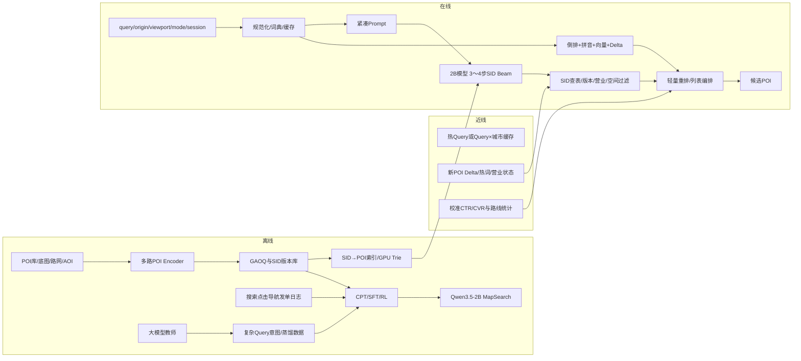

# 地图 POI 生成式搜索：完整实验、训练样本与在线推理方案

> 版本：2026-07-21  
> 范围：地图 POI 搜索，即用户输入 query 后生成候选 POI，暂不展开无 query 的推荐场景。  
> 本文是对本轮讨论的完整校订版，覆盖开源基座、POI encoder、SID、CPT、SFT、RL、样本构造、loss/reward、分期实验和 200～300ms 在线推理。  
> 本文优先采用论文原文和官方模型卡。文中的数据规模、loss 权重和延迟拆分若标为“建议”，均为地图迁移方案，不是论文公开结论。

---

## 0. 阅读约定

本文用三种标签区分信息来源：

- **[论文事实]**：对应论文或官方模型卡已经描述、验证的做法。
- **[地图迁移]**：基于论文方法，针对地图 POI 搜索做的设计。
- **[待消融]**：不能直接假定有效，必须通过对照实验验证。

核心符号：

- `q`：原始搜索 query。
- `o`：用户当前位置 origin。
- `a`：query 中显式或隐式的目标 anchor/target region。
- `v`：viewport、地图中心与缩放级别。
- `m`：出行方式，如驾车、步行、骑行、公交。
- `h`：当前搜索 session 的短期历史。
- `p`：POI。
- `SID(p)=(s_1,...,s_L)`：POI 的离散语义 ID。
- `P+(x)`：给定搜索上下文 `x` 下的多正确 POI 集合。

目标建模为：

```math
P_\theta(\mathrm{SID}(p)\mid q,o,a,v,m,t,h)
```

其中 `a` 和 `o` 必须明确区分。例如用户位于深圳搜索“北京协和医院”，目标区域来自 query，而不是当前位置。

---

# 1. 今日讨论覆盖检查

| 讨论项 | 是否覆盖 | 本文位置 | 校订说明 |
|---|---:|---|---|
| 地图生成式搜索目标与搜索/推荐差异 | 是 | 第2、4节 | 强相关性优先，个性化只作次级条件 |
| 快手九篇生成式搜推方法 | 是 | 第3节 | OneThink 统一使用论文正式名 OneRec-Think |
| 开源基座模型选择 | 是 | 第5节 | 推荐 Qwen3.5-2B-Base，Qwen3-1.7B-Base 为稳定对照 |
| 为什么不能只用 Qwen3-Embedding | 是 | 第6节 | 可以作为强基线，但缺少协同、精确空间和地图图关系 |
| FAMAE 的作用 | 是 | 第6节 | 与 Qwen embedding 互补，不是强制替代 |
| GeoEncoder、GraphEncoder、BehaviorEncoder | 是 | 第6节 | 给出输入、模型、loss 和消融 |
| `z_poi` 是否能用 Q-Former | 是 | 第6节 | 变长多模态 token 时有价值；固定向量融合先用 gated MLP |
| 经纬度能否换成底图图片描述 | 是 | 第6节 | 图片/描述可补充，不能替代数值 geo、路网与可达性 |
| SID 与 GAOQ | 是 | 第7节 | 给出主方案、对照组、码本版本与新 POI 机制 |
| CPT 所有样本构造和示例 | 是 | 第8节 | 共17类，每类均有具体示例 |
| SFT 所有样本构造和示例 | 是 | 第9节 | 共21类，每类均有具体示例 |
| RL 所有样本构造和示例 | 是 | 第10节 | DPO、listwise、GRPO、TPMA、IPS、反 reward-hacking 均有示例 |
| CPT/SFT/RL loss 与地图 reward | 是 | 第8～10节 | 明确区分 NTP、MML、KD、DPO、GRPO、地图硬门控 |
| 各阶段数据比例和训练量 | 是 | 第8～11节 | 给出2B模型的起始预算，需由 scaling/held-out 决定是否扩展 |
| SID/CPT/SFT/RL 分期实验 | 是 | 第11节 | 从传统基线到 shadow/A-B，逐阶段设 Go/No-Go |
| 200～300ms 在线 inference 架构 | 是 | 第12节 | 无在线 CoT；每条 beam 只生成一个固定长度 SID |
| 在线 prompt 构造 | 是 | 第12节 | 给出教师 prompt、训练 prompt 和紧凑线上 prompt |
| 风险、指标和降级 | 是 | 第13节 | 码本 churn、日志偏差、距离误用、新 POI 和超时回退 |

结论：今天讨论的主题均已覆盖。本次新增的主要内容是：把 CPT、SFT、RL 的每一种地图样本都补成可执行示例，并修正旧文档中 OneSearch-V2 “线上显式 CoT”以及若干未经论文支持的固定 reward 数值。

---

# 2. 总体结论与推荐主线

## 2.1 第一版主方案

1. 使用 `Qwen3.5-2B-Base` 作为生成模型主基座，`Qwen3-1.7B-Base` 作为稳定对照。
2. 使用领域微调后的 `Qwen3-Embedding-0.6B` 提供 POI 文本语义。
3. 另外训练结构、Geo、Graph、Behavior encoder，融合得到 `z_poi`。
4. 使用多路 `z_poi + GAOQ` 生成 3 层固定长度 SID；最后一层负责 prefix 内冲突消解。
5. 先进行新增 SID token warm-up，再做地图 CPT、三阶段 SFT、DPO，最后才做 on-policy TPMA-GRPO。
6. 线上不输出自然语言 CoT，不串行生成几十个 POI；模型每条 beam 只解码一个 3～4 token SID，Top-K 来自并行 beam。
7. 初期保留倒排、拼音/纠错、向量召回和新 POI delta 分支，生成模型作为一条新召回源逐步扩量。

## 2.2 搜索与推荐的边界

地图搜索的优化顺序应为：

```text
SID合法/POI有效
→ query实体与目标区域正确
→ 地址、分店、入口、交通方式等约束正确
→ 地理可达性和路线成本
→ 点击、导航、发单和履约等业务价值
→ 宽泛query下的列表覆盖与多样性
```

不能先优化 CTR/发单再补相关性，也不能统一假设“越近越好”。

---

# 3. 快手九篇生成式搜推的训练方法与地图迁移

## 3.1 方法总览

| 工作 | SID/架构 | 训练方法 | 地图搜索迁移 |
|---|---|---|---|
| [OneRec](https://arxiv.org/html/2502.18965) | RQ-Kmeans（含 balanced K-means）三层 SID；Encoder-Decoder；Decoder MoE | 高质量 session 做 SID NTP；Reward Model 对 beam 候选排序；最好/最差组成 self-hard DPO；迭代 IPA | 训练结果页/候选集合；用模型自己生成的同名异城、错分店、主体/入口作为困难负例 |
| [OneRec-V2](https://arxiv.org/html/2508.20900) | Lazy Decoder-Only；context 静态 KV；目标 SID 短解码 | 只对最新目标计算 loss；真实用户反馈 RL；Duration-Aware Reward；GBPO；强调 on-policy 分布 | 对路线时间按意图、城市密度、类别分桶；优先使用本模型真实展现反馈，避免只依赖旧 ranker RM |
| [OneRec-Think](https://arxiv.org/html/2510.11639) | Itemic token 与自然语言空间对齐 | Persona grounding、顺序预测、SID→caption、通用 LM；token warm-up；从裁剪历史生成 rationale，再用原始噪声历史学习；Rollout-Beam+GRPO | 教师利用地图事实生成意图/推理，学生线上直接生成 SID；热 query 可缓存意图或前缀，不在线生成长 CoT |
| [OpenOneRec](https://arxiv.org/html/2512.24762) / [官方仓库](https://github.com/Kuaishou-OneRec/OpenOneRec) | Qwen3+Itemic token | Itemic-Text Alignment→全参 Co-Pretrain→多任务 SFT→通用域 on-policy reverse-KL 蒸馏→Rec-RL（基于 GRPO） | 地图 CPT 混入通用中文、地址与地图问答；SFT 后检查基础能力退化；必要时用原始 Qwen 教师恢复 |
| [OneLoc](https://arxiv.org/html/2508.14646) | Geo-aware SID、自注意力、邻域 prompt | SID NTP；地理 reward+GMV reward；beam 最优/最差做 DPO | Geo 必须进入 SID、context 和 reward；但距离 reward 要按搜索意图控制，不能照搬“越近越好” |
| [OneSearch](https://arxiv.org/html/2509.03236) | KHQE；query/item 语义协同对齐；RQ-KMeans+OPQ | Encoder 侧 q2q/i2i/q2i contrastive、margin、困难相关性校正；文本↔SID、共现、个性化三阶段 SFT；RM+listwise DPO+真实行为 | 最接近地图搜索：强 query–POI 相关性、三阶段 SFT、多级行为、DPO+NLL、流式真实反馈 |
| [OneSearch-V2](https://arxiv.org/html/2603.24422) | 延续 OneSearch SID | 大模型产生关键词式 query reasoning；教师看关键词、学生只看原 query；CE+KL 自蒸馏；R-Drop/FGM/Focal；复合 reward+TPMA-GRPO | 地图复杂 query 使用教师侧结构化意图；线上不生成长 CoT，关键词可异步缓存；按 GAOQ prefix 的真实语义做位置级信用分配 |
| [OneReason](https://arxiv.org/abs/2606.06260) | 多模态 Itemic token；推荐推理基座 | token/item/relation/user 四粒度预训练；感知→推导→演化→推荐 cognition SFT；single-domain RL 后通过 RFT/MOPD 统一 | 地图对应 POI/SID 感知、地图关系推导、query/session 演化、最终 POI 搜索；当前官方主要发布 pretrain checkpoint，SFT/RL仍应视为研究方案 |
| [OneRetrieval](https://arxiv.org/html/2606.13533) | Keyword-Aligned Encoding；可编辑 reserved slots；在线 SID→item lookup | Stage0 属性↔slot；Stage1 文本↔SID；Stage2 query-item/SID 协同共现；Stage3 个性化检索与 reserved-slot self-routing | 闭集 GAOQ 需补充热词、新 POI、版本迁移和运营可编辑性；生产初期保留倒排/delta 分支 |

## 3.2 需要特别校正的三个认识

### 校正一：OneSearch-V2 不是线上“先生成 CoT 再生成 SID”

**[论文事实]** OneSearch-V2 Tables 3～4 表明，让小型生成检索模型先输出 textual CoT 再输出 SID 会显著伤害检索效果；显式 CoT 还会增加线上生成延迟。有效方法是：

```text
Teacher input = 原始query + 关键词式CoT/偏好校准
Student input = 原始query
Target = 同一个SID序列
Loss = CE + token-level KL + 稳定性正则
```

论文还描述了 keyword CoT 的异步缓存和 raw-query 直出两条路径，但没有披露具体流量分配。

### 校正二：OneLoc 的距离 reward 不能直接成为地图通用 reward

OneLoc 面向本地生活推荐，当前位置距离天然重要。地图搜索存在：

```text
当前位置=深圳
query=北京协和医院东院区
```

此时“离深圳近”应完全失效，目标区域应从 query/anchor 推断。

### 校正三：GAOQ prefix 不等同于人工字段层级

不能未经分析便假设：

```text
s1 = 类别
s2 = 城市
s3 = POI
```

GAOQ 的 token 表示全局对齐的聚类/残差方向。每一级含义必须用 cluster 内 POI 的类别、区域、图关系和行为分布解释，并通过消融确定 prefix reward。

---

# 4. 数据、标签与评估集定义

## 4.1 基础数据

### POI 主数据

```json
{
  "poi_id": "poi_123",
  "name": "北京协和医院东单院区",
  "aliases": ["协和东院", "北京协和东单"],
  "category_path": ["医疗", "综合医院", "三级甲等医院"],
  "brand_id": "brand_xiehe",
  "address": "北京市东城区帅府园1号",
  "admin_region": ["北京", "东城区"],
  "lat": 39.912,
  "lon": 116.414,
  "aoi_id": "aoi_xiehe_dongdan",
  "parent_poi": null,
  "entrances": ["entrance_east", "entrance_west"],
  "status": "open",
  "version": 17
}
```

### 地图图数据

```text
POI —inside→ AOI
Entrance —entrance_of→ POI
ParkingLot —serves→ Building/POI
StationExit —connects_to→ Station/AOI
POI —near_road→ RoadSegment
RoadSegment —reachable_by→ drive/walk/bike
```

### 搜索日志

```json
{
  "request_id": "r_001",
  "event_time": "2026-07-01T09:30:00+08:00",
  "query": "虹桥站接人停车",
  "origin": {"city": "上海", "cell": "h3_891"},
  "viewport": {"center_cell": "h3_892", "zoom": 15},
  "travel_mode": "drive",
  "shown_pois": ["p1", "p2", "p3"],
  "clicked_pois": ["p2"],
  "navigated_poi": "p2",
  "ordered_poi": null,
  "next_query": "虹桥火车站到达层附近停车场"
}
```

## 4.2 行为标签层级

建议将搜索反馈清洗为 graded gain：

| 行为 | 起始 gain | 说明 |
|---|---:|---|
| 履约完成发单 | 5 | 最强业务信号，但要排除供需与用户临时取消 |
| 有效发单 | 4 | 已产生真实目的地选择 |
| 开始导航/路线规划 | 3 | 地图搜索强信号 |
| 高质量详情/拨号/收藏 | 2 | 强于普通点击 |
| 普通点击 | 1 | 弱正例 |
| 曝光未点击 | 未知 | 不能默认作为负例 |
| 快速返回并改写 query | -1或困难负例候选 | 需结合后续 query 判断 |
| 明确“不是这里”/错地点取消 | -2 | 高置信负反馈 |

## 4.3 数据切分

- 严格按时间切分，不能随机拆分同一 POI 版本或同一 session。
- 训练只使用 target event 之前的行为，避免未来泄漏。
- 新 POI、改名、搬迁、下线必须形成独立时间切片。
- 头部 query 重复 PV 应降采样，建议采样概率与 `freq(q)^α` 成正比，`α` 可从0.4～0.7搜索。
- 单独维护随机曝光或轻干预流量，用于 IPS/SNIPS 和无偏评估。

## 4.4 必备测试集切片

```text
精确名称
别名/历史名
地址/门牌号
同名异城
同品牌多分店
医院院区/大学校区
机场航站楼/火车站
主体POI/入口/出口/停车场/接送点
附近类别
远程搜索
viewport/沿途/路线约束
拼音、错别字、ASR口语
否定约束
多正确答案
无结果/歧义
新增/更名/搬迁/下线POI
头部/中腰部/长尾query
```

---

# 5. 开源基座模型选择

## 5.1 推荐模型

| 用途 | 模型 | 结论 |
|---|---|---|
| 主生成模型 | [Qwen3.5-2B-Base](https://huggingface.co/Qwen/Qwen3.5-2B-Base) | 主推荐。2B、24层、混合 Gated DeltaNet/Attention；checkpoint 含视觉塔，纯文本部署需验证显存与裁剪；从 Base 做 CPT |
| 稳定对照 | [Qwen3-1.7B-Base](https://qwenlm.github.io/blog/qwen3/) | 标准 Transformer，生态成熟，用于确认 Qwen3.5 收益 |
| 低延迟下界 | Qwen3.5-0.8B / Qwen3-0.6B | 确定质量-延迟曲线，也可实验 draft model |
| POI文本encoder | [Qwen3-Embedding-0.6B](https://huggingface.co/Qwen/Qwen3-Embedding-0.6B) | 最高1024维、支持MRL，离线使用并做地图领域微调 |
| 离线教师 | Qwen3.5-27B/35B-A3B 或 Qwen3-32B | 复杂 query 解析、关系解释、反事实样本生成 |
| 推荐预训练对照 | [OpenOneRec-1.7B](https://github.com/Kuaishou-OneRec/OpenOneRec) | 原 Itemic token 不属于地图码本，只作为迁移对照 |
| 推理预训练对照 | [OneReason-0.8B Pretrain](https://huggingface.co/OpenOneRec/OneReason-0.8B-pretrain-competition) | 当前官方主要为 pretrain checkpoint，不作为生产直接起点 |

## 5.2 为什么主模型从 Base 开始

- 扩展 SID vocabulary 更自然。
- 避免 chat/instruction 行为与纯 SID 输出冲突。
- 可以完整控制 token warm-up、CPT、SFT 和 RL curriculum。
- 线上不需要开放式对话能力。

Post-trained 大模型主要作为离线教师。

---

# 6. POI Encoder、Q-Former 与多模态融合

## 6.1 多路表征

```math
e_{\mathrm{text}}=\mathrm{Qwen3Embedding}(\mathrm{name},\mathrm{alias},\mathrm{category},\mathrm{address},\mathrm{AOI},\mathrm{mapCaption})
```

```math
e_{\mathrm{struct}}=\mathrm{Embedding}(\mathrm{category},\mathrm{brand},\mathrm{admin},\mathrm{poiType},\mathrm{status})
```

```math
e_{\mathrm{geo}}=\mathrm{GeoEncoder}(\mathrm{lat},\mathrm{lon},\mathrm{multiScaleGrid},\mathrm{road},\mathrm{access})
```

```math
e_{\mathrm{graph}}=\mathrm{GraphEncoder}(\mathrm{POI},\mathrm{AOI},\mathrm{road},\mathrm{parent},\mathrm{entrance})
```

```math
e_{\mathrm{collab}}=\mathrm{BehaviorEncoder}(\mathrm{query}\leftrightarrow\mathrm{POIInteractions})
```

## 6.2 Text Encoder

**[地图迁移]** `Qwen3-Embedding-0.6B` 是第一版强基线。建议用以下数据微调：

```text
正例：query=协和东院 ↔ 北京协和医院东单院区
困难负例：query=协和东院 ↔ 北京协和医院西单院区
困难负例：query=协和东院 ↔ 深圳名称相似医院
```

它不能单独承担全部 POI embedding，因为不天然包含：

- 精确路线距离和路网可达性；
- AOI内部、入口、道路侧关系；
- query–POI 点击/导航/发单协同；
- POI 实时状态与版本关系。

## 6.3 GeoEncoder

输入建议：

```text
sin/cos(latitude, longitude)
+ multi-frequency Fourier features
+ H3/S2/GeoHash 多尺度 cell embeddings
+ city/district/AOI embeddings
+ road class/road side/accessibility
+ static route-neighborhood statistics
```

可用2～4层 MLP、轻量 Transformer 或多尺度 embedding pooling。

训练任务示例：

```text
输入POI对：P9停车场、虹桥火车站
标签：same_AOI=1, drive_connected=1, walk_distance_bucket=400-600m
```

## 6.4 GraphEncoder

推荐 HGT、GraphSAGE 或 GAT。主要 loss：

```text
relation classification
link prediction
neighbor contrastive learning
parent/entrance/AOI reconstruction
```

## 6.5 BehaviorEncoder

可用 two-tower、LightGCN 或 query–POI 异构图。边类型：

```text
show, click, detail, phone, navigation, order, fulfilled_order,
quick_back, reformulation, wrong_poi_cancel
```

需要时间衰减和曝光 propensity 修正。曝光未点击默认是未知，不进入强负例集合。

## 6.6 FAMAE 为什么有价值，但不是强制替代 Qwen embedding

[ReSID/FAMAE/GAOQ](https://arxiv.org/html/2602.02338)指出，纯 foundation embedding 更偏语义相似度，未必保留对行为预测最有用的结构字段。FAMAE 对目标 POI 的部分字段做 mask，并结合历史预测被 mask 字段，从而学习 recommendation/search-predictive 表征。

地图推荐组合：

```text
e_text：Qwen3-Embedding，负责自然语言语义
e_field：FAMAE，负责结构字段和行为可预测性
e_geo：精确空间
e_graph：地图拓扑
e_collab：真实搜索行为
```

## 6.7 `z_poi` 是否用 Q-Former

### 推荐基线

固定向量输入时先用 gated fusion：

```math
z_{\mathrm{poi}}=\mathrm{LN}(\sum_k g_kW_ke_k),\quad
g=\mathrm{softmax}(W_g[e_1,\ldots,e_K])
```

### Q-Former 适用条件

当输入包含变长 token 时使用 Q-Former：

```text
底图/卫星图 patch tokens
多条别名和长地址 tokens
多个图邻居 tokens
多个历史 query/行为 tokens
```

用8～16个 learnable queries cross-attend 到多模态 token，pool 得到 `z_poi`。

**[待消融]** 如果每路已经只有一个固定向量，Q-Former 可能增加参数和训练难度而没有收益，因此不能作为默认主方案。

## 6.8 底图图片描述能否代替经纬度

不能。推荐关系为：

```text
数值经纬度/多尺度网格：精确空间基础
路网/AOI/入口图：可达性和拓扑基础
底图图片或VLM描述：补充视觉与场景语义
```

底图描述示例：

```text
该POI位于大型交通枢纽内部，东侧临近高架落客区，
南侧为出租车排队区，普通社会车辆入口位于申虹路。
```

它有助于理解“交通枢纽/入口/建筑内部”，但不能准确计算路径、路侧、实时当前位置或绕行时间。

## 6.9 POI encoder loss

```math
L_{\mathrm{enc}}=\lambda_tL_{\mathrm{q2p}}^{\mathrm{InfoNCE}}+\lambda_bL_{\mathrm{behavior}}^{\mathrm{BPR/InfoNCE}}+\lambda_fL_{\mathrm{field}}^{\mathrm{mask}}+\lambda_gL_{\mathrm{geo}}^{\mathrm{relation}}+\lambda_rL_{\mathrm{graph}}^{\mathrm{link}}+\lambda_cL_{\mathrm{modality}}^{\mathrm{consistency}}
```

`modality_consistency` 通过随机丢弃某一路输入，使冷启动、字段缺失和无行为 POI 仍可编码。

---

# 7. SID 与 Map-GAOQ

## 7.1 GAOQ 的准确含义

GAOQ 不是普通 RQ，也不是人工字段树。其核心过程：

1. 根层使用 balanced K-Means 得到全局粗簇。
2. 每个父簇内部继续 balanced K-Means。
3. 子簇中心减去父簇中心，得到 residual direction。
4. 构建该层全局共享、近似正交的 anchors。
5. 通过 cosine similarity 和 Hungarian Matching，将各父簇的子簇方向对齐到同一套 anchor index。
6. 最后一层在 prefix 内做冲突消解。

同一个 `p2_17` 在不同 `p1` 下因此具有更一致的方向含义，降低 prefix-dependent ambiguity。

**[论文事实]** OneSearch Table 2 中，`+keywords`、仅 L3 balanced、全层 balanced 的“L3 CUR / 整体 ICR”分别为 `1.64%/43.32%`、`7.03%/68.08%`、`0.51%/33.47%`；`48.95%` 是 L2 CUR，不是 `CUR_total`。论文据此指出全层均衡存在聚类坍缩风险。**[地图迁移]** 该结果不能直接外推到 GAOQ，只能作为“全层均衡 vs 仅末层均衡 vs 不均衡”消融的依据。

## 7.2 Map-GAOQ 主方案

建议固定三层：

```text
<poi_begin><sid_v3><p1_x><p2_y><leaf_z><poi_end>
```

全国级起始搜索空间：

```text
p1: 2048 或 4096
p2: 512 或 1024
leaf: 每个prefix内部动态冲突序号，cap 256/512
```

位置 vocabulary 分开：

```text
<p1_17> != <p2_17> != <leaf_17>
```

## 7.3 SID 对照实验

| 实验 | 表征 | Quantizer | 目标 |
|---|---|---|---|
| A | Qwen3-Embedding | RQ-KMeans | 文本语义基线 |
| B | 多路融合 | RQ-KMeans | 验证 encoder 融合 |
| C | 多路融合 | GAOQ | 主方案 |
| D | 多路融合 | RQ-KMeans+OPQ | 对照 OneSearch |
| E | FAMAE结构/协同 | GAOQ | 验证 search-native 表征 |
| F | 强化Geo权重 | GAOQ | 验证地理占比，防止同名异城 |
| G | Q-Former多模态 | GAOQ | 仅在有变长视觉/图token时实验 |
| H | Geo-first人工层级 | 分层K-Means | 对照 OneLoc 风格，检查远程搜索是否受损 |
| I | 多路融合 | GAOQ 仅末层均衡 | 对照 OneSearch 全层均衡坍缩证据，检查 balanced K-Means 层级范围对 CUR/ICR 的影响 |

所有对照必须使用相同生成 backbone、相同训练样本和相同 beam 设置。

## 7.4 SID 评价指标

```text
codebook utilization
prefix conditional entropy
prefix bucket size P50/P95/P99/max
独立编码率/冲突率
类别、品牌、城市、AOI NMI
query-POI行为一致性
同名异城错误率
同品牌错分店率
主体/入口/停车场混淆率
新POI量化误差
码本重建后的SID churn rate
下游HR/Recall/MRR/NDCG
```

## 7.5 新 POI 与码本版本

```text
日常增量：冻结centroid/anchors，为新POI分配prefix和leaf
线上索引：SID主表 + delta表
周期重建：产生old_sid→new_sid映射
迁移期：prompt带<sid_v3>，新旧trie双读
模型迁移：旧模型分布蒸馏到新SID模型
运营热词：倒排/delta或OneRetrieval式reserved slot
```

---

# 8. CPT：所有样本构造、示例和 Loss

## 8.1 CPT 训练阶段

### CPT-0：SID token warm-up

- 冻结 backbone。
- 只训练新增 SID embedding 和对应 LM head。
- 使用 prefix grounding、POI↔SID 和 SID→caption。
- 训练到新增 token loss 与 embedding norm 稳定。

### CPT-1：POI/地图知识对齐

- 解冻 backbone 或使用全参/LoRA 对照。
- 学习 POI 文本、结构、地图关系、地址与 SID。

### CPT-2：搜索日志 co-pretraining

- 加入 query–POI 共现、session、行为、反事实位置和新 POI 数据。
- 混入通用中文、地址理解和地图问答，抑制遗忘。

## 8.2 CPT 数据比例建议

| 类型 | 比例 |
|---|---:|
| SID token/prefix 语义 | 12% |
| 完整 POI 文本↔SID | 15% |
| 地图空间/图关系 | 15% |
| query–POI 共现/别名/纠错 | 20% |
| 搜索 session/query reformulation | 10% |
| 新增/变更/下线/SID迁移 | 7% |
| 异地搜索等地理反事实 | 6% |
| 通用中文/地址/地图知识保持 | 15% |

2B 模型起始预算：

```text
POC：1～3B tokens
完整第一版：7～15B tokens
是否扩展：由held-out loss、长尾Recall和重复率决定
```

## 8.3 CPT 样本全集

下面每一种都应单独打 task type，便于控制比例、loss mask 和离线消融。

### CPT-01：SID prefix → cluster caption

目的：让新 token 具有可理解的经验语义，但不强行把 prefix 命名为“城市/类别层”。

```text
<task=prefix_caption>
Input:
  SID prefix: <p1_037><p2_181>
  Cluster statistics:
    top_categories=[停车场, 接送点, 交通设施]
    top_aois=[上海虹桥综合交通枢纽]
    top_queries=[虹桥站停车, 虹桥接人, 到达层停车]
Output:
  该前缀主要覆盖上海虹桥交通枢纽周边的停车和接送设施，
  但仅凭前缀不能确定具体停车场或入口。
```

### CPT-02：POI 文本 → SID

```text
<task=poi_to_sid>
Input:
  名称=北京协和医院东单院区
  别名=协和东院|北京协和东单
  类别=三级甲等综合医院
  地址=北京市东城区帅府园1号
  AOI=北京协和医院东单院区
Output:
  <poi_begin><sid_v3><p1_132><p2_088><leaf_014><poi_end>
```

### CPT-03：SID → POI dense caption

```text
<task=sid_to_poi_caption>
Input:
  <sid_v3><p1_132><p2_088><leaf_014>
Output:
  北京协和医院东单院区，位于北京市东城区帅府园1号，
  常被称为“协和东院”，与西单院区是不同地点。
```

### CPT-04：结构字段 masked reconstruction

目的：对应 FAMAE/字段感知思路，补足纯文本 encoder。

```text
<task=masked_field>
Input:
  名称=虹桥火车站P9停车场
  类别=[MASK]
  parent=虹桥火车站
  AOI=虹桥综合交通枢纽
  drive_access=1
Output:
  类别=停车场
```

也可 mask `parent/AOI/行政区/品牌/POI类型`。

### CPT-05：数值地理与多尺度网格 grounding

```text
<task=geo_grounding>
Input:
  POI_A cell=[city_shanghai,h3_l8_17,h3_l11_912]
  POI_B cell=[city_shanghai,h3_l8_17,h3_l11_913]
  straight_distance=380m
  route_distance=920m
Output:
  两个POI地理邻近，但路线距离明显大于直线距离，
  可能存在道路方向或物理障碍，不能仅按经纬度判断可达性。
```

### CPT-06：地图图关系

```text
<task=map_relation>
Input:
  subject=<P9停车场SID>
  relation=?
  object=<虹桥火车站SID>
  facts=[same_AOI, walk_connected, drive_entrance=申虹路]
Output:
  relation=parking_serves
  explanation=P9是服务虹桥火车站的停车场，不是车站主体POI。
```

### CPT-07：query → POI 协同共现

```text
<task=query_to_poi_cooccur>
Input:
  query=协和东院
  city_hint=北京
Output:
  <北京协和医院东单院区SID>
```

采样时按 `履约发单 > 导航 > 点击` 加权，避免只复刻曝光顺序。

### CPT-08：POI → 历史 query/别名

```text
<task=poi_to_queries>
Input:
  poi=<北京协和医院东单院区SID>
Output:
  协和东院 | 北京协和东单 | 协和医院王府井院区
```

该任务帮助模型理解用户口语名、历史名和非标准简称。

### CPT-09：query SID → POI SID

如果为 query 构造 query-side code，可加入 OneSearch/OneRetrieval 式 code-space routing。

```text
<task=query_sid_to_poi_sid>
Input:
  query=虹桥站接人停车
  query_sid=<q1_41><q2_08><q3_77>
Output:
  <sid_v3><p1_037><p2_181><leaf_029>
```

**[待消融]** 如果线上 query SID 需要额外大模型/embedding 调用，则不应进入主线上链路；可使用词典/轻模型或仅作训练辅助。

### CPT-10：搜索 session 与 query reformulation

```text
<task=query_reformulation>
Input:
  q1=虹桥站
  shown1=[虹桥火车站, 虹桥机场, 虹桥枢纽]
  q2=虹桥火车站接人停车
  clicked2=[虹桥火车站主体]
  q3=离到达层近的停车场
Output:
  final_target=<P9停车场SID>
  intent_evolution=station→pickup_parking→short_walk_to_arrival
```

### CPT-11：短行为序列 → 下一目标

```text
<task=next_search_target>
Input:
  [
    query=迪士尼, click=<上海迪士尼主体SID>,
    query=迪士尼停车, click=<迪士尼停车场SID>
  ]
  current_query=迪士尼接人
Output:
  <迪士尼接送区SID>
```

搜索场景只保留当前 session 的短历史，不能让长期推荐兴趣压过 query。

### CPT-12：地理反事实

```text
<task=geo_counterfactual>
Input:
  origin_city=深圳
  query=北京协和医院东院区
Candidates:
  A=<北京协和医院东单院区SID>, distance_from_origin=1950km
  B=<深圳名称相似医院SID>, distance_from_origin=4km
Output:
  correct=A
  reason=query显式指定北京实体，当前位置距离不参与实体选择。
```

### CPT-13：困难负例相关性校正

```text
<task=hard_negative_relevance>
Input:
  query=上海虹桥火车站P9停车场
  candidate=<虹桥火车站主体SID>
Output:
  relevance=1/3
  error=facility_type_mismatch
  correction=用户搜索的是停车场，不是车站主体。
```

困难负例来源：

```text
同名异城
同品牌不同分店
主体/入口/停车场
相邻但不可达
旧名称/搬迁前POI
模型beam中的高概率错误
```

### CPT-14：POI 生命周期

```text
<task=poi_lifecycle>
Input:
  old_record={sid:<old_sid>, name:北京XX饭店, version:12}
  change={type:rename_and_move, new_name:北京XX酒店, move:80m}
  new_record={sid:<new_sid>, version:13}
Output:
  relation=same_entity_new_version
  serving_sid=<new_sid>
  <old_sid>=stale
```

### CPT-15：SID 版本翻译与新增 POI 路由

```text
<task=sid_version_translation>
Input:
  poi_description=新开业的虹桥枢纽P12停车场，位于申虹路北入口
  codebook_version_from=v3
  codebook_version_to=v4
Output:
  old_sid=<NA>
  new_sid=<sid_v4><p1_041><p2_219><leaf_003>
  nearest_existing_prefix=<p1_041><p2_219>
```

### CPT-16：模态缺失与噪声鲁棒性

```text
<task=missing_modality>
Input:
  name=星巴克
  address=北京市朝阳区建国路...
  aliases=[NA]
  behavior=[NA]
  map_caption=[NA]
  geo_cell=<h3_...>
  parent_aoi=<国贸商城SID>
Output:
  <该分店SID>
```

同一 POI 构造完整字段版、缺行为版、缺别名版和噪声地址版，做一致性训练。

### CPT-17：通用语言、地址与地图知识保持

```text
<task=general_address_qa>
Input:
  地址中的“附楼”“院区”“航站楼”“出站口”通常分别表示什么？
Output:
  它们表示主体建筑的附属建筑、同一机构的不同地点、机场的独立航站设施，
  以及车站与外部道路连接的具体出口，搜索时不能与主体POI简单合并。
```

## 8.4 CPT loss

主模型优先统一使用 weighted NTP：

```math
L_{\mathrm{CPT}}=-\sum_t w_{\mathrm{type}(x_t)}\log P_\theta(x_t\mid x_{1:t-1})+\lambda_{\mathrm{retain}}L_{\mathrm{retain}}
```

建议：

- SID、关系答案、目标文本权重高于输入 context。
- 纯日志中的展现列表可不计算 loss 或降权。
- `L_retain` 使用通用文本 CE，或对原始基座做 KL anchor。
- encoder 的 InfoNCE、FAMAE、Geo/Graph loss 留在 encoder 阶段，不必全部并入 LLM CPT。

---

# 9. SFT：所有样本构造、示例和 Loss

## 9.1 SFT curriculum

```text
SFT-0：SID/文本/类别 grounding
SFT-1：无用户 query–POI 共现
SFT-2：与线上输入同构的直接 POI 搜索
SFT-3：多正例、session、列表辅助任务
SFT-4：复杂 query 教师侧地图推理→学生无CoT自蒸馏
SFT-5：冷启动、歧义、无结果、运营和生命周期
```

## 9.2 最终 SFT mixture 建议

| 类型 | 比例 |
|---|---:|
| SID/文本 grounding | 15% |
| query–POI双向与协同共现 | 20% |
| 在线同构直接搜索 | 35% |
| 多正例/列表/session | 15% |
| 复杂 query 教师蒸馏 | 8% |
| 冷启动/歧义/无结果/生命周期 | 4% |
| 通用指令与语言保持 | 3% |

训练规模建议：

```text
POC：5～10M高质量样本
中期：100～300M去重样本
全量：300～800M样本
复杂query教师样本：按query或query×city去重后1～5M
```

## 9.3 SFT 样本全集

### SFT-01：精确名称/别名搜索

```text
<map_search><sid_v3>
<q>协和东院</q>
<origin_city>北京</origin_city>
<target_region>北京</target_region>
<mode>unknown</mode>
<answer>
<poi_begin><p1_132><p2_088><leaf_014><poi_end>
```

### SFT-02：地址/门牌号搜索

```text
Input:
  query=北京市东城区帅府园1号
  origin_city=北京
Output:
  <北京协和医院东单院区SID>
```

标签可由地址库和 POI footprint 匹配产生，低置信地址只进入软标签或人工集。

### SFT-03：附近类别搜索

```text
Input:
  query=附近24小时药店
  origin_cell=<h3_891>
  time=23:30
  travel_mode=walk
Targets:
  A=<药店A SID>, walk_time=4min, open=1, gain=4
  B=<药店B SID>, walk_time=8min, open=1, gain=3
```

这是典型多正例，不应只保留最近一个 POI。

### SFT-04：品牌分店搜索

```text
Input:
  query=国贸商城里的星巴克
  origin_city=北京
  target_aoi=<国贸商城SID>
Output:
  <星巴克国贸商城分店SID>
Hard negatives:
  <星巴克建外SOHO分店SID>
  <星巴克北京旗舰店SID>
```

### SFT-05：主体/入口/出口/停车场

```text
Input:
  query=协和医院东院区开车从哪个门进
  travel_mode=drive
Output:
  <协和医院东院区机动车入口SID>
Secondary valid:
  <协和医院东院区东门SID>
Hard negative:
  <协和医院东院区主体SID>
```

### SFT-06：远程目标搜索

```text
Input:
  origin_city=深圳
  query=北京南站地下停车场
  inferred_target_region=北京
Output:
  <北京南站地下停车场SID>
Hard negative:
  <深圳北站停车场SID>
```

### SFT-07：viewport/地图中心搜索

```text
Input:
  query=咖啡
  origin_cell=<h3_home>
  viewport_center=<h3_sanlitun>
  zoom=16
  search_this_area=1
Output:
  <三里屯viewport内咖啡店SID>
```

当用户明确“搜索此区域”时，viewport 优先于当前位置。

### SFT-08：路线/沿途搜索

```text
Input:
  query=沿途加油站
  route_id=<route_beijing_tianjin_17>
  travel_mode=drive
Targets:
  A=<服务区加油站A SID>, detour=2min, gain=4
  B=<出口加油站B SID>, detour=5min, gain=3
```

### SFT-09：多约束复杂 query

```text
Input:
  query=虹桥火车站接人，能停半小时，走到到达层近的停车场
  origin_city=上海
  mode=drive
Output:
  <P9停车场SID>
Constraints:
  entity=虹桥火车站
  facility=parking
  allowed_short_stay=1
  short_walk_to_arrival=1
```

### SFT-10：多正确答案 MML

```json
{
  "input": {
    "query": "国贸附近咖啡店",
    "origin_cell": "h3_891"
  },
  "valid_targets": [
    {"sid": "<A>", "gain": 4},
    {"sid": "<B>", "gain": 4},
    {"sid": "<C>", "gain": 3}
  ]
}
```

使用：

```math
L_{\mathrm{MML}}=-\log\sum_{p\in P^+(x)}w_pP_\theta(\mathrm{SID}_p\mid x)
```

### SFT-11：结果列表辅助任务

```text
Input:
  query=西湖附近景点
  origin=<杭州西湖东侧>
Output list:
  [<断桥SID>, <白堤SID>, <岳王庙SID>, <曲院风荷SID>]
```

等 gain 目标顺序随机化；训练时加入 duplicate mask。

**[上线约束]** 此任务作为辅助训练或离线 reranker，不作为第一版线上主输出，因为串行输出多个 SID 会增加解码长度。

### SFT-12：session/query 改写

```text
Input:
  q1=虹桥站
  click1=<虹桥火车站主体SID>
  q2=停车场
  current_q=到达层近一点
Output:
  <P9停车场SID>
```

### SFT-13：拼音/错别字/ASR

```text
Input:
  query=beijing xie he yi yuan dong yuan
  asr_confidence=0.82
  origin_city=北京
Output:
  <北京协和医院东单院区SID>
```

```text
Input:
  query=虹桥伙车站停車场
Output:
  <虹桥火车站停车场SID>
```

### SFT-14：否定约束

```text
Input:
  query=虹桥机场附近停车场，不要火车站那边的
  origin_city=上海
Output:
  <虹桥机场航站楼停车场SID>
Rejected:
  <虹桥火车站P9停车场SID>
```

### SFT-15：歧义与澄清/多地域覆盖

```text
Input:
  query=万达广场
  origin_city=成都
  nearby_exact_candidates=[金牛万达, 锦华万达]
Output option A:
  <need_disambiguation><金牛万达SID><锦华万达SID>
```

若产品不允许澄清：

```text
Output option B:
  生成覆盖不同区域的多个高置信候选，而不是只猜一个。
```

### SFT-16：无结果/拒识

```text
Input:
  query=已经拆除的XX大厦旧入口
  catalog_status=no_active_exact_match
Output:
  <no_active_poi>
```

不能强迫模型总生成一个 POI。

### SFT-17：新增/更名/搬迁/下线

```text
Input:
  query=北京XX酒店
  catalog_version=v4
  alias_history=北京XX饭店
Output:
  <新版本酒店SID>
Rejected:
  <旧版本已下线SID>
```

### SFT-18：短历史个性化与 history dropout

```text
Full input:
  previous_queries=[充电站, 地下停车场]
  current_query=国贸附近停车
  mode=drive
Output:
  <支持充电的国贸停车场SID>
```

同一训练样本再构造：

```text
Drop-history input:
  previous_queries=[NA]
  current_query=国贸附近停车
Output:
  <普通高相关停车场SID集合>
```

防止长期/短期历史压过当前 query。

### SFT-19：教师侧结构化意图

教师看到完整地图事实：

```json
{
  "query": "虹桥火车站接人停哪方便",
  "candidate_map_facts": [
    "P9可从申虹路驶入",
    "P9步行到到达层约420米",
    "出发层只允许短暂停靠"
  ],
  "output": {
    "intent": "pickup_parking",
    "target_anchor": "虹桥火车站",
    "scope": "destination",
    "constraints": ["drive_accessible", "short_walk_to_arrival"]
  }
}
```

### SFT-20：教师—学生无 CoT 自蒸馏

```text
Teacher input:
  raw query + structured intent + map facts
Student input:
  raw query + online compact context only
Shared target:
  <P9停车场SID>
```

Loss：

```math
L_{\mathrm{KD}}=\sum_l D_{\mathrm{KL}}(P_T(s_l\mid x,\mathrm{privileged})\Vert P_S(s_l\mid x))
```

教师 logits 必须 detach；线上学生不需要关键词、地图长文本或第二个模型调用。

### SFT-21：运营/增量路由辅助

若实验 OneRetrieval 式 reserved slot：

```text
Input:
  query_sid=<reserved_hotword_17><q2_03>
Output:
  poi_sid=<reserved_hotword_17><p2_88><leaf_01>
```

该样本只训练 identity routing，不预先绑定具体新热词；热词含义由上线词典绑定。

## 9.4 SFT loss

```math
L_{\mathrm{SFT}}=L_{\mathrm{CE}}+\lambda_mL_{\mathrm{MML}}+\lambda_dL_{\mathrm{KD}}+\lambda_rL_{\mathrm{RDrop}}+\lambda_aL_{\mathrm{adv}}+\lambda_uL_{\mathrm{UL}}
```

说明：

- `L_CE`：response-only SID token CE。
- `L_MML`：多个正确 POI 的边际似然。
- `L_KD`：复杂意图内化。
- `L_RDrop`：同输入不同 dropout 的输出分布一致性。
- `L_adv`：FGM 在 embedding 扰动后执行第二次 forward/backward；OneSearch-V2 使用扰动输入上的 CE 与蒸馏 KL。这里的 `lambda_a` 是地图侧建议系数。
- `L_UL`：仅用于非法 SID、下线 POI、明确错城市/错实体等高置信负例。
- OneSearch-V2 用 focal loss **替换**标准 CE；地图版只在确认 SID 频率失衡后实验该替换。

位置加权版本：

```math
L_{\mathrm{SID}}=-\sum_{l=1}^{L}\alpha_l\log P(s_l\mid x,s_{1:l-1})
```

先用等权 `[1,1,1]`，再对 `[1.5,1.2,1]` 或基于位置条件熵的权重做消融。不能未经验证便认定第一层一定最重要。

---

# 10. RL：所有偏好/rollout 样本、Loss 与地图 Reward

## 10.1 分期

```text
RL-0：高置信 DPO + chosen NLL anchor
RL-1：Reward Model 辅助的 self-hard DPO
RL-2：本模型 on-policy 行为反馈 GRPO
RL-3：Map-GAOQ prefix-aware TPMA-GRPO
```

建议规模：

```text
DPO：5～20M高置信pair
GRPO：每轮0.5～2M prompts，每个prompt 8～16 rollouts
SFT replay：10%～20%
复杂/长尾/反事实prompt必须单独保量
```

**[论文事实]** OneSearch 指出传统系统 RM 会限制生成模型上限，并观察到其 GRPO 变体产生更多不相关 SID；OneRec-V2 则讨论有限采样和 reward hacking。**[地图迁移]** RM 只作冷启动过渡，并应与生成模型使用相同输入空间。

## 10.2 DPO loss

```math
A_\theta(x,y)=\log\frac{\pi_\theta(y\mid x)}{\pi_{\mathrm{ref}}(y\mid x)}
```

```math
L_{\mathrm{DPO}}=-\log\sigma(\beta[A_\theta(x,y^+)-A_\theta(x,y^-)])
```

地图推荐使用：

```math
L=L_{\mathrm{DPO}}+\alpha L_{\mathrm{NLL}}(y^+)
```

`NLL` anchor 防止偏好学习破坏 SID 生成和召回覆盖。

## 10.3 RL 样本全集

### RL-01：真实强行为 chosen vs 弱行为 rejected

```text
Prompt:
  query=虹桥火车站接人停车
  origin=上海
  mode=drive
Chosen:
  <P9停车场SID>，用户导航并完成目的地确认
Rejected:
  <虹桥火车站主体SID>，用户点击后立即返回并改搜“停车场”
```

### RL-02：OneRec 式 beam self-hard pair

```text
Current model beams:
  A=<P9停车场SID>, reward=0.91
  B=<P10停车场SID>, reward=0.82
  C=<虹桥火车站主体SID>, reward=0.31
  D=<虹桥机场停车场SID>, reward=0.08

Chosen=A
Rejected=D
```

优先选模型高概率但明显错误的 rejected，而不是随机远负例。

### RL-03：远程搜索地理反事实 pair

```text
Prompt:
  origin_city=深圳
  query=北京协和医院东院区
Chosen:
  <北京协和医院东单院区SID>
Rejected:
  <深圳名称相似医院SID>
```

该 pair 明确教会模型：实体/目标区域优先于当前位置距离。

### RL-04：同品牌错分店 pair

```text
Prompt:
  query=国贸商城里的星巴克
Chosen:
  <星巴克国贸商城分店SID>
Rejected:
  <星巴克建外SOHO分店SID>
```

### RL-05：主体/入口/停车场 pair

```text
Prompt:
  query=协和东院开车入口
Chosen:
  <协和东院机动车入口SID>
Rejected:
  <协和东院主体SID>
```

### RL-06：生命周期 pair

```text
Prompt:
  query=北京XX酒店
  catalog_version=v4
Chosen:
  <new_active_sid>
Rejected:
  <old_stale_sid>
```

`old_stale_sid` 同时应被 constrained decoding/trie 硬过滤，RL只作为辅助。

### RL-07：否定约束 pair

```text
Prompt:
  query=虹桥机场停车，不要火车站那边
Chosen:
  <虹桥机场停车场SID>
Rejected:
  <虹桥火车站P9停车场SID>
```

### RL-08：不应构造 DPO pair 的多正确案例

```text
Prompt:
  query=国贸附近咖啡
Candidate A：步行4分钟，用户点击
Candidate B：步行5分钟，用户导航
Candidate C：步行6分钟，高质量且营业
```

A/B/C 都可能正确，不能因为某次日志只点击 B 就强制 `B>A`、`B>C`。应使用：

- 多正例集合 reward；
- listwise gain；
- 或只在 reward 差距超过阈值时形成 pair。

### RL-09：OneSearch 式一正多负 listwise pair

```json
{
  "prompt": "附近24小时药店",
  "chosen": "<open_nearby_pharmacy>",
  "rejected": [
    "<closed_pharmacy>",
    "<far_pharmacy>",
    "<nearby_convenience_store>"
  ]
}
```

一正多负可减少同一 chosen 的重复计算，但负例必须是高置信错误或明显次优。

### RL-10：GRPO rollout group

```text
Prompt:
  query=虹桥火车站接人停哪方便
  mode=drive

Rollout 1=<P9停车场SID>
Rollout 2=<P10停车场SID>
Rollout 3=<到达层接客区SID>
Rollout 4=<虹桥火车站主体SID>
Rollout 5=<虹桥机场停车场SID>
Rollout 6=<invalid_sid>
Rollout 7=<P9停车场旧版本SID>
Rollout 8=<出租车上客点SID>
```

对8条 rollout 计算同一 prompt 内的相对 advantage。

### RL-11：TPMA prefix 样本

```text
Ground-truth set:
  A=<p1_37><p2_181><leaf_29>
  B=<p1_37><p2_181><leaf_31>

Rollout X=<p1_37><p2_181><leaf_88>
Rollout Y=<p1_37><p2_90><leaf_12>
Rollout Z=<p1_08><p2_11><leaf_02>
```

解释：

```text
X：前两级落在正确停车设施簇，最后POI错误
Y：第一级相关，第二级已偏离目标簇
Z：第一级已进入错误实体/区域簇
```

后续 token 的梯度应按 prefix 正确程度进行 gate。

### RL-12：附近搜索路线时间分桶

```text
Prompt bucket:
  intent=nearby_pharmacy
  city_density=high
  mode=walk

Candidate A route_time=4min, percentile=0.10
Candidate B route_time=12min, percentile=0.70
```

地理 reward：

```math
R_{\mathrm{geo}}=1-F_{\mathrm{bucket}}(\log(1+t_{\mathrm{route}}))
```

这比直接使用米数更能处理市中心和郊区分布差异。

### RL-13：路线可达性 reward

```text
Prompt:
  query=商场地下停车场入口
  mode=drive
Candidate A:
  straight_distance=80m, route_detour=1.8km, wrong_road_side=1
Candidate B:
  straight_distance=220m, route_detour=300m, legal_entrance=1
```

应偏好 B，证明直线距离不能替代 route/access reward。

### RL-14：宽泛 query 列表 reward

```text
Prompt:
  query=西湖附近景点
List A:
  [断桥, 白堤, 岳王庙, 曲院风荷]
List B:
  [断桥, 断桥入口1, 断桥入口2, 断桥停车点]
```

List A 的覆盖和去重 reward 高；但对于精确 query“断桥入口”，不能使用同样 diversity 逻辑。

### RL-15：无结果/拒识 reward

```text
Prompt:
  query=已拆除的XX大厦旧东门
Rollout A=<no_active_poi>
Rollout B=<附近名称相似写字楼SID>
```

若 catalog 确认无有效实体，应奖励 A，防止模型为了“命中”而生成错误 POI。

### RL-16：Reward hacking 对抗样本

```text
Prompt:
  query=北京协和医院东院区
Candidate A:
  exact_entity=1, calibrated_ctr=0.28
Candidate B:
  popular_nearby_mall=1, calibrated_ctr=0.73, relevance=0
```

相关性 gate 必须使 B 得到强负奖励，不能让高 CTR 覆盖实体错误。

### RL-17：取消原因拆分

```text
Order A canceled_reason=user_changed_plan
Order B canceled_reason=poi_location_wrong
Order C canceled_reason=driver_supply_shortage
```

只将 B 视为 POI 负反馈；A/C 不应直接惩罚 POI。

### RL-18：IPS/随机流量样本

```json
{
  "query": "国贸附近咖啡",
  "poi": "<A>",
  "position": 8,
  "exposure_propensity": 0.04,
  "clicked": 1
}
```

训练权重可使用截断 IPS：

```math
w=\min(w_{\mathrm{max}},1/\rho_{\mathrm{exp}})
```

其中 $\rho_{\mathrm{exp}}$ 表示候选在日志中的曝光 propensity。

并与普通日志、随机曝光流量分别做稳定性对照。

## 10.4 地图 reward 总体设计

先硬门控：

```text
非法SID/错误版本/空bucket/已下线     → 强负或直接过滤
明确错城市/错实体/相关性0            → 强负
通过合法性和相关性门槛               → 才计算geo/access/behavior/list
```

```math
R=G_{\mathrm{valid}}G_{\mathrm{rel}}(w_rR_{\mathrm{rel}}+w_eR_{\mathrm{entity}}+w_g(q)R_{\mathrm{geo}}+w_aR_{\mathrm{access}}+w_bR_{\mathrm{behavior}}+w_fR_{\mathrm{fresh}}+w_l(q)R_{\mathrm{list}})-P
```

### 相关性等级

```text
3：实体、地区、分店和约束精确满足
2：实体正确，部分设施/入口/约束不完全
1：同类或弱相关
0：错实体、错城市或无关
```

### 行为 reward 起始标尺

| 行为 | 建议起始值 |
|---|---:|
| 履约完成发单 | 1.0 |
| 有效发单 | 0.8 |
| 开始导航/路线规划 | 0.6 |
| 高质量详情/拨号/收藏 | 0.4 |
| 普通点击 | 0.2 |
| 曝光未点击 | 0.0，未知 |
| 快速返回并改写 | -0.3 |
| 明确不是这里/POI错误 | -1.0 |

这些值只是同量纲初始化，必须经过 reward scale、方差和线上敏感性校准，不能视为论文固定参数。

## 10.5 GRPO 与 Map-TPMA

标准 GRPO：同一 prompt 采样一组 rollout，reward 组内标准化得到 advantage，并加入 reference KL。

对于多正确 POI：

```math
r_l(s)=\max_{p\in P^+(x)}\sum_{j=1}^{l}\alpha_j\mathbf{1}[s_j=p_j]
```

```math
\Delta r_l=r_l-r_{l-1}
```

Map-GAOQ 的 prefix reward 还应融合：

```text
prefix是否合法
是否与任一正确POI共享prefix
prefix cluster与正确POI embedding/centroid相似度
prefix内相关POI占比
是否已明确排除目标城市、实体或设施类型
```

不能仅用单一 ground-truth SID 的精确 token match。

**[论文事实]** OneSearch-V2 的 SID overlap 是 TPMA 中的位置加权 prefix reward 与 marginal advantage，不是额外并列的独立标量。**[地图迁移]** 上述新增地图信号必须分别消融，不能写成论文结论。

---

# 11. 分期实验节奏、训练量与 Go/No-Go

| 阶段 | 核心实验 | 建议规模 | 主要指标 | Go/No-Go |
|---|---|---:|---|---|
| P0 数据/传统基线 | 倒排、拼音、Qwen embedding ANN、现有MCA；时间切分和标签审计 | 最近60～90天 | Recall/MRR、错实体/错城市、延迟 | 所有核心slice有可信基线 |
| P1 POI Encoder | text-only、+struct、+geo、+graph、+behavior、Q-Former | 全量有效POI；0.5～2B采样行为边 | q2p Recall、关系准确率、冷启动 | 多路融合在搜索目标上优于text-only |
| P2 SID | RQ、RQ-OPQ、GAOQ、FAMAE+GAOQ、Geo-first | 全量POI | prefix entropy、冲突、churn、下游HR | GAOQ至少不劣于最强SID且更可预测 |
| P3 CPT-0/1 | token warm-up、POI/地图 grounding | 1～3B tokens | SID PPL、caption/关系、基础能力 | 新SID稳定，地址/语言能力无明显退化 |
| P4 CPT-2 | query共现、session、反事实、新POI | 累计7～15B tokens | 长尾/冷启动、错城市 | 增益来自搜索而非头部记忆 |
| P5 SFT | 三阶段SFT、多正例、复杂query蒸馏 | 10M→100～300M | HR/MRR、entity/branch、invalid | 达到传统强基线，复杂slice改善 |
| P6 DPO | beam self-hard、地图规则、真实行为 | 5～20M pairs | relevance、branch、Recall回退 | 相关性提升且召回不被破坏 |
| P7 GRPO/TPMA | on-policy、多目标地图reward | 每轮0.5～2M×8～16 | reward稳定、长尾、业务 | 无明显reward hacking或头部坍缩 |
| P8 Shadow/A-B | 生成召回分支→融合→部分替代 | 1%→5%→20% | P99、改写率、错POI取消、导航/发单 | 满足护栏后再扩量 |

## 11.1 建议学习率搜索范围

以下仅为2B模型的起始搜索范围：

```text
SID token warm-up：5e-4 ～ 2e-3，仅新embedding/LM head
CPT full/LoRA：1e-5 ～ 5e-5
SFT：5e-6 ～ 2e-5
DPO beta：0.05 ～ 0.2
GRPO KL coefficient：0.01 ～ 0.05
```

需要监控新增 token embedding norm、不同 SID 位置梯度、通用能力回退和输出熵。

---

# 12. 200～300ms 在线 Inference

## 12.1 离线/近线/在线架构



## 12.2 不在线输出 CoT

线上只使用蒸馏后的 student：

```text
原始query + 紧凑地图context → POI SID
```

不使用：

```text
原始query → 长自然语言推理 → SID
```

原因：

- 生成几十个 reasoning token 会直接破坏 200～300ms 目标。
- OneSearch-V2 已证明 teacher-side reasoning/self-distillation 可以做到线上不增加推理 token。
- 地图事实和底图描述适合离线教师，不适合每次请求在线拼成长文本。

## 12.3 Top-K 不串行生成

训练模型输出一个 SID：

```text
<poi_begin><p1_37><p2_181><leaf_29><poi_end>
```

使用 beam=32/64，在3个 SID 位置后得到32/64个候选序列。每个 SID 再查表 materialize 1～5个 POI。

因此候选数量增加不会把 autoregressive 深度增加为 `K×SID长度`。

OneRec 式 session-wise list generation 保留为辅助训练/后期实验，不作为第一版主线上格式。

## 12.4 教师 Prompt

```text
System:
你是地图搜索标注器。根据query、目标区域、地图图关系和候选事实，
输出结构化意图，不输出泛化建议。

User:
query=虹桥火车站接人停哪方便
origin=上海浦东
mode=drive
candidate_facts:
- P9可由申虹路进入，步行到到达层420米，可停半小时
- 出发层接客区只允许临时停靠
- P10步行到到达层900米

Assistant:
{
  "intent":"pickup_parking",
  "target_anchor":"虹桥火车站",
  "target_scope":"destination",
  "hard_constraints":["drive_accessible"],
  "soft_constraints":["short_walk_to_arrival","short_stay_allowed"],
  "valid_pois":["P9","P10"],
  "preferred_poi":"P9"
}
```

该输出用于 SFT/KD 数据，不进入线上请求。

## 12.5 可读训练 Prompt

```text
<map_search><sid_v3>
<query>虹桥火车站接人停车</query>
<origin_city>上海</origin_city>
<origin_cell>h3_891</origin_cell>
<target_region>上海虹桥枢纽</target_region>
<viewport>z15_h3_892</viewport>
<travel_mode>drive</travel_mode>
<time>weekday_evening</time>
<session>
  <previous_query>虹桥站</previous_query>
  <previous_click><虹桥火车站主体SID></previous_click>
</session>
<return>poi_sid</return>
```

Response：

```text
<poi_begin><p1_37><p2_181><leaf_29><poi_end>
```

## 12.6 紧凑线上 Prompt

```text
<MS><V3><Q>虹桥火车站接人停车
<OC_SH><OG_891><TR_HQ><Z15_892><DRIVE><WD_EVE>
<HQ>虹桥站<HC><sid_of_station><ANS>
```

规则：

- 字段顺序固定。
- 缺失字段使用 `<NA>`。
- query 保留原文本。
- origin 与 target region 分开。
- session 最多2～3次 query/click。
- prompt 总长建议64～96 tokens。
- 输出只有一个固定长度 SID。

## 12.7 Query 解析与近线缓存

在线只运行：

```text
Aho-Corasick品牌/地名/类别词典
轻量NER/地址解析
拼音/错别字归一化
热query缓存
高置信target region解析
```

复杂大模型 query 分析：

- 离线按 `query` 或 `query×city` 去重生成；
- 近线缓存热 query 的短 intent tokens 或候选 prefix；
- 自蒸馏 student 只依赖 raw query；论文未披露它与关键词缓存路径的流量分配。

## 12.8 Beam 与合法性约束

需要对比：

### A. 无约束 beam + 后过滤

- GPU实现简单。
- 需要过生成。
- 可能产生非法、空 bucket 或旧版本 SID。

### B. GPU轻约束

- 每个位置独立 vocabulary mask。
- prefix→合法下一 token bitset/trie 常驻 GPU。
- 不进行逐 token CPU RPC。
- 可使用 beam 32/64。

第一版推荐 B，但必须实测 GPU trie 是否比无约束过生成更快。

## 12.9 延迟预算

以下是目标预算，不是未经实测的性能承诺：

| 模块 | P99预算 |
|---|---:|
| 网关、位置与session读取 | 15～30ms |
| query规范化、词典与缓存 | 5～15ms |
| prompt tokenize与prefill | 20～40ms |
| 3～4 token、beam32/64解码 | 35～80ms |
| SID查表与状态/空间过滤 | 5～15ms |
| 轻量rerank与列表编排 | 15～30ms |
| 排队、网络与异常余量 | 40～80ms |
| 合计目标 | 135～290ms |

工程要求：

```text
BF16/FP8或验证后的INT8
TensorRT-LLM/vLLM/SGLang
CUDA Graph
deadline-aware micro-batching
固定最大prompt长度
固定SID输出深度
GPU驻留trie/lookup
头部query结果缓存
模型超时立即fallback
```

由于只有3～4个生成 token，speculative decoding 未必有收益，应后置实验。

## 12.10 混合召回与降级

保留并行分支：

```text
精确名称/地址倒排
拼音/纠错
Qwen embedding ANN
新POI delta
运营干预
生成式SID召回
```

触发 fallback：

```text
模型推理超过120～150ms
SID版本不匹配
合法候选不足
候选全部被营业/城市/可达性过滤
生成结果与高置信精确实体解析冲突
```

上线节奏：

```text
Shadow
→ 只记录生成结果
→ 额外召回分支
→ 参与融合排序
→ 替代部分向量召回
→ 再评估是否替代预排/主排
```

---

# 13. 指标、风险与最终验收

## 13.1 离线指标

### 通用检索

```text
Recall/HR@K
MRR@K
NDCG@K
multi-positive Recall
```

### 地图特有

```text
exact entity accuracy
wrong city rate
wrong branch/campus/terminal rate
facility type accuracy
target-region satisfaction
route-time percentile
road/access constraint satisfaction
invalid/stale SID rate
new POI recall
no-result precision/recall
```

### SID

```text
prefix entropy
code utilization
collision bucket P99
SID churn
prefix semantic consistency
```

## 13.2 在线指标

```text
候选点击率
导航发起率
有效发单率
履约发单率
query reformulation rate
快速返回率
错POI取消率
路线纠正率
零结果率
页面good rate
P50/P95/P99 latency
GPU利用率与单请求成本
```

## 13.3 主要风险

| 风险 | 现象 | 处理 |
|---|---|---|
| SID码本 churn | 模型、索引和POI库失配 | 版本token、双码本、old→new映射、蒸馏迁移 |
| 旧排序曝光偏差 | 模型只学到原系统头部POI | 曝光未点击不作强负；随机流量；IPS/SNIPS；on-policy |
| 距离 reward 误用 | 异地精确搜索被本地POI劫持 | 先识别搜索scope；实体/目标区域gate；意图条件化geo reward |
| 个性化压过 query | 精确搜索被历史兴趣改变 | 短session、history dropout、query/entity高权重 |
| 单标签惩罚其他正确POI | 宽泛query召回坍缩 | 多正例MML、set/list reward、max-over-valid prefix |
| 高CTR无关POI reward hacking | 热门商场替代精确医院 | relevance/entity硬gate，业务reward后置 |
| 新POI不可编辑 | 热点/新店不能及时召回 | delta/倒排分支、reserved slot实验、流式索引 |
| 显式CoT延迟 | 超过300ms | teacher-side推理+self-distillation，线上直接SID |
| 列表串行解码 | token数随K增长 | 一条beam一个SID，Top-K来自beam |
| 图片描述替代精确Geo | 可达性和距离错误 | 图片仅补充，保留数值geo、路网和图关系 |
| Q-Former过度复杂 | 训练/推理成本增加无收益 | 固定向量先做gated fusion；变长多模态再上Q-Former |

## 13.4 第一阶段成功标准

在不使用 RL 的情况下，以下主链必须先成立：

```text
多路POI embedding + GAOQ
→ SID token warm-up/CPT
→ 多正例直接搜索 SFT
→ beam候选召回
```

至少要证明：

1. 头部 query 不劣于 `Qwen embedding + ANN/现有召回`。
2. 长尾、同名异城、错分店、主体/入口、冷启动存在稳定增益。
3. 非法/下线 SID 可通过解码约束和索引过滤控制。
4. 线上固定深度 beam 在目标硬件上满足 P99 预算。

若上述主链不能成立，不应提前用复杂 RL 掩盖 SID 或 SFT 的基础问题。

---

# 14. 主要参考资料

- [OneRec](https://arxiv.org/html/2502.18965)
- [OneRec-V2](https://arxiv.org/html/2508.20900)
- [OneRec-Think](https://arxiv.org/html/2510.11639)
- [OpenOneRec Technical Report](https://arxiv.org/abs/2512.24762)
- [OpenOneRec 官方仓库](https://github.com/Kuaishou-OneRec/OpenOneRec)
- [OneLoc](https://arxiv.org/html/2508.14646)
- [OneSearch](https://arxiv.org/html/2509.03236)
- [OneSearch-V2](https://arxiv.org/html/2603.24422)
- [OneReason](https://arxiv.org/abs/2606.06260)
- [OneReason 官方模型卡](https://huggingface.co/OpenOneRec/OneReason-0.8B-pretrain-competition)
- [OneRetrieval](https://arxiv.org/html/2606.13533)
- [ReSID：FAMAE 与 GAOQ](https://arxiv.org/html/2602.02338)
- [Qwen3 官方介绍](https://qwenlm.github.io/blog/qwen3/)
- [Qwen3.5-2B-Base 官方模型卡](https://huggingface.co/Qwen/Qwen3.5-2B-Base)
- [Qwen3-Embedding-0.6B 官方模型卡](https://huggingface.co/Qwen/Qwen3-Embedding-0.6B)
