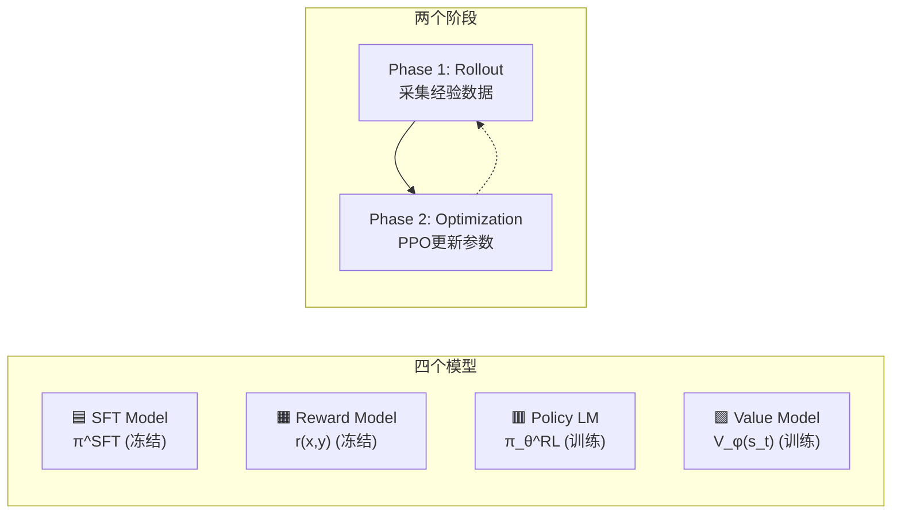
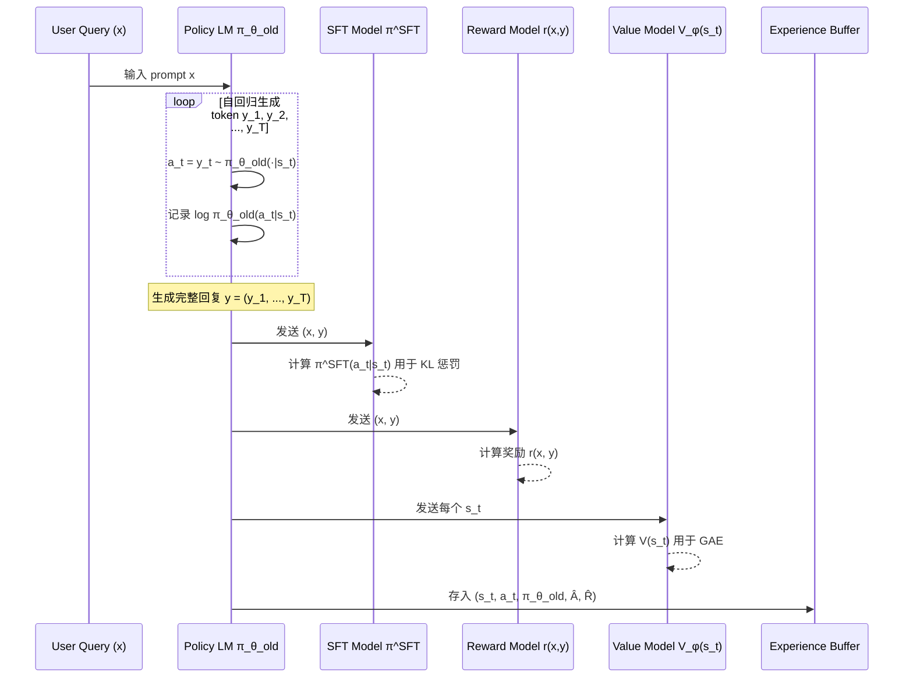

# RLHF 训练中的 PPO 算法 — 架构与数学细节全解读

> 基于截图中的 PPO 训练架构，结合 [PPO.py](file:///Users/jet/Desktop/LLM_Learning/cs336/code_to_LLM/PPO.py) 代码与强化学习理论进行深度剖析。

---

## 一、整体架构概览

RLHF（Reinforcement Learning from Human Feedback）用 PPO 训练 LLM 时，涉及 **4 个模型** 和 **2 个阶段**：



### 四个模型的角色

| 模型 | 符号 | 是否训练 | 作用 |
|------|------|----------|------|
| **SFT Model** | $\pi^{\text{SFT}}$ | ❄️ 冻结 | 提供 KL 散度的参考分布，防止策略偏离太远（防崩塌） |
| **Reward Model** | $r(x, y)$ | ❄️ 冻结 | 对生成文本打分，替代人类标注者进行奖励计算 |
| **Policy LM** | $\pi_\theta^{\text{RL}}$ | 🔥 训练 | 当前策略网络，即被优化的 LLM |
| **Value Model** | $V_\phi(s_t)$ | 🔥 训练 | 估计当前状态（到当前 token 为止）的期望未来总回报 |

> [!IMPORTANT]
> 与学术界小环境（如 Acrobot）常采用的共享骨干网络（Shared Backbone）不同，在 RLHF 中，**Policy LM** 和 **Value Model** 通常是两个完全独立的模型（Value Model 常由 SFT 初始化并接一个 scalar head 分别训练），以避免百亿参数大模型的梯度冲突。

---

## 二、Phase 1: Rollout（经验采集）

对应 [PPO.py](file:///Users/jet/Desktop/LLM_Learning/cs336/code_to_LLM/PPO.py#L267-L301) 中的“阶段 1: 采集经验数据”。

### 2.1 状态与动作的定义

在 LLM 语境下，强化学习基本概念定义如下：

| 经典 RL (Acrobot) | RLHF for LLM |
|---|---|
| **状态 $s_t$** | $s_t = (x, y_1, y_2, \dots, y_{t-1})$ 即 Prompt + 已生成的 tokens |
| **动作 $a_t$** | $a_t = y_t \in \text{Vocabulary}$（从词表中选择下一个 token） |
| **策略 $\pi(a\|s)$** | $\pi_\theta^{\text{RL}}(y_t \| x, y_1, \dots, y_{t-1})$ 即 LLM 生成下一个 token 的概率分布 |
| **环境 Step** | 自回归向后生成一个 token |
| **Episode 终止** | 生成 EOS token 或达到最大长度截断 |
| **即时奖励 $r_t$** | 中间步 $r_t = 0$；最后一步输出完整文本时由 Reward Model 计算得分 $r(x,y)$并减去 KL 惩罚 |

### 2.2 Rollout 流程与数据分解（Divide）



* **“Divide”的概念**：自回归生成的完整序列 $(x, y_1, y_2, \dots, y_T)$ 被拆解成 $T$ 个时间步。每个时间步 $t$ 的状态 $s_t$ 就是之前所有的上下文，动作 $a_t$ 就是该步生成的 $y_t$。

### 2.3 奖励的计算与 KL 惩罚

RLHF 中的即时奖励并非由外部物理环境给出，而是通过计算 **Reward Model 分数** 并扣除 **KL 散度惩罚** 得到。

#### 逐 token 惩罚方式下各步奖励：
$$r_t = \begin{cases} -\beta \cdot \left[ \log \pi_\theta^{\text{RL}}(a_t|s_t) - \log \pi^{\text{SFT}}(a_t|s_t) \right] & \text{if } t < T \\ r(x, y) - \beta \cdot \left[ \log \pi_\theta^{\text{RL}}(a_t|s_t) - \log \pi^{\text{SFT}}(a_t|s_t) \right] & \text{if } t = T \end{cases}$$

> [!NOTE]
> **KL 惩罚的作用**：防止 Policy LM 为了迎合 Reward Model 的喜好而生成语病、怪异字符等（称为 Reward Hacking）。参数 $\beta$ 控制了对偏离 SFT 模型的惩罚力度。

#### 💡 逐 Token KL 惩罚数值计算示例
假设当前 KL 惩罚系数 $\beta = 0.1$。当模型在状态 $s_t$ 下预测下一个 token 为 `"is"` 时：
* **情况 A（合理偏离）**：
  * SFT 模型预测概率：$\pi^{\text{SFT}}(\text{"is"}|s_t) = 0.5 \implies \log \pi^{\text{SFT}} \approx -0.693$
  * Policy 模型预测概率：$\pi_\theta^{\text{RL}}(\text{"is"}|s_t) = 0.8 \implies \log \pi_\theta^{\text{RL}} \approx -0.223$
  * 该步的 KL 惩罚值为：$-0.1 \times [-0.223 - (-0.693)] = -0.1 \times 0.47 = -0.047$（微弱扣分）。
* **情况 B（极端偏离/Reward Hacking）**：
  * SFT 模型预测概率：$\pi^{\text{SFT}}(\text{"is"}|s_t) = 0.1 \implies \log \pi^{\text{SFT}} \approx -2.303$
  * Policy 模型预测概率：$\pi_\theta^{\text{RL}}(\text{"is"}|s_t) = 0.9 \implies \log \pi_\theta^{\text{RL}} \approx -0.105$
  * 该步的 KL 惩罚值为：$-0.1 \times [-0.105 - (-2.303)] = -0.1 \times 2.198 \approx -0.220$（高额扣分）。

通过这种机制，一旦 Policy 模型选择了一个在 SFT 看来概率极低而在 RM 看来得分高的 Token，KL 惩罚就会急剧增加，强行纠正模型的偏离。

---

## 三、数学解析：Value, TD Error, Advantage, Return 的关系

为了训练 Policy Model，我们需要知道每个动作的**优势 $A_t$**（这个动作比“平均水平”好多少）。为此引入了一套严密的数学关系链。

### 3.1 核心概念澄清

1. **Value $V(s_t)$ — “未来总回报的估计”**
   
   $V(s_t)$ 预测的是 **从 $t$ 时刻到结束累积回报的期望**，而不是即时奖励 $r_t$。
   $$V(s_t) \approx \mathbb{E} \left[ r_t + \gamma r_{t+1} + \gamma^2 r_{t+2} + \dots \right]$$
   在稀疏奖励下（只有最后一项 $r_T = 1$），即使中间的即时奖励 $r_0, \dots, r_{T-1}$ 都是 $0$，中间状态的价值 $V(s_t)$ 也应该学到接近 $1.0$ 的值（因为从这里走下去终能拿到 $1.0$）。
   
2. **TD Error $\delta_t$（时序差分误差）— “一步发生的惊喜”**
   
   $$\delta_t = r_t + \gamma V(s_{t+1}) - V(s_t)$$
   这是对优势（Advantage）的**一步估计**。如果 `实际的一步奖励 + 对未来的估计` 大于 `你对当下的估计`，说明这一步动作超出了预期（正惊喜）。

3. **Advantage $\hat{A}_t$（优势函数）— “多步惊喜的混合”**
   
   单步 TD Error 偏差较大。GAE（Generalized Advantage Estimation）通过参数 $\lambda$ 将 $1$ 步、$2$ 步、直至无限步的估算进行指数加权平滑：
   $$\hat{A}_t^{\text{GAE}} = \sum_{l=0}^{T-t} (\gamma \lambda)^l \delta_{t+l}$$
   写成递推形式（对应 [PPO.py L107](file:///Users/jet/Desktop/LLM_Learning/cs336/code_to_LLM/PPO.py#L107)）：
   $$\hat{A}_t = \delta_t + \gamma\lambda \cdot \hat{A}_{t+1}$$
   - **$\lambda = 0$**：退化为单步 TD Error $\hat{A}_t = \delta_t$（高偏差、低方差）。
   - **$\lambda = 1$**：退化为蒙特卡洛计算 $\hat{A}_t = \sum r_{t+l} - V(s_t)$（无偏差、高方差）。
   - **$\lambda = 0.95$**：最佳折中方案。

4. **Target Return $\hat{R}_t$（目标回报）— “价值网络的学习目标”**
   
   $$\hat{R}_t = \hat{A}_t + V(s_t)$$
   它是 GAE 反算回来的更准确的实际总回报估计，用于作为 MSE 损失的目标来训练 Value 网络。

> [!WARNING]
> **常见误区：价值网络的拟合目标是即时奖励 $r_t$ 吗？**
> 很多人误以为既然中间步的即时奖励 $r_t = 0$，那么中间步的 Value Loss 拟合目标也就是 $0$（即中间步的 MSE 就是 $-V(s_t)$）。这是完全错误的！
> 价值网络 $V(s_t)$ 拟合的是**期望累积未来总回报**。因此，它的学习目标是 $\hat{R}_t = \hat{A}_t + V_{\text{old}}(s_t)$。由于优势 $\hat{A}_t$ 包含了从当前步往后所有步骤的惊喜反馈（蕴含了终局的真实奖励信息），$\hat{R}_t$ 在中间步同样是一个非零的、逼近真实未来总奖励的值。

### 3.2 关系传导链图

```
即时奖励 r_t + 价值估计 V(s_t)
        │
        ▼
   δ_t = r_t + γ·V(s_{t+1}) - V(s_t)      ← TD Error (单步惊喜)
        │
        ▼
   Â_t = δ_t + γλ · Â_{t+1}                ← GAE (多步惊喜混合)
        │
        ├──→ PPO-Clip Loss → 训练 Policy LM (告诉策略该动作好坏)
        │
        ▼
   R̂_t = Â_t + V(s_t)                      ← Return (目标回报)
        │
        └──→ MSE Loss → 训练 Value Model (更新估值网络)
```

### 3.3 稀疏奖励下的 GAE 数值计算示例

为了直观理解计算过程，假设折现因子 $\gamma = 1.0$，GAE 参数 $\lambda = 0.95$。一个包含 5 个 token 的生成序列中，仅在最后一步产生 $+1.0$ 的奖励：

```
时间步 t:      t=0     t=1     t=2     t=3     t=4
即时奖励 r_t:   0       0       0       0       +1.0   (稀疏奖励)
当前网络估计 V: 0.3     0.4     0.5     0.7     0.9    (尚不准的旧价值)
下一步估计 V': 0.4     0.5     0.7     0.9     0.0    (t=4结束后结束，V'=0)
```

#### 第一步：从前向后计算单步误差 $\delta_t$
* $\delta_0 = 0 + 1.0 \times 0.4 - 0.3 = +0.1$
* $\delta_1 = 0 + 1.0 \times 0.5 - 0.4 = +0.1$
* $\delta_2 = 0 + 1.0 \times 0.7 - 0.5 = +0.2$
* $\delta_3 = 0 + 1.0 \times 0.9 - 0.7 = +0.2$
* $\delta_4 = 1.0 + 1.0 \times 0.0 - 0.9 = +0.1$

#### 第二步：从后向前递推优势 $\hat{A}_t$
* $\hat{A}_4 = \delta_4 = +0.1$
* $\hat{A}_3 = \delta_3 + (1.0 \times 0.95) \times \hat{A}_4 = 0.2 + 0.95 \times 0.1 = +0.295$
* $\hat{A}_2 = \delta_2 + (1.0 \times 0.95) \times \hat{A}_3 = 0.2 + 0.95 \times 0.295 = +0.480$
* $\hat{A}_1 = \delta_1 + (1.0 \times 0.95) \times \hat{A}_2 = 0.1 + 0.95 \times 0.480 = +0.556$
* $\hat{A}_0 = \delta_0 + (1.0 \times 0.95) \times \hat{A}_1 = 0.1 + 0.95 \times 0.556 = +0.628$

> [!TIP]
> **观察结论**：即使前 4 步的即时奖励为 $0$，通过 GAE 的反向传播，早期的 token（如 $t=0$）也分配到了显著的优势值（$+0.628$）。这说明“开头前几步的生成方向非常正确，对最终拿到高奖励起到了关键贡献”。

#### 第三步：计算价值网络的目标标签 $\hat{R}_t = \hat{A}_t + V(s_t)$
* $\hat{R}_0 = 0.628 + 0.3 = 0.928$ （使得价值网络将 $V(s_0)$ 从 $0.3$ 往 $0.928$ 优化）
* $\hat{R}_4 = 0.100 + 0.9 = 1.000$ （使得价值网络将 $V(s_4)$ 往 $1.000$ 优化）

---

## 四、关于 Experience Buffer 的关键运行逻辑

在 Phase 1 采集结束后，计算得到的 $\hat{A}_t$ 和 $\hat{R}_t$ 以及状态动作会被写入 Experience Buffer。

### 4.1 为什么 Buffer 随机打乱不会破坏 GAE 的顺序计算？

**因为 GAE 的计算在打乱之前就已经完成了。**

* **顺序**：
  1. **Phase 1**：按序列生成顺序（有序地）从环境收集 $(s_t, a_t, r_t, V_t)$。
  2. **Phase 2**：在 Buffer 内部**从后向前**（有顺序地）反向迭代，计算出每个 token 的 $\hat{A}_t$ 和 $\hat{R}_t$。
  3. **Phase 3**：此时每行数据已经包含了该时刻的所有计算结果：`(s_t, a_t, log_prob_old, Â_t, R̂_t)`。这些行数据自此成为**独立样本**，不再需要前后的时序信息。
  4. **Phase 4**：打乱 Buffer（Shuffle），切分成 Mini-batches，送入 PPO 计算 Loss 进行随机梯度下降（SGD）。打乱的目的是打碎时间步之间的相关性，符合 SGD 独立同分布（I.I.D.）的假设。

### 4.2 Buffer 中的字段设计及其在 Loss 中的流向

| 字段名 | 来源 | Phase 2 优化时的流向与用途 |
|---|---|---|
| **$s_t$** | 采样序列当前上下文 | 输入当前 Policy LM，前向传播得到**新概率** $\pi_\theta(a_t\|s_t)$ |
| **$a_t$** | 采样时采到的 token | 索引对应的概率值 |
| **$\log \pi_{\theta_{\text{old}}}(a_t\|s_t)$** | 采样时记录的旧对数概率 | 用于计算比率：$\text{ratio} = \exp(\log \pi_\theta - \log \pi_{\theta_{\text{old}}})$ |
| **$\hat{A}_t$** | 打乱前由 GAE 算好的优势 | 与 ratio 相乘得到策略优化的梯度方向和幅度 |
| **$\hat{R}_t$** | 打乱前算好的目标回报 | 作为 Value Model MSE Loss 的拟合真值（Label） |

---

## 五、Phase 2: PPO 优化与 Loss 的物理意义

### 5.1 PPO-Clip Loss 是如何更新 Policy 模型的？

$$L^{\text{CLIP}} = -\mathbb{E}\left[\min\left(\frac{\pi_\theta(a_t|s_t)}{\pi_{\theta_{\text{old}}}(a_t|s_t)} \hat{A}_t, \; \text{clip}\left(\frac{\pi_\theta(a_t|s_t)}{\pi_{\theta_{\text{old}}}(a_t|s_t)}, 1-\epsilon, 1+\epsilon\right) \hat{A}_t\right)\right]$$

PPO-Clip Loss 并仅是为了“限制偏离”，而是**“在保障安全的前提下，尽可能朝正确的方向更新 Policy 参数 $\theta$”**：

1. **更新方向 (The Gradient Direction)**
   * 当优势 $\hat{A}_t > 0$（说明这一步选择 $a_t$ 带来了超出预期的正面回报）：Loss 鼓励将 ratio $\frac{\pi_\theta}{\pi_{\theta_{\text{old}}}}$ 变大，即 **提高** 产生该 $a_t$ 的概率。
   * 当优势 $\hat{A}_t < 0$（差动作）：Loss 迫使 ratio 变小，即 **降低** 产生该 $a_t$ 的概率。

2. **步幅限制 (The Trust Region)**
   * **好动作 $\hat{A}_t > 0$ 的情况**：
     当新策略选择该 token 的概率提高，使得比率 $\text{ratio} \le 1+\epsilon$ 时，优化器继续提供正向梯度推动更新；一旦超过天花板 $1+\epsilon$，`clip` 后的值封顶不再增加，比率的梯度随之归零。这就把好动作的概率增幅限制在一个信赖域内。
   * **差动作 $\hat{A}_t < 0$ 的情况**：
     当概率降低，比率 $\text{ratio} \ge 1-\epsilon$ 时，优化器继续推动降低其概率；一旦低于地板 $1-\epsilon$，梯度同样归零。

下面是优势大于 0 时的 Loss 曲线与梯度示意图：

```
 Loss (L^CLIP)
  ^
  |        /----梯度为 0 (Clipped Region, 不鼓励无限扩张)
  |       /
  |      / 梯度为正 (Active Optimization Region)
  |     /
  +----+------------------> ratio
  0   1-ε  1  1+ε
```

#### 💡 PPO-Clip 细粒度数值计算示例
假设截断参数 $\epsilon = 0.2$。我们来看优化器在不同情况下的具体 Loss 和梯度行为：

* **情况 1：优势 $\hat{A}_t = +0.5$（好动作）**
  * 若比率 $\text{ratio} = 1.1$（新概率比旧概率稍高，未超限）：
    $$\text{unclipped} = 1.1 \times 0.5 = 0.55$$
    $$\text{clipped} = \text{clip}(1.1, 0.8, 1.2) \times 0.5 = 1.1 \times 0.5 = 0.55$$
    $$\min(0.55, 0.55) = 0.55 \implies L^{\text{CLIP}} = -0.55$$
    **结果**：此处存在非零梯度，优化器会继续**提高**该动作的产生概率。
  * 若比率 $\text{ratio} = 1.3$（概率提升过快，已超限）：
    $$\text{unclipped} = 1.3 \times 0.5 = 0.65$$
    $$\text{clipped} = \text{clip}(1.3, 0.8, 1.2) \times 0.5 = 1.2 \times 0.5 = 0.60$$
    $$\min(0.65, 0.60) = 0.60 \implies L^{\text{CLIP}} = -0.60$$
    **结果**：此时即使 ratio 进一步增大到 $1.4$，Loss 也始终固定在 $-0.60$。梯度在此处归零，**阻止概率过度膨胀**。

* **情况 2：优势 $\hat{A}_t = -0.5$（差动作）**
  * 若比率 $\text{ratio} = 0.9$（新概率比旧概率稍低，未超限）：
    $$\text{unclipped} = 0.9 \times (-0.5) = -0.45$$
    $$\text{clipped} = \text{clip}(0.9, 0.8, 1.2) \times (-0.5) = -0.45$$
    $$\min(-0.45, -0.45) = -0.45 \implies L^{\text{CLIP}} = 0.45$$
    **结果**：梯度存在，优化器会继续**降低**该动作的产生概率。
  * 若比率 $\text{ratio} = 0.7$（概率降得极低，已超限）：
    $$\text{unclipped} = 0.7 \times (-0.5) = -0.35$$
    $$\text{clipped} = \text{clip}(0.7, 0.8, 1.2) \times (-0.5) = 0.8 \times (-0.5) = -0.40$$
    $$\min(-0.35, -0.40) = -0.40 \implies L^{\text{CLIP}} = 0.40$$
    **结果**：由于 $\min$ 函数的作用，取了值更小的 $-0.40$（对应取负前的更大项）。即使概率被压得再低（如 ratio $= 0.6$），Loss 也卡在 $0.40$。梯度归零，**防止把差动作的概率直接打压到零（保留了探索空间，防止策略过早收敛崩溃）**。

---

### 5.2 三个 Loss 的物理意图与大模型更新机制

1. **Policy Loss ($L^{\text{CLIP}}$)**
   * **作用**：提高好的 token 概率，降低差 of token 概率。
   * **更新参数**：Policy LM $\theta$。

2. **Value Loss ($L^V$)**
   * **作用**：让 $V_\phi(s_t)$ 逼近实际回报 $\hat{R}_t$。
   * **更新参数**：Value Model $\phi$。

3. **LM Loss ($L^{\text{LM}}$，可选，即预训练混合损耗)**
   * **作用**：在预训练文本数据上计算自回归 Loss，作为正则化项。
   * **更新参数**：Policy LM $\theta$。防止 RL 训练过程中出现大模型的“灾难性遗忘”（即 RL 训练后模型只会做任务，丧失了通用的对话与写作能力）。

### 5.3 优势标准化 (Advantage Normalization)

在将优势送入 Loss 计算之前，代码中进行了一步标准化处理（对应 [PPO.py L329](file:///Users/jet/Desktop/LLM_Learning/cs336/code_to_LLM/PPO.py#L329)）：

```python
adv_tensor = (adv_tensor - adv_tensor.mean()) / (adv_tensor.std() + 1e-8)
```

* **必要性**：不同 Prompt 下 Reward Model 打分的绝对尺度可能完全不同。有的任务打分集中在 $[0.8, 0.9]$，有的任务在 $[0.1, 0.2]$。
* **效果**：通过减去均值并除以标准差，强制当前 Batch 内优势的均值为 $0$，方差为 $1$。这可以保证：
  1. 无论原始奖励范围如何，优化梯度步长都维持在一个稳定的尺度。
  2. Batch 内部总是有一半的 Token 概率被提升（优势大于 0），另一半概率被降低（优势小于 0），实现了更稳定高效的对比学习。

### 5.4 价值截断 (Value Clipping，进阶技巧)

在大模型 RLHF 实践中，通常会对价值函数的更新也进行类似于 Policy 的截断限制：

$$L^{V}_{\text{clipped}} = \frac{1}{2} \mathbb{E} \left[ \max \left( (V_\phi(s) - \hat{R})^2, \; (V_{\phi_{\text{old}}}(s) + \text{clip}(V_\phi(s) - V_{\phi_{\text{old}}}(s), -\epsilon_v, \epsilon_v) - \hat{R})^2 \right) \right]$$

* **物理直觉**：防止价值估计网络 $V_\phi$ 受到单个批次噪声数据的剧烈冲击导致震荡。限制了每一次参数迭代中，$V_\phi(s_t)$ 相较于上一轮估值 $V_{\phi_{\text{old}}}(s_t)$ 的改变幅度。

### 5.5 RLHF-PPO 典型失败模式与调参避坑指南

RLHF 阶段以“极难收敛、极其敏感”著称，以下是三大典型失败模式及其诊断和调参方法：

#### 1. Reward Hacking（奖励作弊）
* **现象**：Reward Model 的得分一路飙升，但人工评测发现模型输出语无伦次、毫无逻辑（例如不断重复某些高分词汇，或者无限刷表情符号）。
* **原因**：Policy 模型通过牺牲可读性彻底 exploit 了 Reward Model 分类器的边界漏洞。
* **调参手段**：
  * **调大 KL 系数 $\beta$**：强制让模型多保留 SFT 原来的语言逻辑（例如将 $\beta$ 从 $0.05$ 上调至 $0.1$）。
  * **采用动态 $\beta$ 调度**：设定目标 KL 散度值 $KL_{\text{target}}$（如 $3 \sim 6$）。若实际 KL 大于目标，说明偏离过远，自动增加 $\beta$；反之减少。

#### 2. Policy Collapse（策略坍塌/模式坍塌）
* **现象**：模型的生成丧失多样性，无论输入什么 prompt，给出的回答都变得高度雷同（常伴随着 KL 散度极速飙升后突降至 0）。
* **原因**：Policy 学习率过大，导致大模型在 RL 优化的早期梯度直接将部分参数带入局部坏死区，模型选择了一条收敛速度最快的“万能高分废话”模板。
* **调参手段**：
  * **降低 Policy 学习率**：LLM 场景下的 Policy LR 通常设得极小（如 $5\text{e-}7 \sim 2\text{e-}6$），并且需要加 Warmup。
  * **增加熵正则/降低采样温度**：在 Rollout 阶段使用较大的 Temperature（如 $0.7 \sim 0.9$）鼓励探索。

#### 3. Value Model 崩溃/剧烈摆动
* **现象**：Value Loss 居高不下，无法收敛，或者预测的 $V(s)$ 与真实的 $\hat{R}$ 几乎没有关联（相关性接近 0）。
* **原因**：Value 拟合是一个难度极高的连续回归任务，且标签 $\hat{R}$ 是动态变化的。如果 Value 网络学得比 Policy 还慢，就会导致 GAE 计算出的 $\hat{A}$ 全是噪声，彻底毁掉 Policy 更新。
* **调参手段**：
  * **非对称学习率**：**必须让 Value 网络的学习率显著大于 Policy**（通常大一个数量级，如 Policy LR = $1\text{e-}6$，Value LR = $1\text{e-}5$）。
  * **Value Warmup/Pre-training**：在 RLHF 正式更新 Policy 之前，先让 Policy 冻结，只采集 Rollout 数据更新 Value Model $2 \sim 3$ 个 epoch，给优势估计打好准确的基础。

---

## 六、PPO 与 GRPO 的深层对比

GRPO (Group Relative Policy Optimization) 是 DeepSeek 提出的一种改进，旨在解决大模型 RL 训练中 Value Model 带来的计算和显存开销。

### 6.1 数学对比：优势计算与信用分配

* **PPO 依赖 GAE 计算优势**（包含时间步维度 $t$）：
  $$\hat{A}_{i,t} = \sum_{l=0}^{T-t} (\gamma \lambda)^l \delta_{i, t+l}$$
  每个时间步的 $a_{i,t}$ 都有其**独立独特**的优势值 $\hat{A}_{i,t}$（逐 token 信用分配）。

* **GRPO 基于组内归一化计算优势**（无时间步维度 $t$）：
  $$A_i = \frac{R_i - \text{mean}(R)}{\text{std}(R)}$$
  对于同一个 Prompt，采样组（Group）生成 $G$ 个完整回答，计算每个回答的最终总奖励 $R_i$。在 Loss 计算时，**当前回答的所有 token 共享同一个优势分 $A_i$**：
  $$L^{\text{GRPO}}(\theta) = -\frac{1}{G} \sum_{i=1}^{G} \sum_{t=1}^{T} \min \left( \text{ratio}_{i,t} A_i, \; \text{clip}(\text{ratio}_{i,t}) A_i \right)$$
  这种做法跳过了对未来回报 $V(s_{t+1})$ 的递归预测，将信用分配粗粒度化。

#### 💡 GRPO 组内优势计算数值示例
假设对于一个特定的 Prompt，系统采样组大小为 $G=4$，自回归生成了 4 个回答：
* 回答 $y^1$（输出正确答案）：最终获得奖励值 $R_1 = 1.0$
* 回答 $y^2$（输出错误答案）：最终获得奖励值 $R_2 = 0.0$
* 回答 $y^3$（输出正确答案）：最终获得奖励值 $R_3 = 1.0$
* 回答 $y^4$（输出错误答案）：最终获得奖励值 $R_4 = 0.0$

#### 计算步骤：
1. **计算均值**：$\text{mean}(R) = \frac{1.0 + 0.0 + 1.0 + 0.0}{4} = 0.5$
2. **计算标准差**：$\text{std}(R) = \sqrt{\frac{2 \times (1.0-0.5)^2 + 2 \times (0.0-0.5)^2}{4}} = 0.5$
3. **计算归一化优势 $A_i$**：
   * $A_1 = \frac{1.0 - 0.5}{0.5} = +1.0$ （回答 1 中的**所有 Token** 的优势值均为 $+1.0$）
   * $A_2 = \frac{0.0 - 0.5}{0.5} = -1.0$ （回答 2 中的**所有 Token** 的优势值均为 $-1.0$）
   * $A_3 = \frac{1.0 - 0.5}{0.5} = +1.0$ （回答 3 中的**所有 Token** 的优势值均为 $+1.0$）
   * $A_4 = \frac{0.0 - 0.5}{0.5} = -1.0$ （回答 4 中的**所有 Token** 的优势值均为 $-1.0$）

**结果分析**：回答正确的那组链路被集体正向奖励，回答错误的链路被集体负向惩罚。这样仅通过规则比对和组内差异归一化，就自然产生了正负学习信号，完全省去了拟合中间步骤的 Critic 网络（Value Model）。

---

### 6.2 综合对比表

| 对比维度 | PPO (标准强化学习) | GRPO (组相对策略优化) |
|---|---|---|
| **Value Model 需求** | ✅ 需要专门的价值网络 $V_\phi$ 拟合基线 | ❌ 完全抛弃价值网络，节省高达 50% 显存 |
| **信用分配粒度** | **逐 token 信用分配**。通过 GAE 算出序列中每个 token 独立独特的 $\hat{A}_t$ | **逐 Response 粗粒度分配**。同一个回答中所有 token 获得完全一样的优势分 $A_i$ |
| **优势计算机制** | $\hat{A}_{i,t} = \delta_{i,t} + \gamma\lambda\hat{A}_{i,t+1}$ | $A_i = \frac{R_i - \text{mean}(R)}{\text{std}(R)}$（通过对同一 Prompt 组内对比 $G$ 个样本得到） |
| **算力侧重** | 侧重于**模型计算**（要对 Policy 和 Value 两个大模型进行前向和反向） | 侧重于**推理采样**（需要同一个 Prompt 采样 $G$ 个不同的完整生成，常 $G=4 \sim 8$） |
| **最适用场景** | 开放域对话、偏好对齐（无明确对错，需要细粒度分配） | 数学、代码、逻辑推理（有明确客观对错，容易在组内拉开得分差距） |

### 为什么 GRPO 在数学推理任务上可行？
数学推理的核心是“整个链条最终能否得出正确答案（Verifier 规则判定 1 或 0）”。
虽然 GRPO 将优势值“均摊”到了生成链条中的每一个 token（粗粒度分配），但通过**组内大量对比采样**，错的链路被整体扣分，对的链路被整体加分，最终依然能在没有庞大 Value Model 的情况下训练出优秀的推理策略（如 DeepSeek-R1-Zero）。

---

## 七、工业界多模型显存物理分布与 LoRA 共享设计

在物理训练中，由于涉及 4 个大模型在显卡内的共存，显存（VRAM）压力极大。业界通常采取以下两种方式来解决：

### 7.1 分布式部署与 DeepSpeed ZeRO 显存分布
标准的四模型流水线物理显存分布如下：
```
  [GPU 集群物理分布]
  ┌─────────────────────────────┐   ┌─────────────────────────────┐
  │         GPU 1 ~ N           │   │         GPU N+1 ~ 2N        │
  │  🟥 Policy LM (训练)         │   │  🟩 Value Model (训练)       │
  │  - 存参数, 梯度, 优化器状态   │   │  - 存参数, 梯度, 优化器状态   │
  │  - 显存占用: 高              │   │  - 显存占用: 高              │
  └─────────────────────────────┘   └─────────────────────────────┘
  ┌─────────────────────────────┐   ┌─────────────────────────────┐
  │         GPU 2N+1            │   │         GPU 2N+2            │
  │  🟦 SFT Model (冻结)        │   │  🟧 Reward Model (冻结)     │
  │  - 仅做 Forward (只存参数)    │   │  - 仅做 Forward (只存参数)    │
  │  - 显存占用: 低              │   │  - 显存占用: 低              │
  └─────────────────────────────┘   └─────────────────────────────┘
```
* **优化策略**：使用 **DeepSpeed ZeRO-Stage 3** 对 Policy LM 和 Value Model 的优化器状态进行分片；冻结的 SFT Model 和 Reward Model 通常采用半精度（BF16/FP16）且可选择卸载（Offload）到 CPU，以此释放关键显存。

### 7.2 LoRA 多头共享设计（VRAM 终极解法）
为了让 70B 级别的大模型只在一两台 8 卡机器上就能跑起来，工业界常使用 **LoRA 共享架构**（如 TRL 框架支持的绑定实现）：
```
                ┌───────────────────────────────────┐
                │        Frozen Base SFT Model      │ <─── 作为核心共享底座 (只加载一份参数)
                └─────────────────┬─────────────────┘
                                  │
         ┌────────────────────────┴────────────────────────┐
         │                                                 │
         ▼                                                 ▼
   [Actor Adapter]                                  [Critic Adapter]
 🟥 Active LoRA weights                          🟩 Active LoRA weights
 (Policy LM: 训练微量参数)                        (Value Model: 训练微量参数并带 Linear Head)
```
* **显存极简化**：整个显存里只需要常驻 **一个** Frozen Base SFT Model 的权重。
* **物理运行**：
  * 用 Actor LoRA 对话并自回归生成 token。
  * 冻结 Base 权重直接给出 SFT 参考概率（无需加载独立 SFT 模型）。
  * 激活 Critic LoRA 接一个轻量级线性层（Linear Head）直接输出 V(s) 值。
* **成果**：四模型瞬间折叠成“单模型底座 + 多组 LoRA 适配器”，显存开销直接暴降 60% 以上！

---

## 八、总结与公式速查

* **GAE 优势计算公式**：
  $$\hat{A}_t = \delta_t + \gamma\lambda \hat{A}_{t+1} \quad \text{其中} \quad \delta_t = r_t + \gamma V(s_{t+1}) - V(s_t)$$
* **Value Model 训练标签（Return）**：
  $$\hat{R}_t = \hat{A}_t + V(s_t)$$
* **PPO 阶段 4 策略优化核心流向**：
  $$\theta \leftarrow \theta - \eta \nabla_\theta (L^{\text{CLIP}} + c_2 L^{\text{LM}})$$
  $$\phi \leftarrow \phi - \eta \nabla_\phi (L^V)$$
