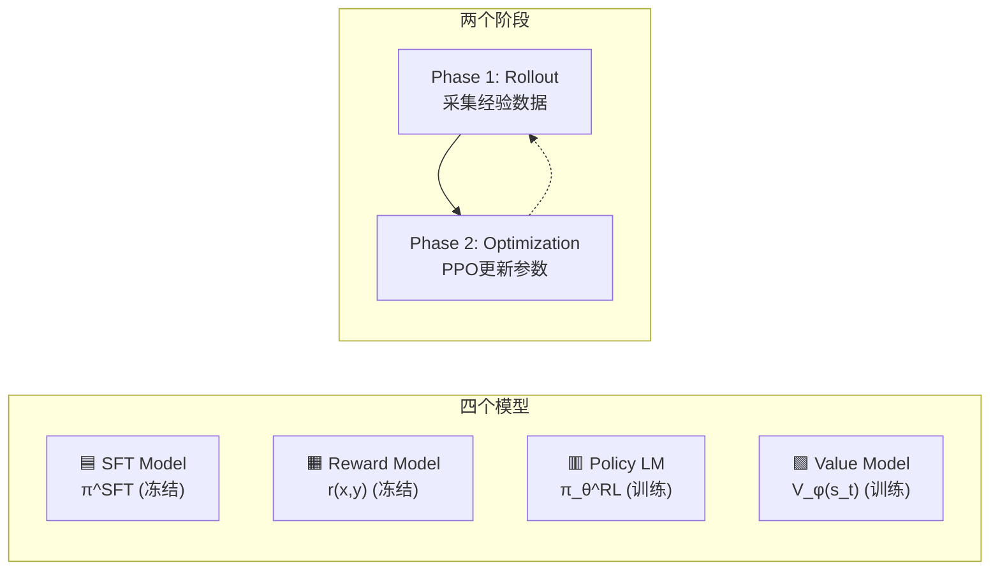
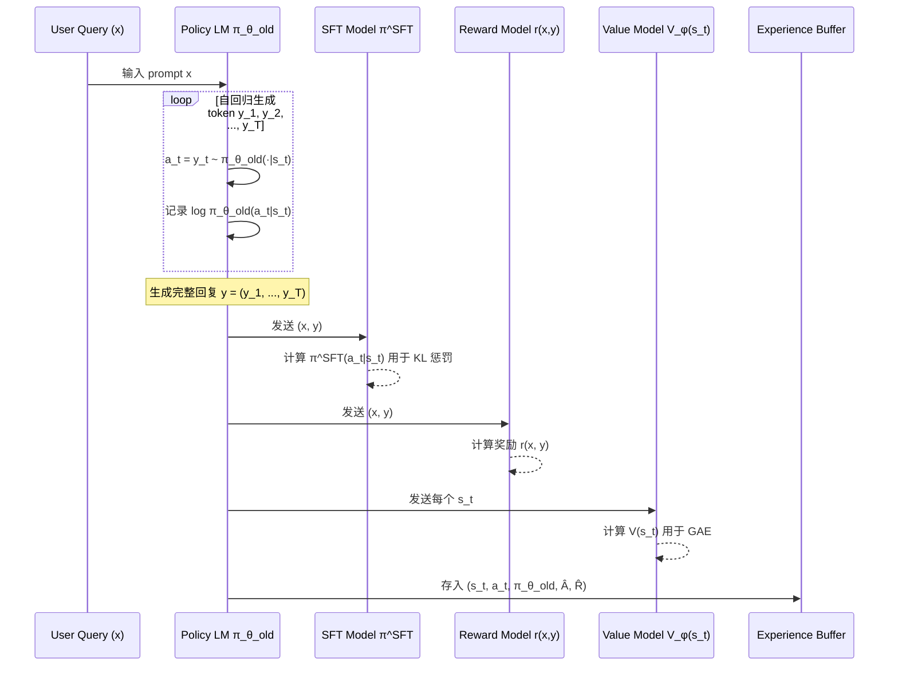
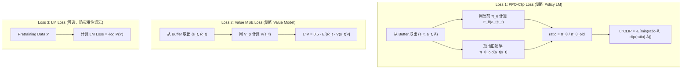
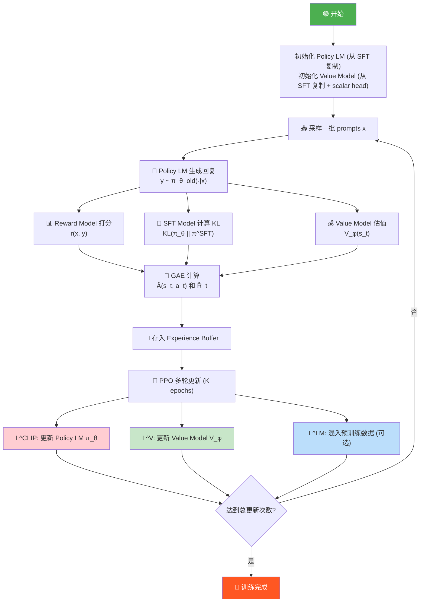

# RLHF 训练中的 PPO 算法 — 架构全解读

> 基于截图中的架构图，结合 [PPO.py](file:///Users/jet/Desktop/LLM_Learning/cs336/code_to_LLM/PPO.py) 代码进行深度解析。

---

## 一、整体架构概览

RLHF（Reinforcement Learning from Human Feedback）用 PPO 训练 LLM 时，涉及 **4 个模型** 和 **2 个阶段**：



### 四个模型的角色

| 模型 | 符号 | 是否训练 | 作用 |
|------|------|----------|------|
| **SFT Model** | π^SFT | ❄️ 冻结 | 提供 KL 散度的参考分布，防止策略偏离太远 |
| **Reward Model** | r(x, y) | ❄️ 冻结 | 对生成文本打分，替代人类标注者 |
| **Policy LM** | π_θ^RL | 🔥 训练 | 当前策略网络，即被优化的 LLM |
| **Value Model** | V_φ(s_t) | 🔥 训练 | 估计每个状态（token 位置）的期望回报 |

> [!IMPORTANT]
> 与你的 [PPO.py](file:///Users/jet/Desktop/LLM_Learning/cs336/code_to_LLM/PPO.py) 中的 `ActorCritic` 共享骨干不同，RLHF 中 **Policy LM** 和 **Value Model** 通常是两个独立的模型（Value Model 从 SFT 初始化，加一个 scalar head）。

---

## 二、Phase 1: Rollout（经验采集）

这对应你的代码中 [阶段 1: 采集经验数据](file:///Users/jet/Desktop/LLM_Learning/cs336/code_to_LLM/PPO.py#L267-L301) 部分。

### 2.1 状态与动作的定义

在 RLHF 的语境下，RL 的概念需要重新映射：

| 经典 RL (Acrobot) | RLHF for LLM |
|---|---|
| 状态 s_t = [cos(θ₁), sin(θ₁), ...] | s_t = (x, y₁, y₂, ..., y_{t-1}) 即 prompt + 已生成 tokens |
| 动作 a_t ∈ {0, 1, 2} | a_t = y_t ∈ Vocabulary (从整个词表中选一个 token) |
| 策略 π(a\|s) | π_θ^RL(y_t \| x, y₁...y_{t-1})，即 LLM 的条件概率 |
| 环境 step | 自回归生成下一个 token |
| Episode 终止 | 生成 EOS token 或达到最大长度 |
| 即时奖励 r_t | 每步奖励 = 0（中间步）；最后一步 = r(x, y) - β·KL |

### 2.2 Rollout 流程（对应截图左半部分）



> **截图中 "Divide" 的含义**：将完整序列 (x, y₁, y₂, ..., y_T) 分解为 T 个 (state, action) 对：
> - s_t = (x, y₁, ..., y_{t-1}) — 到 t 时刻的上下文
> - a_t = y_t — 第 t 步选择的 token

### 2.3 奖励的计算

RLHF 中的奖励不是来自环境，而是来自 **Reward Model** + **KL 惩罚**：

$$r_t = \begin{cases} 0 & \text{if } t < T \text{ (中间步无奖励)} \\ r(x, y) - \beta \sum_{t'=1}^{T} \text{KL}[\pi_\theta^{RL}(\cdot|s_{t'}) \| \pi^{SFT}(\cdot|s_{t'})] & \text{if } t = T \text{ (最后一步)} \end{cases}$$

也有实现采用 **逐 token KL 惩罚** 的变体：

$$r_t = \begin{cases} -\beta \cdot [\log \pi_\theta^{RL}(a_t|s_t) - \log \pi^{SFT}(a_t|s_t)] & \text{if } t < T \\ r(x, y) - \beta \cdot [\log \pi_\theta^{RL}(a_t|s_t) - \log \pi^{SFT}(a_t|s_t)] & \text{if } t = T \end{cases}$$

> [!NOTE]
> **KL 惩罚的作用**：防止 Policy LM 为了获取高奖励而生成不自然的文本（reward hacking）。β 是 KL 惩罚系数，控制探索与利用的平衡。

---

## 三、GAE 计算（截图中间部分）

这对应你代码中的 [compute_gae](file:///Users/jet/Desktop/LLM_Learning/cs336/code_to_LLM/PPO.py#L66-L118) 函数，逻辑完全一致。

### 3.1 TD Error（时序差分误差）

$$\delta_t = r_t + \gamma V(s_{t+1}) - V(s_t)$$

- `r_t`：第 t 步的奖励（在 RLHF 中包含 KL 惩罚）
- `V(s_t)`：Value Model 对状态 s_t 的价值估计
- `γ`：折扣因子（RLHF 中通常 γ = 1.0，因为一个 episode 就是一次完整的文本生成）

### 3.2 Advantage Function（优势函数）

$$\hat{A}(s_t, a_t) = \sum_{l=0}^{T-t} (\gamma \lambda)^l \delta_{t+l}$$

展开就是 GAE 的递推公式，对应你代码中的：

```python
# 从 PPO.py L107
gae = delta + GAMMA * LAMBDA * mask * gae  # Â_t = δ_t + γλ · Â_{t+1}
```

### 3.3 Return（回报）

$$\hat{R}_t = \hat{A}(s_t, a_t) + V(s_t)$$

这是 Value Model 的训练目标，对应：

```python
# 从 PPO.py L116
returns = advantages + np.array(values[:-1], dtype=np.float32)
```

### 3.4 存入 Experience Buffer

计算完毕后，每条经验包含：

```
Experience = (s_t, a_t, π_θ_old(a_t|s_t), Â(s_t, a_t), R̂_t)
```

对应你代码中的 5 个 buffer：`obs_buf`, `act_buf`, `logp_buf` + 计算得到的 `advantages`, `returns`。

---

## 四、Phase 2: Optimization（PPO 更新）

这对应截图右半部分和你代码中的 [阶段 4: PPO 策略更新](file:///Users/jet/Desktop/LLM_Learning/cs336/code_to_LLM/PPO.py#L333-L391)。

### 4.1 三个 Loss 的计算

截图右侧展示了三个损失函数的训练流程：



#### Loss 1: PPO-Clip Loss（策略损失）

$$L^{CLIP} = -\mathbb{E}\left[\min\left(\frac{\pi_\theta(a_t|s_t)}{\pi_{\theta_{old}}(a_t|s_t)} \hat{A}_t, \; \text{clip}\left(\frac{\pi_\theta(a_t|s_t)}{\pi_{\theta_{old}}(a_t|s_t)}, 1-\epsilon, 1+\epsilon\right) \hat{A}_t\right)\right]$$

对应你代码中的：

```python
# PPO.py L358-L372
ratio = torch.exp(new_logp - mb_old_logp)          # r(θ) = π_θ / π_θ_old
unclipped = ratio * mb_adv                          # r(θ) · Â
clipped = torch.clamp(ratio, 1 - CLIP_EPS, 1 + CLIP_EPS) * mb_adv  # clip(r(θ)) · Â
actor_loss = -torch.min(unclipped, clipped).mean()  # L^CLIP
```

> [!TIP]
> **Clip 的直觉**：
> - 当 Â > 0（好动作）：ratio 被上界 1+ε 截断 → 防止策略过度偏向这个动作
> - 当 Â < 0（差动作）：ratio 被下界 1-ε 截断 → 防止策略过度远离这个动作
> - 效果：每次更新的"步幅"被限制在一个信赖域内

#### Loss 2: Value MSE Loss（价值损失）

$$L^{V} = \frac{1}{2} \mathbb{E}\left[(\hat{R}_t - V_\phi(s_t))^2\right]$$

对应你代码中的：

```python
# PPO.py L376
critic_loss = 0.5 * (mb_ret - value).pow(2).mean()
```

> [!IMPORTANT]
> 在 RLHF 中，Value Model 通常是一个**独立的模型**（不与 Policy LM 共享参数），它从 SFT Model 初始化，顶部加一个 linear head 输出标量 V(s_t)。截图中清楚地展示了 Value Model V_φ(s_t) 是独立训练的。

#### Loss 3: LM Loss（语言模型损失，可选）

$$L^{LM} = -\mathbb{E}_{x' \sim \text{Pretrain Data}}[\log P_\theta(x')]$$

这是截图中 **Pretraining Data** 部分对应的损失。

> [!NOTE]
> 这个 Loss 在 InstructGPT 论文中被称为 **pretraining loss mix-in**，目的是在 RL 训练过程中混入一小部分预训练数据的语言建模损失，防止模型的通用语言能力灾难性遗忘。不是所有 RLHF 实现都包含此项。

### 4.2 总损失

$$L^{total} = L^{CLIP} + c_1 \cdot L^{V} + c_2 \cdot L^{LM}$$

在你的 Acrobot 代码中（没有 LM Loss，但加了熵正则）：

```python
# PPO.py L384-386
loss = actor_loss + VALUE_COEF * critic_loss + ENTROPY_COEF * entropy_loss
```

### 4.3 多轮 Epoch 复用（PPO 的核心优势）

```python
# PPO.py L338 — 同一批数据训练多个 epoch
for _ in range(TRAIN_EPOCHS):
    indices = np.arange(data_size)
    np.random.shuffle(indices)
    for start in range(0, data_size, MINIBATCH_SIZE):
        # ... PPO 更新 ...
```

普通策略梯度（如 REINFORCE）数据只能用一次，PPO 的 clip 机制允许多次复用，大幅提升数据效率。

---

## 五、完整训练循环流程图



---

## 六、Acrobot PPO vs RLHF PPO 对照表

| 维度 | Acrobot PPO（你的代码） | RLHF PPO for LLM |
|------|------------------------|-------------------|
| **状态** | 6 维连续向量 | token 序列 (prompt + 已生成 tokens) |
| **动作** | 3 个离散动作 | ~32,000-128,000 个 tokens (词表大小) |
| **奖励来源** | 环境（每步 -1） | Reward Model + KL 惩罚 |
| **Policy 网络** | 2 层 MLP (64 hidden) | Transformer LLM (~7B-70B 参数) |
| **Value 网络** | 与 Policy 共享骨干 | 独立模型（从 SFT 初始化） |
| **Episode 长度** | ~100-500 步 | ~100-2000 tokens |
| **γ (折扣因子)** | 0.99 | 通常 1.0 |
| **λ (GAE)** | 0.95 | 0.95-1.0 |
| **ε (clip)** | 0.2 | 0.2 |
| **额外 Loss** | 熵正则 | KL 惩罚 + 可选 LM Loss |
| **KL 约束** | 无（clip 隐式约束） | 显式 KL(π_θ \|\| π^SFT) |
| **冻结模型** | 无 | SFT Model + Reward Model |

---

## 七、关键设计决策解读

### 7.1 为什么需要 SFT Model？

Policy LM 从 SFT Model 初始化，但在 RL 训练中会不断更新。SFT Model 保持冻结，作为 KL 散度的**锚点**：

$$\text{KL penalty} = \beta \cdot \text{KL}[\pi_\theta^{RL} \| \pi^{SFT}]$$

如果没有这个约束，Policy LM 可能会学到一些"exploit"Reward Model 弱点的方式（例如重复某些模式获取高分但语言质量很差），这就是 **reward hacking**。

### 7.2 为什么 Value Model 独立？

在你的 Acrobot 代码中，Actor 和 Critic 共享骨干：

```python
# PPO.py L148-160 — 共享骨干
self.backbone = nn.Sequential(...)
self.actor = nn.Linear(64, act_dim)   # 共享 backbone
self.critic = nn.Linear(64, 1)        # 共享 backbone
```

但在 LLM 场景中，Policy 是一个巨大的 Transformer，如果让 Critic head 和 Policy 共享参数：
1. **梯度冲突**：Policy 的梯度（来自 L^CLIP）和 Value 的梯度（来自 L^V）方向可能矛盾
2. **容量不匹配**：Value 估计是一个回归任务，与文本生成的分类任务性质不同
3. **训练不稳定**：在大模型上，共享骨干会导致训练更加不稳定

因此 RLHF 通常使用独立的 Value Model，从 SFT 初始化，顶部加一个 `nn.Linear(hidden_dim, 1)` 输出 V(s_t)。

### 7.3 Experience Buffer 的作用

截图中间的 Experience Buffer 存储了：

```
Buffer = {(s_t, a_t, π_θ_old(a_t|s_t), Â(s_t, a_t), R̂_t)} for all t
```

PPO 是 **on-policy** 算法，但通过 importance sampling ratio `π_θ/π_θ_old` + clip 机制，允许对同一批数据进行 **多个 epoch** 的更新，提高数据利用效率。

---

## 八、总结

截图中的架构可以用一句话概括：

> **用旧策略采集数据 → Reward Model 打分 → GAE 计算优势 → PPO-Clip 约束更新策略 + MSE 更新价值网络 → 循环**

核心公式就三个：
1. **GAE**: $\hat{A}_t = \sum_{l=0}^{T-t} (\gamma\lambda)^l \delta_{t+l}$
2. **PPO-Clip**: $L^{CLIP} = -\mathbb{E}[\min(r(\theta)\hat{A}, \text{clip}(r(\theta))\hat{A})]$
3. **Value Loss**: $L^V = \frac{1}{2}\mathbb{E}[(\hat{R}_t - V_\phi(s_t))^2]$

你的 [PPO.py](file:///Users/jet/Desktop/LLM_Learning/cs336/code_to_LLM/PPO.py) 已经完整实现了这三个核心组件，区别仅在于 RLHF 场景下的"环境"变成了 LLM 自回归生成 + Reward Model 打分。
